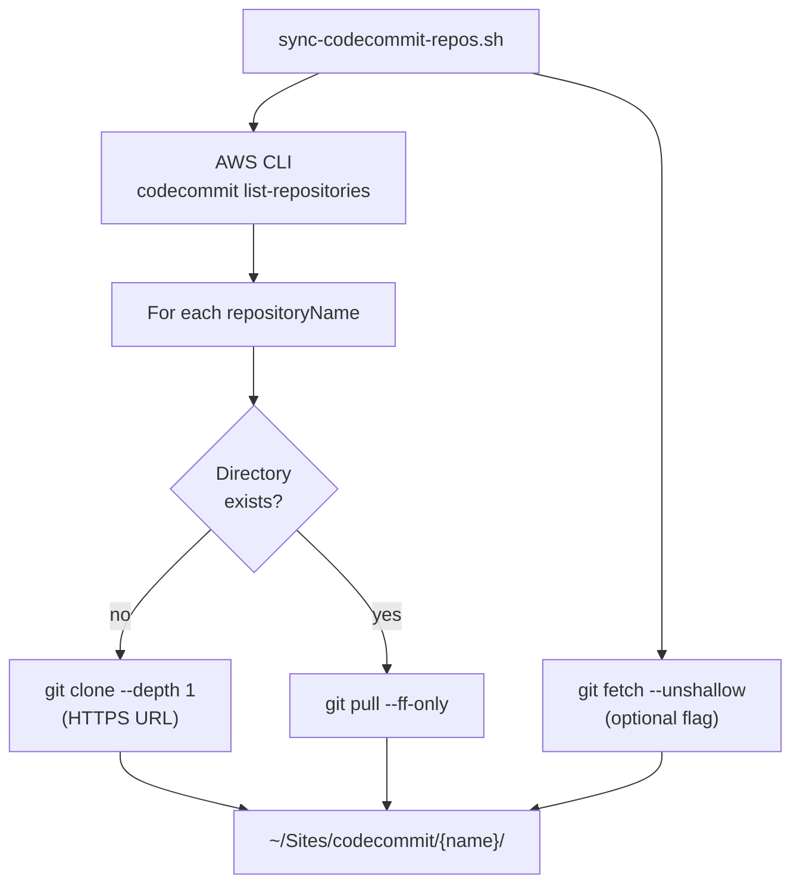

# CodeCommit Bulk Clone — Design Spec

**Date:** 2026-06-08  
**Status:** Approved  
**Goal:** Sync all AWS CodeCommit repositories in `us-east-1` to `~/Sites/codecommit/` for local analysis tooling (Cursor, linters, grep, codebase review).

## Problem

Some code lives in [AWS CodeCommit](https://us-east-1.console.aws.amazon.com/codesuite/codecommit/repositories?region=us-east-1) rather than GitHub/GitLab. Local analysis tooling needs working copies on disk. CodeCommit differs from GitHub/GitLab in discovery (AWS CLI, not `gh`) and authentication (IAM-backed HTTPS credential helper).

## Requirements

| Requirement | Decision |
|-------------|----------|
| Target layout | `~/Sites/codecommit/{repositoryName}/` |
| Scope | All repos in the AWS account, `us-east-1` |
| Clone depth | Shallow (`--depth 1`) on first clone |
| Deepen option | `--deepen {name}` runs `git fetch --unshallow` for one repo |
| Re-run behaviour | Clone new repos; `git pull --ff-only` in existing ones |
| Auth | Existing global git credential helper + `aws configure` IAM credentials |

## Approaches Considered

### 1. Shell sync script + AWS CLI + HTTPS auth (selected)

List repos via `aws codecommit list-repositories`, clone or pull each into the target root.

**Pros:** Matches working auth setup; no new dependencies; easy to re-run.  
**Cons:** Manual bash error handling; no audit manifest.

### 2. `git-remote-codecommit` helper

Clone via `codecommit::us-east-1://{name}` URLs (`pip install git-remote-codecommit`).

**Pros:** AWS-recommended; avoids HTTPS credential-helper edge cases.  
**Cons:** Extra install; different from current working setup.

### 3. Mirror to GitHub/GitLab

Mirror each CodeCommit repo to a private GitHub org, clone from GitHub locally.

**Pros:** Unified tooling across all code.  
**Cons:** Heavy operational overhead; duplicate storage; overkill for local analysis.

**Recommendation:** Approach 1.

## Architecture



## Components

| Component | Responsibility |
|-----------|----------------|
| `scripts/sync-codecommit-repos.sh` | Entry point: list repos, clone or pull, report summary |
| AWS CLI | Discovery — `list-repositories`, `get-repository` for clone URL |
| Git + credential helper | Clone/pull over HTTPS using existing global config |
| `~/Sites/codecommit/` | Local workspace root for analysis tooling |

### Prerequisites (already configured)

```bash
git config --global credential."https://git-codecommit.us-east-1.amazonaws.com".helper "!aws codecommit credential-helper $@"
git config --global credential."https://git-codecommit.us-east-1.amazonaws.com".UseHttpPath true
aws configure   # Access key, secret, region us-east-1, output json
```

### Clone URL

Use HTTPS URL from `aws codecommit get-repository --repository-name {name}` or construct:

```
https://git-codecommit.us-east-1.amazonaws.com/v1/repos/{name}
```

The credential helper handles authentication automatically.

### Sync logic per repo

1. If `~/Sites/codecommit/{name}/` does not exist → `git clone --depth 1 {https-url} {path}`
2. If it exists and is a git repo → `git -C {path} pull --ff-only`
3. If directory exists but is not a git repo → skip with warning
4. If `--deepen {name}` → `git -C {path} fetch --unshallow` (only if shallow)

### Configuration

Environment variables or flags, with defaults:

| Variable / flag | Default | Purpose |
|-----------------|---------|---------|
| `CODECOMMIT_REGION` | `us-east-1` | AWS region |
| `CODECOMMIT_ROOT` | `~/Sites/codecommit` | Local clone root |
| `AWS_PROFILE` | unset | Passed through to `aws` if set |

### Usage

```bash
./scripts/sync-codecommit-repos.sh                    # sync all repos
./scripts/sync-codecommit-repos.sh --deepen my-repo    # full history for one repo
```

## Error Handling

### Pre-flight checks (fail fast)

- `aws` CLI present and callable
- `aws sts get-caller-identity` succeeds
- Git credential helper configured for `git-codecommit.us-east-1.amazonaws.com`
- Target root exists or can be created

### Per-repo errors (continue on failure)

| Situation | Behaviour |
|-----------|-----------|
| Clone fails (permissions, network) | Log error, continue to next repo |
| Pull fails (local changes, diverged branch) | Warn with repo path; do not force; continue |
| Non-git directory at expected path | Warn and skip |
| Repo deleted from CodeCommit but still local | Leave local copy untouched |

**Exit code:** `0` if all repos succeeded; `1` if any failed.

### Summary output

```
Synced 12 repos: 3 cloned, 8 pulled, 1 failed
Failed: legacy-archive (permission denied)
Root: ~/Sites/codecommit
```

## Verification

Manual checks (no automated test suite):

1. `aws codecommit list-repositories --region us-east-1` — repo count matches console
2. First sync — directories appear under `~/Sites/codecommit/`
3. Re-run — existing repos pull, no duplicate clones
4. Open one repo in Cursor — indexing works
5. `--deepen one-repo` — `git log` shows full history

## Out of Scope

- Multi-region support
- Allowlists / blocklists
- Auto-deleting stale local repos
- Mirroring to GitHub/GitLab
- Parallel clones (add later if repo count is large)
