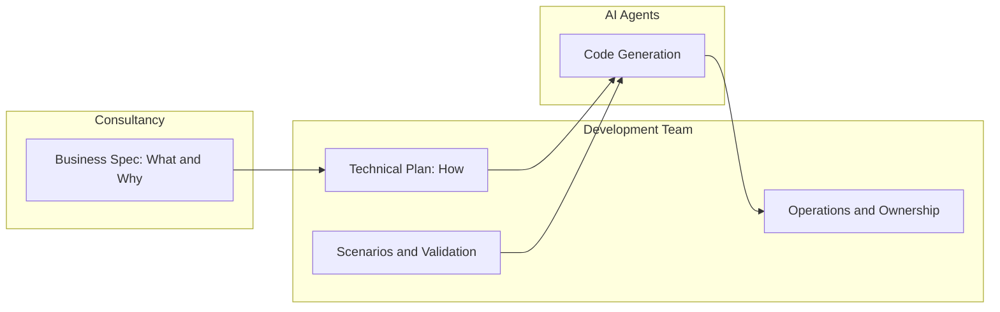

<figure class="report-section-image-wrapper" aria-labelledby="fig-consultancy-caption">
  
  <figcaption id="fig-consultancy-caption">Business spec and technical plan: collaboration between consultancy and dev team</figcaption>
</figure>

## 5. Dark Factory in a Consultancy Environment

This section addresses how Dark Factory and spec-driven workflows apply when the development team sits inside a consultancy (e.g. Elixirr as parent company): whether developers are at odds with consultants, whether the structure gives consultants power to replace the dev team, and what competitive advantage the development team retains.

### 5.1 The Consultancy Model (Elixirr Context)

Elixirr positions itself as "The Challenger Consultancy," combining strategy, digital, data, and AI consulting. It operates across practices such as Strategy & Transformation, Operational Excellence, Data & Technology, Digital Experience, and Research & Insights. The consultancy side advises clients on business strategy, transformation roadmaps, and digital opportunity.

Elixirr Digital (formerly Den Creative) is the in-house product and engineering arm that builds and maintains digital products for clients—including, for example, Dezeen's websites, server infrastructure, and platforms (WordPress, Laravel, high-traffic publishing). The consultancy side defines *what* to build and *why* from a business perspective; the dev team implements, operates, and owns the technical delivery. In a Dark Factory world, the boundary between "consultant output" and "developer output" becomes a critical question.

### 5.2 The Surface-Level Threat: Can Consultants Replace Developers?

A natural concern: if "writing specs" is the high-value skill in a Dark Factory, and consultants already produce strategy decks, transformation roadmaps, and requirements documents, could they bypass the development team and feed specifications directly to AI coding agents?

**The answer: No, but the boundary shifts.** There is a critical gap between:

- **Business specification** (consultant output): goals, user stories, high-level requirements, success criteria, domain expertise. This answers *what* and *why*.
- **Technical specification** (developer output): architecture, data models, API contracts, edge cases, constraints, validation scenarios, constitution/principles. This answers *how* and *does it actually work*.

A Dark Factory needs *both*. A strategy deck or PRD is not an implementable spec—an agent cannot reliably generate correct, production-ready code from "we want to improve user engagement" without a technical plan that specifies data models, endpoints, and validation. Consultants excel at the former; developers (or engineers who think like developers) are needed for the latter. So consultants do not replace developers; the handoff and division of labour evolve. That said, the boundary is already shifting in practice: at least one consultant is already generating more lines of code with Cursor than most of the dev team combined—a concrete sign that consultants plus AI can narrow the gap and that the dev team's durable advantages (see 5.5) matter more than raw output volume.

### 5.3 Collaboration, Not Competition: The Spec-Driven Value Chain

The value chain is better understood as **collaboration** than as zero-sum competition:

- **Consultants** own the "Specify" phase: business intent, user stories, acceptance criteria, domain expertise. They produce the business spec (what and why).
- **Developers** own the "Plan" and "Validate" phases: translating business specs into technical plans, designing scenarios, maintaining constitution/principles, and operating the production system. They also own outcome approval.
- **AI agents** own the "Implement" phase: generating code from plans and tasks, running tests, iterating until scenarios pass.

Neither side replaces the other; both are needed. The handoff point shifts—consultants can do more of the "what"; developers do more of the "how" and "does it work"—but the responsibilities remain distinct.

### 5.4 Where Developers Are At Risk

There are genuine risks to acknowledge:

- **Implementation monopoly erodes.** If the only value a developer offers is "I can write PHP," that value drops as AI handles implementation. Developers who stay at Level 2 (pair-programming, reviewing every diff) become bottlenecks rather than multipliers.
- **Consultants + AI narrow the gap.** At least one consultant is already generating more lines of code using Cursor than most of the dev team combined. That illustrates how consultants with strong AI-assisted workflows can push further into the plan/task space and produce substantial implementation volume. The boundary between business spec and technical spec is not fixed; it can be moved by upskilling and tooling. The dev team's response is not to compete on lines of code but to own technical precision, validation, and operations (see 5.5).
- **Junior roles shrink.** Entry-level "write this CRUD endpoint" work is the first to be fully automated. The team needs to plan for different career paths and ways to onboard new engineers (e.g. into spec-writing, scenario design, and operations).
- **Industry adoption is accelerating.** Thomson Reuters reports organisation-wide AI adoption in professional services jumped to 40% in 2026 from 22% in 2025. Consultancy firms are adopting AI quickly; the question is whether the dev team leads or follows.

### 5.5 Competitive Advantages for the Development Team

Seven durable advantages that consultants (and other non-engineering roles) cannot easily replicate:

1. **Technical specification precision.** Turning vague business requirements into implementable specs—data models, API contracts, constraints, edge cases—requires engineering experience, not business strategy skills. Agents need this precision to generate correct code.
2. **Validation and scenario design.** Knowing *what to test* and *how to catch real bugs*: holdout scenarios, integration edge cases, security and performance validation. These require deep system knowledge.
3. **System and domain knowledge.** The existing codebase (e.g. Dezeen: 30,000+ articles, custom plugins, WordPress hooks, Laravel awards platform, Cloudflare/CDN, Algolia search) is accumulated expertise that no consultant or greenfield AI agent starts with.
4. **Operational ownership.** Production systems need people who understand deployment, monitoring, incident response, caching, performance, and infrastructure. Consultants do not operate production.
5. **Quality judgement.** Knowing when AI-generated code is architecturally sound versus when it introduces technical debt or subtle bugs. Gartner warns that prompt-to-app approaches could increase software defects significantly by 2028 without engineering oversight.
6. **Tool and agent mastery.** Configuring Cursor rules, Claude Code skills, agent harnesses, and CI pipelines for AI workflows. The "factory floor" still needs operators who can tune and steer the system.
7. **Faster path to structured spec writing.** Developers are likely to get good at structured, implementable spec writing *quicker* than consultants, product owners, or PMs. They already think in terms of constraints, edge cases, data shapes, and what can actually be built—so the gap between "business wish" and "spec an agent can execute" is smaller for them. Other teams can learn, but developers start with the implementation mental model; upskilling them into spec ownership is a shorter journey than teaching non-technical spec authors what "implementable" really means. That makes the dev team the natural owners of the technical-plan layer and the bridge between business intent and agent-ready input.

### 5.6 The Strategic Play: Developers as Factory Operators

Reframing the developer role from "people who write code" to "people who operate the software factory" changes the narrative:

- Developers become **more valuable per person** because each can serve more projects (or consultancy clients) when implementation is AI-assisted. Throughput increases without linear headcount growth.
- The dev team becomes a **force multiplier** for the consultancy: faster turnaround, more concurrent engagements, higher delivery capacity.
- **Revenue leverage:** a smaller dev team generating more output is not a threat to the team; it is a higher-margin, more strategic asset for the consultancy group. The value is in outcomes and ownership, not in hours of typing code.
- The real competitive threat is **external**: other consultancies adopting Dark Factory patterns. The advantage goes to the first consultancy whose dev team masters spec-driven, agent-operated workflows and can deliver with speed and quality.

### 5.7 Recommendations for the Dezeen / Elixirr Digital Team

Concrete actions:

- **Own the spec pipeline.** Establish the dev team as the authority on technical specs, plans, scenarios, and constitution—not just code. This makes the team indispensable regardless of how code is produced.
- **Collaborate with consultancy on business specs.** Build a shared format (e.g. Specify → Plan → Tasks) so handoffs between consultants and developers are clean and repeatable. Define clearly what "business spec" hands off and what "technical plan" the dev team adds.
- **Invest in validation.** Scenario design, holdout management, and CI-based satisfaction or pass/fail gates are moats that keep the dev team central. Consultants are unlikely to own this; developers should.
- **Level up, don't dig in.** Move towards Level 4 (spec-driven, outcome-focused approval) rather than defending Level 2 (pair-programming, diff-reviewing). The risk is not AI replacing developers—it is developers who refuse to change being outpaced by those who do.

### 5.8 Product, PM, and Commercial Roles: Competition or Collaboration?

**Developers vs Product Owner / PM.** In a spec-driven world, the question arises: does this put developers in competition with product owners or project/product managers?

It can look like competition if "who writes the spec?" is seen as a single role. In practice, the pipeline splits cleanly: **PO/PM** own the *business* spec—backlog, priorities, user stories, acceptance criteria, and "what success looks like" for users and the business. **Developers** own the *technical* spec—how it is built, data models, contracts, scenarios, and constitution. So PO/PM and devs are complementary: the former define intent and outcomes; the latter make that intent implementable by agents and own validation. There is overlap in "structured spec writing" (both benefit from clear, unambiguous language), but PO/PM bring product and user judgement; developers bring implementability and system boundaries. As long as the handoff is defined (e.g. business spec → technical plan → tasks → implementation), the roles are not in zero-sum competition. The risk is only if one side tries to own the entire chain without the other—e.g. PO/PM writing technical plans without engineering input, or developers writing business requirements without product input. Collaboration on a shared format (Specify → Plan → Tasks) keeps both sides necessary.

**Where the account manager sits.** Account managers sit **upstream and around** the delivery pipeline rather than inside the "spec → code" chain. They own the client relationship, scope, commercials, expectations, and reporting. In the new model: **upstream**, they translate client need into engagements that feed into business specs (often via consultants or PMs). **Around** delivery, they own communication, change control, and client satisfaction—so they care that the pipeline produces the right outcomes on time and within scope, but they do not need to write specs or code. Their role is to keep the commercial and relationship layer intact while the internal chain (consultancy → dev team → agents) does the work. So the account manager is not replaced by the Dark Factory; they remain the face of the engagement and the link between what was promised and what was delivered. If anything, a more predictable spec-driven pipeline (clear handoffs, scenario-based acceptance) can make their job easier—scope and acceptance are explicit, and "done" is easier to demonstrate to the client.
