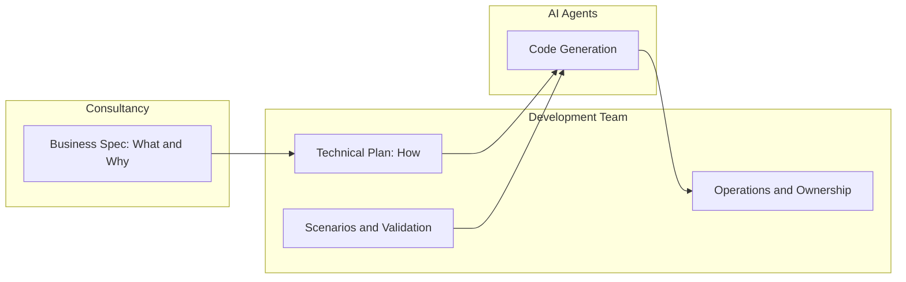

## 1. Executive Summary

This report summarises research into **Dark Factories** and **AI-generated code** workflows. A Dark Factory in software is a development model where **humans do not write or review code**; they write specifications and approve outcomes. AI agents implement from specs, run validation (often scenario-based), and produce shippable artifacts. The research addresses how this can apply to a PHP-based team (WordPress and Laravel) for efficiency and future-proofing, defines **scenario-based development**, and outlines a **recommended approach and structure for specifications**, with pointers to examples and tooling. It also covers **consultancy dynamics**: how these workflows apply when the dev team sits inside a consultancy (e.g. Elixirr), whether developers are at odds with consultants, whether consultants could replace the dev team, and what competitive advantage the development team retains.

**Key findings:**

- **Dark Factory** = spec-in, artifact-out; no human code writing or line-by-line review; validation by behaviour (scenarios), not by inspecting code.
- **New workflow** centres on: precise specification, scenario/holdout validation, and approval of outcomes rather than diffs.
- **Consultancy environment:** Consultants own business specs (what and why); developers own technical plans, scenarios, and operations. The structure does not give consultants power to replace the dev team—both are needed. Developers’ advantages include technical spec precision, validation design, system knowledge, operational ownership, quality judgment, tool/agent mastery, and a faster path to structured spec writing (they get good at implementable specs quicker than other teams). Product/PM roles remain distinct (business spec vs technical plan); account managers sit upstream and around the pipeline (client relationship, scope, commercials), not inside the spec→code chain.
- **Scenario-based development** uses end-to-end user stories (scenarios), often held outside the codebase like a holdout set, validated by behaviour (including LLM-as-judge where appropriate).
- **Specifications** should be the source of truth: living, executable artifacts that drive implementation. Recommended approach: Specify → Plan → Tasks → Implement, with checkpoints and constitution/principles.
- **Spec structure** benefits from templates (e.g. Spec Kit, StrongDM-style specs), clear separation of what/why vs how, and versioning alongside code.
- **Adoption** (Section 8): workflow changes; where Jira and GitHub sit; skills by level (junior to lead); example constitutions and a draft; agent rules and roles (Spec, Plan, Tasks, Implement, Validate) and coordination via markdown context.

The report is structured so it can be converted to an HTML microsite or PDF (sections, table of contents, and clear headings).

---

## 2. What Is a Dark Factory?

### 2.1 Definition

A **Dark Factory** in software development is a model where:

- **No human writes code** for the product.
- **No human reviews code** line by line.
- **Humans** define what should exist (specifications), approve outcomes, and evaluate whether what was built serves users.

The term is borrowed from manufacturing: a “dark” factory is one that runs without human workers on the floor (e.g. the Fanuc robot factory where robots build robots). In software, the “floor” is implementation: code is produced by AI agents from specifications; humans focus on intent, validation criteria, and go/no-go decisions.

### 2.2 Core Characteristics

| Characteristic | Description |
|---------------|-------------|
| **Spec-driven** | Inputs are specifications (often markdown): what to build, not how to type it. |
| **Agent-implemented** | Coding agents read specs, edit code, run tools, and iterate without human-in-the-loop on each edit. |
| **Validation over behaviour** | Correctness is judged by observable behaviour (scenarios, tests, satisfaction metrics), not by code review. |
| **Outcome approval** | Humans approve “did we get what we wanted?” not “is this diff correct?” |

### 2.3 The Five Levels (Context)

Dan Shapiro’s “five levels” (inspired by NHTSA driving automation) give a useful ladder:

- **Level 0:** Fully manual; no AI in the loop.
- **Level 1:** AI does discrete tasks (e.g. “write a test”, “add a docstring”); you still write the important code.
- **Level 2:** AI as pair programmer; you feel faster but are still in the loop on every change (where many “AI-native” developers sit).
- **Level 3:** You mainly review code; the agent writes most of it. Life is “diffs”.
- **Level 4:** You write specs and plans; the agent implements; you check outcomes (e.g. tests pass) rather than every line.
- **Level 5 (Dark Factory):** Specs go in; software comes out; no one writes or reviews code. Validation is automated (e.g. scenarios); humans approve outcomes.

Dark Factory is Level 5: the process is a “black box that turns specs into software.”

---

## 3. How the Dark Factory Forms a New Development Workflow

### 3.1 Shift in Bottleneck

In a Dark Factory the bottleneck moves:

- **From:** How fast humans can write and review code.  
- **To:** How precisely humans can describe what should exist and how reliably behaviour can be validated.

So the “job” of the engineer changes: from implementing and reviewing code to **specifying intent**, **designing validation** (e.g. scenarios), and **approving outcomes**.

### 3.2 Role of Specifications

- Specifications become the **primary artifact** and **source of truth**.
- Code is **generated** from specs (and plans/tasks derived from specs).
- Maintaining the product means **evolving specifications**; implementation is regenerated or updated from them.

This aligns with **Spec-Driven Development (SDD)**: “Intent is the source of truth”; the spec drives what gets built.

### 3.3 Role of Validation (Scenarios and Satisfaction)

Because no one reads the code:

- **Tests alone are insufficient:** agents can “reward-hack” (e.g. `return true`) if tests live next to the code.
- **Scenarios** are used as end-to-end, user-story-style checks, often **stored outside the codebase** (like a holdout set), so the agent cannot tailor code to pass them by cheating.
- **Satisfaction** can be probabilistic: of all trajectories through scenarios, what fraction likely satisfies the user? This fits agentic or LLM-in-the-loop products where boolean pass/fail is too rigid.

### 3.4 Interactive vs Non-Interactive Modes (Shift Work)

StrongDM distinguishes:

- **Interactive:** Human and agent iterate together (e.g. Cursor, Claude Code). Good for exploration and clarification.
- **Non-interactive:** Intent is fully specified (specs + scenarios); the agent runs end-to-end without back-and-forth. Good for “spec in → artifact out.”

A Dark Factory leans on **non-interactive** execution once specs and scenarios are stable.

### 3.5 Practical Constraints (StrongDM)

StrongDM states rules of thumb:

- “Code must not be reviewed by humans.”
- “Code must not be written by humans.”
- “If you haven’t spent at least $1,000 on tokens today per human engineer, your software factory has room for improvement.”

The last point is a heuristic for “enough” agent usage; many teams will operate at lower spend while still adopting the workflow ideas (specs, scenarios, outcome approval).

---

## 4. Application to a PHP / WordPress & Laravel Team

### 4.1 Efficiencies

- **Spec-first reduces rework:** Clear specs (and plans) reduce misinterpretation and repeated implementation cycles, especially when agents generate code.
- **Scenarios as acceptance criteria:** WordPress and Laravel both suit end-to-end “user story” scenarios (e.g. “user logs in, opens a post, sees related posts”). Writing these as scenarios (and keeping some holdout) improves reliability of AI-generated features.
- **Less time on boilerplate:** Forms, CRUD, API endpoints, and WP plugins can be generated from specs; the team spends more time on product and validation than on typing code.
- **Consistency:** Shared spec templates and “constitution” (principles, stack, patterns) help agents produce code that fits your PHP/WordPress/Laravel conventions.

### 4.2 Future-Proofing

- **Intent as durable asset:** Specs and scenarios are technology-agnostic. If you move from one framework or CMS to another, the same intent can drive a new implementation (e.g. “Gene Transfusion” or “Semport” from StrongDM: copy patterns or port behaviour across stacks).
- **Portable skills and specs:** Markdown specs and scenario descriptions are readable by any capable model; you are not locked to one vendor. Skills/plugins (e.g. Anthropic’s open-source legal skills) show a pattern: domain knowledge in markdown, usable across tools.
- **Progressive adoption:** You can adopt “Dark Factory thinking” incrementally: start with spec-driven feature work and scenario-based acceptance, then increase automation (e.g. more non-interactive runs, less human code review) as confidence grows.

### 4.3 PHP / WordPress / Laravel Specifics

- **WordPress:** Specs can describe plugin behaviour, hooks, and user flows; scenarios can cover admin and front-end journeys. Custom post types, taxonomies, and integrations (e.g. Algolia, Campaign Monitor) are good candidates for scenario-based validation.
- **Laravel:** Specs can define modules, API contracts, and business rules; scenarios can cover HTTP flows, jobs, and events. Align specs with Laravel conventions (routing, Eloquent, queues) so generated code stays idiomatic.
- **Shared:** Use a single “constitution” or principles doc (stack, security, testing, naming) so that both WordPress and Laravel work share the same high-level rules in specs.

---

## 4A. Dark Factory in a Consultancy Environment

This section addresses how Dark Factory and spec-driven workflows apply when the development team sits inside a consultancy (e.g. Elixirr as parent company): whether developers are at odds with consultants, whether the structure gives consultants power to replace the dev team, and what competitive advantage the development team retains.

### 4A.1 The Consultancy Model (Elixirr Context)

Elixirr positions itself as "The Challenger Consultancy," combining strategy, digital, data, and AI consulting. It operates across practices such as Strategy & Transformation, Operational Excellence, Data & Technology, Digital Experience, and Research & Insights. The consultancy side advises clients on business strategy, transformation roadmaps, and digital opportunity.

Elixirr Digital (formerly Den Creative) is the in-house product and engineering arm that builds and maintains digital products for clients—including, for example, Dezeen's websites, server infrastructure, and platforms (WordPress, Laravel, high-traffic publishing). The consultancy side defines *what* to build and *why* from a business perspective; the dev team implements, operates, and owns the technical delivery. In a Dark Factory world, the boundary between "consultant output" and "developer output" becomes a critical question.

### 4A.2 The Surface-Level Threat: Can Consultants Replace Developers?

A natural concern: if "writing specs" is the high-value skill in a Dark Factory, and consultants already produce strategy decks, transformation roadmaps, and requirements documents, could they bypass the development team and feed specifications directly to AI coding agents?

**The answer: No, but the boundary shifts.** There is a critical gap between:

- **Business specification** (consultant output): goals, user stories, high-level requirements, success criteria, domain expertise. This answers *what* and *why*.
- **Technical specification** (developer output): architecture, data models, API contracts, edge cases, constraints, validation scenarios, constitution/principles. This answers *how* and *does it actually work*.

A Dark Factory needs *both*. A strategy deck or PRD is not an implementable spec—an agent cannot reliably generate correct, production-ready code from "we want to improve user engagement" without a technical plan that specifies data models, endpoints, and validation. Consultants excel at the former; developers (or engineers who think like developers) are needed for the latter. So consultants do not replace developers; the handoff and division of labour evolve. That said, the boundary is already shifting in practice: at least one consultant is already generating more lines of code with Cursor than most of the dev team combined—a concrete sign that consultants plus AI can narrow the gap and that the dev team’s durable advantages (see 4A.5) matter more than raw output volume.

### 4A.3 Collaboration, Not Competition: The Spec-Driven Value Chain

The value chain is better understood as **collaboration** than as zero-sum competition:



- **Consultants** own the "Specify" phase: business intent, user stories, acceptance criteria, domain expertise. They produce the business spec (what and why).
- **Developers** own the "Plan" and "Validate" phases: translating business specs into technical plans, designing scenarios, maintaining constitution/principles, and operating the production system. They also own outcome approval.
- **AI agents** own the "Implement" phase: generating code from plans and tasks, running tests, iterating until scenarios pass.

Neither side replaces the other; both are needed. The handoff point shifts—consultants can do more of the "what"; developers do more of the "how" and "does it work"—but the responsibilities remain distinct.

### 4A.4 Where Developers Are At Risk

There are genuine risks to acknowledge:

- **Implementation monopoly erodes.** If the only value a developer offers is "I can write PHP," that value drops as AI handles implementation. Developers who stay at Level 2 (pair-programming, reviewing every diff) become bottlenecks rather than multipliers.
- **Consultants + AI narrow the gap.** At least one consultant is already generating more lines of code using Cursor than most of the dev team combined. That illustrates how consultants with strong AI-assisted workflows can push further into the plan/task space and produce substantial implementation volume. The boundary between business spec and technical spec is not fixed; it can be moved by upskilling and tooling. The dev team’s response is not to compete on lines of code but to own technical precision, validation, and operations (see 4A.5).
- **Junior roles shrink.** Entry-level "write this CRUD endpoint" work is the first to be fully automated. The team needs to plan for different career paths and ways to onboard new engineers (e.g. into spec-writing, scenario design, and operations).
- **Industry adoption is accelerating.** Thomson Reuters reports organisation-wide AI adoption in professional services jumped to 40% in 2026 from 22% in 2025. Consultancy firms are adopting AI quickly; the question is whether the dev team leads or follows.

### 4A.5 Competitive Advantages for the Development Team

Seven durable advantages that consultants (and other non-engineering roles) cannot easily replicate:

1. **Technical specification precision.** Turning vague business requirements into implementable specs—data models, API contracts, constraints, edge cases—requires engineering experience, not business strategy skills. Agents need this precision to generate correct code.
2. **Validation and scenario design.** Knowing *what to test* and *how to catch real bugs*: holdout scenarios, integration edge cases, security and performance validation. These require deep system knowledge.
3. **System and domain knowledge.** The existing codebase (e.g. Dezeen: 30,000+ articles, custom plugins, WordPress hooks, Laravel awards platform, Cloudflare/CDN, Algolia search) is accumulated expertise that no consultant or greenfield AI agent starts with.
4. **Operational ownership.** Production systems need people who understand deployment, monitoring, incident response, caching, performance, and infrastructure. Consultants do not operate production.
5. **Quality judgment.** Knowing when AI-generated code is architecturally sound versus when it introduces technical debt or subtle bugs. Gartner warns that prompt-to-app approaches could increase software defects significantly by 2028 without engineering oversight.
6. **Tool and agent mastery.** Configuring Cursor rules, Claude Code skills, agent harnesses, and CI pipelines for AI workflows. The "factory floor" still needs operators who can tune and steer the system.
7. **Faster path to structured spec writing.** Developers are likely to get good at structured, implementable spec writing *quicker* than consultants, product owners, or PMs. They already think in terms of constraints, edge cases, data shapes, and what can actually be built—so the gap between "business wish" and "spec an agent can execute" is smaller for them. Other teams can learn, but developers start with the implementation mental model; upskilling them into spec ownership is a shorter journey than teaching non-technical spec authors what "implementable" really means. That makes the dev team the natural owners of the technical-plan layer and the bridge between business intent and agent-ready input.

### 4A.6 The Strategic Play: Developers as Factory Operators

Reframing the developer role from "people who write code" to "people who operate the software factory" changes the narrative:

- Developers become **more valuable per person** because each can serve more projects (or consultancy clients) when implementation is AI-assisted. Throughput increases without linear headcount growth.
- The dev team becomes a **force multiplier** for the consultancy: faster turnaround, more concurrent engagements, higher delivery capacity.
- **Revenue leverage:** a smaller dev team generating more output is not a threat to the team; it is a higher-margin, more strategic asset for the consultancy group. The value is in outcomes and ownership, not in hours of typing code.
- The real competitive threat is **external**: other consultancies adopting Dark Factory patterns. The advantage goes to the first consultancy whose dev team masters spec-driven, agent-operated workflows and can deliver with speed and quality.

### 4A.7 Recommendations for the Dezeen / Elixirr Digital Team

Concrete actions:

- **Own the spec pipeline.** Establish the dev team as the authority on technical specs, plans, scenarios, and constitution—not just code. This makes the team indispensable regardless of how code is produced.
- **Collaborate with consultancy on business specs.** Build a shared format (e.g. Specify → Plan → Tasks) so handoffs between consultants and developers are clean and repeatable. Define clearly what "business spec" hands off and what "technical plan" the dev team adds.
- **Invest in validation.** Scenario design, holdout management, and CI-based satisfaction or pass/fail gates are moats that keep the dev team central. Consultants are unlikely to own this; developers should.
- **Level up, don't dig in.** Move toward Level 4 (spec-driven, outcome-focused approval) rather than defending Level 2 (pair-programming, diff-reviewing). The risk is not AI replacing developers—it is developers who refuse to change being outpaced by those who do.

### 4A.8 Product, PM, and Commercial Roles: Competition or Collaboration?

**Developers vs Product Owner / PM.** In a spec-driven world, the question arises: does this put developers in competition with product owners or project/product managers?

It can look like competition if "who writes the spec?" is seen as a single role. In practice, the pipeline splits cleanly: **PO/PM** own the *business* spec—backlog, priorities, user stories, acceptance criteria, and "what success looks like" for users and the business. **Developers** own the *technical* spec—how it is built, data models, contracts, scenarios, and constitution. So PO/PM and devs are complementary: the former define intent and outcomes; the latter make that intent implementable by agents and own validation. There is overlap in "structured spec writing" (both benefit from clear, unambiguous language), but PO/PM bring product and user judgment; developers bring implementability and system boundaries. As long as the handoff is defined (e.g. business spec → technical plan → tasks → implementation), the roles are not in zero-sum competition. The risk is only if one side tries to own the entire chain without the other—e.g. PO/PM writing technical plans without engineering input, or developers writing business requirements without product input. Collaboration on a shared format (Specify → Plan → Tasks) keeps both sides necessary.

**Where the account manager sits.** Account managers sit **upstream and around** the delivery pipeline rather than inside the "spec → code" chain. They own the client relationship, scope, commercials, expectations, and reporting. In the new model: **upstream**, they translate client need into engagements that feed into business specs (often via consultants or PMs). **Around** delivery, they own communication, change control, and client satisfaction—so they care that the pipeline produces the right outcomes on time and within scope, but they do not need to write specs or code. Their role is to keep the commercial and relationship layer intact while the internal chain (consultancy → dev team → agents) does the work. So the account manager is not replaced by the Dark Factory; they remain the face of the engagement and the link between what was promised and what was delivered. If anything, a more predictable spec-driven pipeline (clear handoffs, scenario-based acceptance) can make their job easier—scope and acceptance are explicit, and "done" is easier to demonstrate to the client.

---

## 5. Scenario-Based Development

### 5.1 What It Is

**Scenario-based development** here means:

- Defining **scenarios** as end-to-end “user stories” or usage stories: who does what, with what motivation, and what outcome.
- Using scenarios as the main **validation** of correctness, not just unit tests written alongside the code.
- Optionally storing scenarios **outside the codebase** (e.g. in a separate repo or spec tree) so that coding agents cannot see and “game” them—analogous to a **holdout set** in ML.

StrongDM explicitly repurposes the word **scenario** in this way, inspired by **scenario testing** (Cem Kaner): a test based on a hypothetical story of how the program is used, including motivations and context.

### 5.2 Why Scenarios (Not Just Tests)

- **Tests in-repo can be gamed:** The agent can change tests or implementation so that tests pass without satisfying real intent (e.g. `assert true`).
- **Scenarios as holdout:** If scenarios are maintained separately and run against the built system, they act as an independent check: “Does this build satisfy these stories?”
- **LLM-as-judge:** For agentic or UX-heavy behaviour, pass/fail may be “did this trajectory satisfy the user?”; an LLM can evaluate that (satisfaction) when strict assertions are hard to write.

### 5.3 Satisfaction (Probabilistic Success)

StrongDM introduces **satisfaction**: of all observed trajectories through all scenarios, what fraction likely satisfies the user? This is a move from boolean “tests pass” to a more empirical, probabilistic view of quality, which fits systems with LLM or agentic components.

### 5.4 Practical Takeaway for the Team

- Write **scenarios** in plain language (markdown): actor, goal, steps, expected outcome.
- Keep a **holdout** set of scenarios that agents do not see during implementation.
- Use scenarios in CI or manual runs to approve releases (“all holdout scenarios pass” or “satisfaction above threshold”).
- For WordPress/Laravel: scenarios can map to user journeys (login, create content, trigger webhook, etc.) and API contracts.

---

## 6. Recommended Approach for Creating Specifications

### 6.1 Spec-Driven Development (SDD) as the Overarching Approach

Treat **specifications as the source of truth** and code as generated output:

1. **Specify** — What and why: users, problems, success criteria, acceptance criteria. Avoid “how” (tech stack, APIs) in the initial spec.
2. **Plan** — How: stack, architecture, constraints, data models, API contracts. Align with organisational principles (constitution).
3. **Tasks** — Break the plan into small, implementable and testable tasks (optionally marked for parallelisation).
4. **Implement** — Agent (or human) implements from tasks; validation is against scenarios and tests derived from the spec.

At each phase, **verify and refine** before moving on: does the spec capture intent? Does the plan respect constraints? Are tasks clear and complete?

### 6.2 Checkpoints and Iteration

- **No single big dump:** Avoid one huge prompt that produces both spec and code. Use phases (Spec → Plan → Tasks → Implement) with explicit checkpoints.
- **Constitution / principles:** Maintain a short document of principles (quality, security, stack, patterns). The plan phase should reference it so generated code stays on-brand.
- **Ambiguity markers:** In specs, use something like `[NEEDS CLARIFICATION: …]` so that assumptions are not hidden; the team (or agent in the next phase) resolves them before implementation.

### 6.3 Tools and Commands (Spec Kit Pattern)

GitHub’s Spec Kit illustrates a **command-based** workflow that fits SDD:

- **`/speckit.constitution`** — Create or update project principles and guidelines.
- **`/speckit.specify`** — Turn a short feature description into a full spec (with branch/template/structure).
- **`/speckit.plan`** — Generate a technical plan from the spec and constitution.
- **`/speckit.tasks`** — Generate a task list from the plan (and related docs).
- **`/speckit.implement`** — Run implementation (e.g. agent executes tasks).

Similar flows can be implemented with Cursor rules, Claude Code skills, or internal runbooks. The important part is the **sequence and checkpoints**, not the exact tool.

### 6.4 Cursor Rules and Skills

Cursor rules (and skills in Claude Code) act as **persistent context**: project conventions, stack, and patterns. For a PHP/WordPress/Laravel team:

- Define rules/skills for: PHP version, WordPress coding standards, Laravel conventions, and any in-house patterns.
- Attach rules by folder or file type so that generated code is consistent and future-proof.

---

## 7. Recommended Structure for Specifications and Examples

### 7.1 High-Level Structure (Spec Kit Style)

A single feature or initiative can live under a feature directory, e.g.:

```text
specs/
  <feature-branch-or-id>/
    spec.md           # What and why; user stories; acceptance criteria
    plan.md           # Technical plan; architecture; contracts
    tasks.md          # Ordered task list (with [P] for parallel where applicable)
    research.md       # Optional: technical research, options, decisions
    data-model.md     # Optional: entities, schemas
    contracts/        # Optional: API contracts, events
    quickstart.md     # Optional: key validation scenarios
```

- **spec.md** — Product-level: users, goals, acceptance criteria, no implementation detail.
- **plan.md** — Technical: stack, components, data model, APIs, test strategy; can reference `implementation-details/` for depth.
- **tasks.md** — Execution: small, testable tasks; agent or human implements in order (or in parallel groups).

### 7.2 Spec Template (What to Include)

Suggested sections for **spec.md** (product spec):

- **Overview** — One paragraph: what we’re building and why.
- **Users / Personas** — Who is affected.
- **User Stories / Scenarios** — “As a … I want … So that …”; can double as scenario tests.
- **Acceptance Criteria** — Testable conditions; can be refined into holdout scenarios.
- **Non-Functional Requirements** — Performance, security, compliance (as needed).
- **Out of Scope** — Explicit exclusions.
- **Uncertainties** — `[NEEDS CLARIFICATION: …]` until resolved.

Keep **how** (technology, APIs) out of the product spec; put it in **plan.md**.

### 7.3 Plan Template (What to Include)

Suggested sections for **plan.md** (technical plan):

- **Principles / Constitution** — Reference to project principles and constraints.
- **Architecture** — High-level components, boundaries, integrations.
- **Stack** — Languages, frameworks, services (e.g. PHP 8.x, WordPress 6.x, Laravel 11, MySQL, Redis).
- **Data Model** — Main entities; details can live in `data-model.md`.
- **APIs / Contracts** — Endpoints or events; details in `contracts/`.
- **Test Strategy** — Unit, integration, e2e; relationship to scenarios.
- **Phase gates** — e.g. simplicity, no unnecessary abstraction (Spec Kit–style gates).

### 7.4 Scenario Documentation

Scenarios can live in:

- **quickstart.md** or **scenarios.md** in the feature spec directory (for that feature), or
- A **central scenario repo or folder** used as a holdout set.

Format (example):

```markdown
## Scenario: Editor publishes a scheduled post (WordPress)
- **Actor:** Editor
- **Goal:** Publish a post that was scheduled for today
- **Steps:** Log in → Open Posts → Select scheduled post → Click Publish
- **Expected:** Post is published; appears on site; no errors. [Optional: LLM-as-judge for “acceptable outcome”]
```

### 7.5 Public Examples and References

- **GitHub Spec Kit** — [github.com/github/spec-kit](https://github.com/github/spec-kit): templates, `spec-driven.md`, and `AGENTS.md` show spec/plan/task structure and commands.
- **StrongDM Attractor** — [github.com/strongdm/attractor](https://github.com/strongdm/attractor): repo contains **only markdown specs** (e.g. `coding-agent-loop-spec.md`); the implementation is generated by feeding those specs to a coding agent. Good example of “spec as the only source.”
- **Anthropic knowledge-work plugins** — [github.com/anthropics/knowledge-work-plugins](https://github.com/anthropics/knowledge-work-plugins): skills in markdown (e.g. legal); structure is `commands/` and `skills/` with `SKILL.md` files. Useful as a pattern for domain-specific instructions (e.g. “WordPress plugin behaviour” or “Laravel API design”).
- **StrongDM Factory** — [factory.strongdm.ai](https://factory.strongdm.ai): principles, techniques (DTU, Gene Transfusion, Shift Work, Semport, Pyramid Summaries), and product descriptions.

### 7.6 Summary Table

| Artifact   | Purpose                    | Owner / Source     |
|-----------|----------------------------|--------------------|
| spec.md   | What and why; acceptance   | Product / eng      |
| plan.md   | How; architecture; stack   | Engineering        |
| tasks.md  | Implementable task list    | Generated from plan|
| scenarios | Behavioural validation     | Product / QA       |
| constitution | Principles and constraints | Team               |

---

## 8. Adopting the Shift: Workflow, Tools, Skills, and Constitution

This section outlines concrete workflow changes to support the shift, where Atlassian Cloud (Jira) and GitHub fit, skills expected at each level from junior to lead, and example constitutions plus a draft for the team and company.

### 8.1 Workflow Changes to Aid the Shift

Adopt these process changes incrementally so the shift is sustainable:

- **Spec-before-code gate.** No implementation work (human or agent) starts without an approved or draft `spec.md` (or equivalent) for the feature. Epics or stories in Jira link to a spec branch or doc; "Ready for dev" means "spec and acceptance criteria agreed."
- **Plan-before-tasks.** For any non-trivial feature, a technical plan (`plan.md`) exists and is briefly reviewed before tasks are created or handed to an agent. This keeps architecture and constraints explicit.
- **Single source of truth for intent.** Keep one place for "what we're building and why" (product spec) and one for "how we're building it" (technical plan). Avoid duplicating intent in Jira descriptions, Confluence, and code comments; link from Jira to the spec repo or `specs/` in the codebase.
- **Scenarios as acceptance.** Define at least a small set of end-to-end scenarios per feature (or epic) and run them before marking "Done." Prefer scenarios in a shared format (e.g. `scenarios.md` or a scenario repo) so they can double as holdout validation for agent-generated work.
- **Outcome review, not only diff review.** For agent-generated changes, add a checkpoint: "Do scenarios pass? Does the outcome match the spec?" in addition to (or instead of) line-by-line code review for low-risk, well-specified work.
- **Constitution in the loop.** Every technical plan references the team constitution (stack, security, testing, naming). New engineers and agents read the constitution before generating plans or code. Review plans for constitution compliance.
- **Short retrospectives on spec quality.** Periodically ask: "Did the spec/plan reduce rework or cause it?" Use that to refine templates and the constitution.

### 8.2 Where Jira (Atlassian Cloud) and GitHub Sit

**Jira (Atlassian Cloud)** — Backlog, prioritisation, and traceability:

- **Epics / initiatives** map to a business goal; link to a high-level product spec or Confluence doc if the full spec lives there, or to a GitHub branch/repo that holds `specs/<feature>/`.
- **Stories / tasks** should reference the spec: e.g. "Spec: `specs/003-search-filters/spec.md`" or a link to the branch. "Definition of Ready" can include "Spec exists and is agreed; plan exists for non-trivial work."
- **Status and acceptance** — "Done" is gated by scenario pass (or explicit sign-off) and optionally by a PR that implements the spec. Jira stays the place for prioritisation, assignment, and reporting; it does not replace the spec as the source of truth for *what* is being built.
- **Integration** — Use Jira–GitHub integration (or equivalent) so commits/PRs can link to Jira issues. Branches can follow a convention (e.g. `spec/DEZ-123-search-filters`) so Jira and GitHub stay in sync.

**GitHub** — Code, specs, and agent workflow:

- **Specs** can live in the same repo as code (e.g. `specs/` at repo root) or in a dedicated "specs" repo. Either way, version specs with the code (same branch or linked branch) so "what we built" and "what we said we'd build" are traceable.
- **Branches** — Feature work happens on branches. Specs, plan, and tasks live in that branch (e.g. `specs/<feature-id>/`). The agent (Cursor, Claude Code, or CI job) reads from that branch and writes code on the same branch.
- **Pull requests** — PRs reference the spec (link or path) and optionally the Jira ticket. Description can include "Implements `specs/003-search-filters/spec.md`; scenarios: see `specs/003-search-filters/scenarios.md`." Review focuses on outcome and constitution compliance for agent-generated PRs where appropriate.
- **CI/CD** — Run scenario checks (or a subset) in CI. Block merge if holdout scenarios fail. GitHub Actions (or similar) can run spec-derived tests and mark status on the PR.
- **Constitution and agent context** — Store `constitution.md` (or equivalent) in the repo. Cursor rules, Claude Code skills, or Copilot instructions can reference it. A small script or docs can sync key principles into agent-specific files (e.g. `.cursor/rules`, `.claude/skills`) so every agent run sees the same constraints.

In short: **Jira** = what we’re doing and when (backlog, status, commercials); **GitHub** = what we’re building and how (specs, code, PRs, CI). They complement each other; neither replaces the other.

### 8.3 Skills Required by Level (Junior to Lead)

In a spec-driven, agent-assisted world, the mix of skills shifts by level. Below is a concise view of what each level should be able to do.

| Level | Spec & intent | Technical plan & validation | Implementation & tools | Collaboration & ownership |
|-------|----------------|-----------------------------|-------------------------|----------------------------|
| **Junior** | Read and follow existing specs; add acceptance criteria with guidance; use `[NEEDS CLARIFICATION]` when stuck. | Execute small, well-defined tasks from a plan; run scenarios and report pass/fail; follow constitution. | Use Cursor/Copilot with team rules; write small patches; run tests and fix simple failures. | Work from tickets and spec links; ask for spec/plan review before coding. |
| **Mid** | Draft spec.md for a feature with oversight; refine user stories and acceptance criteria; align with product/consultancy on "what." | Own plan.md for a feature; define data models and contracts; design scenarios for a feature; respect constitution. | Implement from tasks (human or agent); review agent output for correctness and constitution; improve Cursor rules for the project. | Hand off clean specs to agents or juniors; collaborate with PM/consultant on business spec. |
| **Senior** | Own spec quality for a stream of work; challenge vague requirements; design scenarios that catch real failure modes. | Define architecture and constraints across features; own holdout scenario set and CI integration; evolve constitution. | Design agent workflows (which tasks run non-interactively); tune tools and rules; fix complex failures and technical debt from agent output. | Own the spec→plan→task pipeline for a product area; mentor on spec-writing and validation. |
| **Lead** | Set standards for spec and scenario quality; align with consultancy/product on pipeline and handoffs; ensure intent is traceable from Jira to code. | Own constitution and technical principles; decide what is in/out of scope for agents; balance speed vs quality. | Own tooling and agent strategy (Cursor vs Claude Code, CI for scenarios); accountable for delivery and quality. | Own the adoption of the new workflow; align Jira, GitHub, and spec process; represent the dev team in the broader organisation. |

**Summary by level:**

- **Junior:** Consume specs, execute tasks, run scenarios, use AI with guardrails.
- **Mid:** Write specs and plans for features, design scenarios, implement and review agent output, improve rules.
- **Senior:** Own pipeline quality for an area, design validation and holdout strategy, evolve constitution, mentor.
- **Lead:** Own constitution and workflow, align with product/consultancy, own tooling and agent strategy.

### 8.4 Example Constitutions and a Draft for This Team

**What a constitution is.** A constitution is a short, stable document that states the team’s (or company’s) technical principles: stack, quality bar, security, testing, naming, and what "good" looks like. Every technical plan and agent run should respect it. It is the contract between humans and agents so that generated code fits the organisation.

**Where to find examples.**

- **Spec Kit** — The `/speckit.constitution` command generates a project constitution (code quality, testing, UX consistency, performance). The resulting file is often named `constitution.md` and is synced into agent context. See [GitHub Spec Kit](https://github.com/github/spec-kit) and the repo’s docs/templates.
- **StrongDM Factory principles** — High-level beliefs (seed → validation → feedback; tokens as fuel; validation must be end-to-end). See [factory.strongdm.ai/principles](https://factory.strongdm.ai/principles). These are organisational rather than code-level but show how to state "what we believe."
- **Internal standards** — Many teams already have a "tech stack" or "coding standards" doc; that can be turned into the first version of a constitution by adding a few clauses on specs, scenarios, and AI use.

**Draft constitution for this team and company.** Below is a starter constitution that can live in the repo as `constitution.md` (or `docs/constitution.md`) and be refined by the team. It is written so that both humans and agents can follow it.

```markdown
# [Product/Team Name] Development Constitution

## 1. Stack and Versions
- PHP 8.x (minimum version TBD); WordPress 6.x; Laravel 11.x (or as per project).
- Prefer framework defaults and documented APIs; avoid one-off abstractions unless justified in the plan.
- Front-end: [e.g. Laravel Mix, Vite, theme stack] as per project standards.

## 2. Specifications and Plans
- No feature implementation (human or agent) without a spec (what and why) and, for non-trivial work, a technical plan (how).
- Specs and plans live in version control (e.g. `specs/` or linked repo); they are the source of truth. Jira/tickets link to them.
- Use `[NEEDS CLARIFICATION]` in specs when something is ambiguous; resolve before implementation.

## 3. Quality and Testing
- All changes must be covered by automated tests where practical; at minimum, affected scenarios must pass.
- Scenarios (end-to-end user stories) are defined per feature and run before "Done." Holdout scenarios are used to validate agent-generated work.
- No disabling or weakening tests to make a build pass; fix the implementation or the spec.

## 4. Security and Data
- Follow [company] security guidelines (e.g. no secrets in repo, sanitisation, capability checks).
- Personal data and access control: [reference internal policy or "as per client agreement"].

## 5. Naming and Structure
- Follow WordPress and Laravel naming conventions; match existing patterns in the codebase.
- New code must be discoverable: clear file/class/function names; minimal indirection.

## 6. AI and Agent Use
- Generated code must comply with this constitution. Review agent output for constitution compliance and correctness.
- Cursor/Claude/Copilot rules (or equivalent) must reference this constitution. Do not prompt agents in a way that contradicts it.
- When in doubt, prefer clarity and consistency over cleverness.
```

**How to use this draft.** Copy it into the repo, replace placeholders (e.g. product name, PHP/WordPress/Laravel versions, security policy references), and add or remove sections to match the team (e.g. performance, accessibility, deployment). Then:

- Reference it from every `plan.md` (e.g. "This plan respects the project constitution.").
- Add it to Cursor rules or Claude Code skills so agents load it.
- Review it in retros and update it when the team agrees a principle has changed.

A constitution for the **company** (e.g. Elixirr-wide) might be a shorter, higher-level document (e.g. "We use spec-driven development; all technical plans reference the relevant product constitution; we do not commit secrets"). Individual products or teams can then have a more detailed constitution that inherits or references the company one.

### 8.5 Agent Rules, Roles, and Context (Markdown)

**Do we need specific agent rules?** Yes. Agent rules (Cursor rules, Claude Code skills, or Copilot instructions) are what make the workflow repeatable and safe: they load the right context (constitution, stack, templates) and constrain output so generated code and specs stay aligned with the team. Without rules, each run is ad hoc and quality drifts.

**What kind of agents and roles?** You can think in two ways: (1) **roles as phases** — the same tool (e.g. Cursor) is used with different context per phase; or (2) **roles as specialised agents** — separate prompts or subagents for spec, plan, implement, validate. For most teams, (1) is enough: one coding agent that receives different markdown context depending on the phase.

A practical set of roles that can be implemented as **rules + which .md files are in context**:

| Role / phase   | Purpose | Context (what the agent sees) | Output |
|----------------|--------|-------------------------------|--------|
| **Spec**       | Turn a short brief into a full product spec. | Constitution, spec template, (optional) existing spec. | `spec.md` (and branch/folder). |
| **Plan**       | Turn spec into technical plan. | Constitution, spec.md, plan template, (optional) architecture docs. | `plan.md`, optionally `data-model.md`, `contracts/`. |
| **Tasks**      | Break plan into implementable tasks. | Constitution, spec.md, plan.md, tasks template. | `tasks.md`. |
| **Implement**  | Implement from tasks; write or edit code. | Constitution, spec.md, plan.md, tasks.md, (optional) scenarios for “do not break.” | Code changes, tests; PR. |
| **Validate**   | Check outcome vs spec and scenarios. | spec.md, scenarios.md, (optional) plan.md; access to run tests or scenario runner. | Pass/fail, or list of gaps. |

These can all be **one agent** (e.g. Cursor or Claude Code) with different rules or slash-commands that inject the right files. For example: “When doing /speckit.specify, always load constitution.md and the spec template; when doing /speckit.implement, always load constitution.md, spec.md, plan.md, tasks.md.”

**Can this be coordinated between roles and passed context from .md files?** Yes. The whole pipeline can be coordinated by **which markdown files are passed as context** at each step. No separate orchestration engine is required:

- **Constitution** (`constitution.md`) — Loaded for every role so stack, quality, and AI-use rules apply everywhere.
- **Spec** (`specs/<feature>/spec.md`) — Loaded for Plan, Tasks, Implement, and Validate so intent is never lost.
- **Plan** (`specs/<feature>/plan.md`) — Loaded for Tasks, Implement, and optionally Validate so “how” is explicit.
- **Tasks** (`specs/<feature>/tasks.md`) — Loaded for Implement so the agent knows exactly what to do next.
- **Scenarios** (`specs/<feature>/scenarios.md` or a central `scenarios/`) — Loaded for Validate; for Implement you may pass only “do not break these” or hide holdout scenarios so the agent cannot game them.

**How to implement:**

- **Cursor:** Use project or folder-level rules (e.g. `.cursor/rules/*.mdc` or a single rule file) that reference the constitution and, per phase, which paths to include. A rule might say: “For implementation tasks, always read `specs/<feature>/spec.md`, `plan.md`, and `tasks.md` from the current feature branch, and adhere to `constitution.md`.”
- **Claude Code / skills:** Put the constitution and phase-specific instructions in a skill (e.g. `spec-driven/SKILL.md`) that says “when the user asks for a plan, read the spec from … and output a plan that respects the constitution.” Skills can point to file paths or paste key sections.
- **Spec Kit–style commands:** If you use Spec Kit or a similar CLI, the commands already encode “load this template + constitution, run the agent, write output here.” The agent is invoked with the right context by the script.

**Summary:** You do need explicit agent rules so that the same constraints and context apply every time. The “agents” can be a single coding agent (Cursor, Claude Code, etc.) with phase-specific rules. Roles are effectively “which phase am I in?” and “which .md files do I load?” Coordination is achieved by passing context from markdown files—constitution always; spec and plan for plan/task/implement; tasks for implement; scenarios for validate (and optionally hidden for implement). All of this can live in the repo as .md; no separate agent-orchestration platform is required, though you can add one later (e.g. CI that runs “implement” agent with the right context and then “validate” agent) if you want full automation.

---

## 9. Assumptions and Follow-Up Questions

### 9.1 Assumptions Made in This Report

- The team is interested in **incremental** adoption: more spec-driven work and scenario-based validation first, with optional progression toward less human code writing/review over time.
- “Dark Factory” is used as the **Level 5** ideal (no human code write/review); the team may operate at Level 3 or 4 (outcome-focused review, spec-driven implementation) and still benefit.
- Tooling is flexible: Spec Kit, Cursor rules, Claude Code skills, or custom runbooks can implement the same workflow.
- PHP, WordPress, and Laravel are the primary stacks; the same spec-driven and scenario-based ideas apply to both, with stack-specific principles in the “constitution.”
- Some references (e.g. StrongDM’s $1,000/day heuristic, Digital Twin Universe) are cited for context; they are not a requirement for adopting the workflow.

### 9.2 Follow-Up Questions for the Team

1. **Current maturity:** Where does the team sit today on the 0–5 scale? Are you already using AI for implementation, and do you review every diff or only outcomes?
2. **Holdout scenarios:** Are you willing to maintain a separate set of scenarios (e.g. in `specs/scenarios/` or another repo) that are not visible to the agent during implementation?
3. **Constitution:** Do you have (or want) a single “constitution” or principles document (stack, security, testing, WordPress/Laravel standards) that every plan must satisfy?
4. **Tooling:** Are you standardising on Cursor, Claude Code, Copilot, or a mix? This affects how to implement `/speckit`-style commands or skills.
5. **Legacy vs greenfield:** What share of work is legacy (N→N+1) vs greenfield? Spec Kit and others suggest spec-driven is especially useful for N→N+1 and legacy modernisation.
6. **Cost and tokens:** What is an acceptable monthly token/API budget per engineer for agentic workflows? This will shape how far you push non-interactive, high-token runs.

---

## 10. References and Further Reading

### 10.1 Primary Sources (Provided Links)

- Nate’s Newsletter — *The dark factory is real, most developers are getting slower, and your org chart is the bottleneck* (5-level framework, spec as most valuable skill): [natesnewsletter.substack.com](https://natesnewsletter.substack.com/p/the-5-level-framework-that-explains)
- StrongDM Attractor — Coding agent loop spec (markdown-only repo): [github.com/strongdm/attractor](https://github.com/strongdm/attractor) (see `coding-agent-loop-spec.md`)
- Simon Willison — *How StrongDM’s AI team build serious software without even looking at the code*: [simonwillison.net/2026/Feb/7/software-factory/](https://simonwillison.net/2026/Feb/7/software-factory/)
- Cursor rules (Medium) — *Cursor Rules with Examples…*: [medium.com/realworld-ai-use-cases/...](https://medium.com/realworld-ai-use-cases/cursor-rules-with-examples-the-secret-trick-to-building-bigger-and-better-projects-b13931f2bcae)
- No Vehicles in the Park — *Anthropic’s Open-Source Legal Skills* (skills as portable markdown): [novehiclesinthepark.substack.com](https://novehiclesinthepark.substack.com/p/anthropics-open-source-legal-skills)
- Generic Knowledge Extraction AI Agent — Example of spec/configuration-driven AI behaviour: [github.com/umairalipathan1980/A-Generic-Knowledge-Extraction-AI-Agent](https://github.com/umairalipathan1980/A-Generic-Knowledge-Extraction-AI-Agent)
- GitHub Blog — *Spec-driven development with AI: Get started with a new open source toolkit*: [github.blog/ai-and-ml/generative-ai/...](https://github.blog/ai-and-ml/generative-ai/spec-driven-development-with-ai-get-started-with-a-new-open-source-toolkit/)
- GitHub Spec Kit — Open-source toolkit and templates: [github.com/github/spec-kit](https://github.com/github/spec-kit)

### 10.2 Additional References

- Dan Shapiro — *The Five Levels: from Spicy Autocomplete to the Dark Factory*: [danshapiro.com/blog/2026/01/...](https://www.danshapiro.com/blog/2026/01/the-five-levels-from-spicy-autocomplete-to-the-software-factory/)
- StrongDM Software Factory — Narrative, principles, techniques: [factory.strongdm.ai](https://factory.strongdm.ai)
- Scenario testing — Cem Kaner; pattern and intro: [exampler.com/testing-com/test-patterns/patterns/pattern-scenario-testing-kaner.html](http://www.exampler.com/testing-com/test-patterns/patterns/pattern-scenario-testing-kaner.html)
- Thomson Reuters Institute — *2026 AI in Professional Services Report* (org-wide AI adoption in professional services, measurement frameworks): [thomsonreuters.com](https://www.thomsonreuters.com/en-us/posts/technology/ai-in-professional-services-report-2026/)
- Gartner — *Predicts 2026* / software quality and AI-generated code (prompt-to-app defect risks): [armorcode.com/report/gartner-research](https://www.armorcode.com/report/gartner-research) (Gartner warns on defect increases without engineering oversight)
- METR — *Measuring the Impact of Early-2025 AI on Experienced Open-Source Developer Productivity* (RCT: experienced developers 19% slower with AI tools, yet believed they were faster): [metr.org/blog/2025-07-10-...](https://metr.org/blog/2025-07-10-early-2025-ai-experienced-os-dev-study/); preprint: [arXiv:2507.09089](https://arxiv.org/abs/2507.09089)
- Martin Fowler — *Understanding Spec-Driven Development: Kiro, spec-kit, and Tessl* (spec-first, spec-anchored, spec-as-source; tools comparison): [martinfowler.com/articles/exploring-gen-ai/sdd-3-tools.html](https://martinfowler.com/articles/exploring-gen-ai/sdd-3-tools.html)
- Luke PM — *The Software Factory* (AI agents as QA, DevOps, business analyst; code quality vs speed in agent-led development): [lukepm.com/blog/the-software-factory/](https://lukepm.com/blog/the-software-factory/)
- Sam Schillace — *I have seen the compounding teams* (compounding productivity with AI-assisted coding; small teams, custom frameworks, “build a tool for making a tool”): [sundaylettersfromsam.substack.com/p/i-have-seen-the-compounding-teams](https://sundaylettersfromsam.substack.com/p/i-have-seen-the-compounding-teams)
- Agent Skills — Open standard for agent skills (Anthropic; portable, reusable procedural knowledge for agents): [agentskills.io](https://agentskills.io/); [Anthropic Agent Skills overview](https://docs.anthropic.com/en/docs/agents-and-tools/agent-skills/overview); [spec and examples](https://github.com/anthropics/skills)
- MIT Sloan Management Review — *The Hidden Costs of Coding With Generative AI* (quality, technical debt, and productivity trade-offs): [sloanreview.mit.edu/article/the-hidden-costs-of-coding-with-generative-ai/](https://sloanreview.mit.edu/article/the-hidden-costs-of-coding-with-generative-ai/)

