<figure class="report-section-image-wrapper" aria-labelledby="fig-standard-workflow-caption">
  
  <figcaption id="fig-standard-workflow-caption">Eleven-phase project path from estimation to post-launch support</figcaption>
</figure>

# 1. Standard Agency Workflow

This section maps the canonical flow that most design-and-build agencies follow for a mid-sized project (8–16 weeks). Variations exist, but the phases and handoff points are broadly consistent across the industry.

## The 11-Phase Flow

```mermaid
flowchart LR
  subgraph PreSale[Pre-Sale]
    EST[1. Estimation &\nScoping]
  end
  subgraph Discovery[Discovery]
    BRIEF[2. Briefing &\nDiscovery]
    IA[3. IA &\nContent Plan]
  end
  subgraph Design[Design]
    UX[4. UX / UI\nDesign]
  end
  subgraph Planning[Planning]
    SPEC[5. Technical\nSpec & Plan]
  end
  subgraph Build[Build]
    DEV[6. Development]
    CONTENT[7. Content\nPopulation]
  end
  subgraph QA[QA & Launch]
    TEST[8. QA &\nTesting]
    TRAIN[9. Client\nTraining]
    LAUNCH[10. Delivery\n& Launch]
  end
  subgraph Post[Post-Launch]
    SUPPORT[11. Support &\nGovernance]
  end
  EST --> BRIEF --> IA --> UX --> SPEC --> DEV --> CONTENT --> TEST --> TRAIN --> LAUNCH --> SUPPORT
```

---

## Phase 1: Estimation and Scoping

**When:** Pre-sale, before any contract is signed.

**What happens:**
- Account manager or sales lead receives a brief (formal or informal) from a prospect or existing client.
- A senior dev/tech lead and a designer review the brief and produce a high-level estimate.
- Estimate covers: hours by discipline (design, dev, PM, QA, content), timeline, assumptions, exclusions, and risks.
- Output is a proposal or SOW with pricing, often T&M or fixed-price.

**Typical deliverables:**
- Proposal / SOW document
- High-level sitemap or scope list
- Ballpark timeline (Gantt or milestone-based)
- Assumptions and exclusions register

**Standard timeline:** 2–5 days (often under time pressure; estimates are frequently done in <1 day).

**Who is involved:** Account manager, tech lead, design lead, sometimes PM.

---

## Phase 2: Briefing and Discovery

**When:** First 1–2 weeks after contract sign-off.

**What happens:**
- Kickoff workshop (60–90 min) with client stakeholders: objectives, audiences, success metrics, constraints.
- Audit of existing site (if redesign): content inventory, analytics review, technical audit, competitive scan.
- Define measurement plan (conversion events, KPIs).
- Stakeholder mapping: who approves what, and at which gate.
- Output: a discovery document or brief that anchors all subsequent work.

**Typical deliverables:**
- Discovery document (goals, audiences, constraints, risks)
- Content and technical audit (for redesigns)
- Competitive/category scan
- Measurement plan
- Stakeholder and approval matrix

**Standard timeline:** 1–2 weeks.

**Who is involved:** PM, design lead, tech lead, client stakeholders, sometimes content strategist.

---

## Phase 3: Information Architecture and Content Planning

**When:** Weeks 2–4.

**What happens:**
- Sitemap creation: page hierarchy, navigation structure, user journeys.
- Page intent definitions: what each page must communicate and what action the user should take.
- Content plan: section-by-section outline per page, content sources, asset requirements (photography, video, icons, copy).
- SEO alignment: keyword mapping to pages, URL structure, redirect plan (for redesigns).
- Content collection begins (client provides raw copy, imagery, data).

**Typical deliverables:**
- Sitemap (visual or spreadsheet)
- Page intent / wireframe briefs
- Content plan (per-page section outlines)
- SEO/keyword map
- Redirect plan (redesigns)
- Asset requirements list

**Standard timeline:** 1–2 weeks (often overlaps with early design).

**Who is involved:** Content strategist, UX designer, SEO specialist, PM, client content owners.

---

## Phase 4: UX and UI Design

**When:** Weeks 3–7 (overlaps with IA on the front end, development on the back end).

**What happens:**
- Wireframes or layout studies for core templates (homepage, service page, article, listing, contact).
- Component design system: cards, CTAs, forms, navigation, accordions, modals.
- Visual design: brand application, typography, colour, spacing, imagery style.
- Responsive behaviour defined (desktop, tablet, mobile).
- Design QA: grid consistency, component states (hover, error, empty, loading), accessibility (contrast, focus).
- Client review rounds (typically 2, with a change-order gate for further rounds).

**Typical deliverables:**
- Wireframes (low-fidelity)
- UI designs (high-fidelity, Figma/Sketch)
- Design system / component library
- Responsive specifications
- Design QA checklist (states, accessibility, edge cases)

**Standard timeline:** 3–5 weeks.

**Who is involved:** UX/UI designers, creative director, PM, client approvers.

---

## Phase 5: Technical Specification and Planning

**When:** Weeks 5–6 (starts once core design is in review; runs parallel to late-stage design).

**What happens:**
- Translate approved designs and content plan into a technical specification.
- Define: CMS architecture (content types, fields, taxonomies), integrations (forms, CRM, analytics, search, CDN), hosting/infrastructure, performance targets.
- Data model and API contracts (if headless or decoupled).
- Task breakdown: tickets or spec-driven tasks for the build phase.
- Identify risks, dependencies, and third-party constraints.

**Typical deliverables:**
- Technical specification document (or `spec.md` + `plan.md` in a spec-driven workflow)
- CMS architecture / content model
- Integration requirements
- Task breakdown (Jira tickets, `tasks.md`, or sprint plan)
- Risk register

**Standard timeline:** 1–2 weeks.

**Who is involved:** Tech lead, senior developer(s), PM, sometimes design lead for CMS/component alignment.

---

## Phase 6: Development (Build)

**When:** Weeks 6–11 (the largest phase by hours).

**What happens:**
- Environment setup: repo, CI/CD, staging, local dev tooling.
- Theme/framework scaffolding.
- Component build from design system (templates, blocks, partials).
- CMS setup: content types, fields, custom post types, taxonomies, admin UI.
- Integration work: forms, search, CRM, analytics, third-party APIs.
- Performance and accessibility checks during build (not just at QA).
- Regular staging deployments and internal reviews.

**Typical deliverables:**
- Working staging site
- CMS configured and ready for content entry
- Integrated third-party services
- Internal dev QA pass

**Standard timeline:** 4–6 weeks (varies enormously by scope).

**Who is involved:** Developers (front-end, back-end), tech lead, PM, QA (informal during build).

---

## Phase 7: Content Population and Migration

**When:** Weeks 9–12 (overlaps with late build and QA).

**What happens:**
- Content entry into the CMS: pages, posts, media, metadata.
- For redesigns: content migration from old CMS (manual, scripted, or tool-assisted).
- SEO metadata entry (titles, descriptions, OG tags).
- Image optimisation and alt text.
- Content review by client (accuracy, tone, completeness).
- Handling edge cases: legacy content, broken links, orphaned media.

**Typical deliverables:**
- Populated staging site with real content
- Migration scripts (if applicable)
- Content sign-off from client

**Standard timeline:** 1–3 weeks (frequently the bottleneck — client-dependent).

**Who is involved:** Content team (agency or client), PM, developer (for migration scripts), SEO specialist.

---

## Phase 8: QA and Testing

**When:** Weeks 11–13 (overlaps with content population tail).

**What happens:**
- Functional testing: forms, navigation, search, interactive components, CMS admin.
- Cross-browser and cross-device testing.
- Performance testing (Core Web Vitals, Lighthouse, load testing).
- Accessibility testing (WCAG 2.2, keyboard navigation, screen reader).
- Security review (dependencies, admin access, headers, input validation).
- Bug triage, fix, retest cycle.

**Typical deliverables:**
- QA report (bugs logged, severity, status)
- Performance audit results
- Accessibility audit results
- Sign-off checklist

**Standard timeline:** 1–2 weeks.

**Who is involved:** QA (dedicated or developer-led), PM, tech lead, client (for UAT).

---

## Phase 9: Client Training

**When:** Week 12–13 (before or at launch).

**What happens:**
- CMS training session(s): content editing, media management, publishing workflow.
- Documentation: CMS user guide, content guidelines, component usage rules.
- Admin user setup and permissions.
- Walkthrough of any custom functionality or integrations.

**Typical deliverables:**
- Training session(s) (live or recorded)
- CMS user guide / documentation
- Admin credentials and permission setup

**Standard timeline:** 1–3 days (often compressed).

**Who is involved:** PM, developer or CMS specialist, client content team.

---

## Phase 10: Delivery and Launch

**When:** Week 13 (or agreed launch date).

**What happens:**
- Pre-launch checklist: DNS, SSL, redirects, analytics, sitemap submission, robots.txt, caching, CDN.
- Final content review and sign-off.
- Go-live (DNS switch or deployment to production).
- Post-launch smoke testing: critical paths, forms, search, analytics firing.
- Client notification and communication plan.

**Typical deliverables:**
- Production site live
- Launch checklist (completed)
- Post-launch smoke test results
- Handover documentation (hosting, credentials, support contacts)

**Standard timeline:** 1–2 days.

**Who is involved:** Tech lead, DevOps/hosting, PM, client, account manager.

---

## Phase 11: Post-Launch Support and Governance

**When:** Ongoing after launch.

**What happens:**
- Hypercare period (typically 2–4 weeks): priority bug fixes, performance monitoring.
- Transition to BAU support (retainer, ticket-based, or ad-hoc).
- Governance: content publishing standards, component usage rules, performance monitoring, security updates.
- Backlog of improvements based on real usage data (analytics, heatmaps, feedback).

**Typical deliverables:**
- Hypercare support (defined SLA)
- Governance document
- Improvement backlog
- Ongoing retainer or support contract

**Standard timeline:** 2–4 weeks hypercare, then ongoing.

**Who is involved:** PM, developers, client content team, account manager.

---

## Typical Timeline (Mid-Sized Build)

| Week | Phase |
|------|-------|
| 0 | Estimation and scoping (pre-sale) |
| 1–2 | Briefing and discovery |
| 2–4 | IA and content planning |
| 3–7 | UX/UI design |
| 5–6 | Technical specification |
| 6–11 | Development |
| 9–12 | Content population |
| 11–13 | QA and testing |
| 12–13 | Client training |
| 13 | Launch |
| 13–17 | Post-launch support |

Phases overlap heavily. The critical path typically runs: discovery → design → build → QA → launch. Content population is the most common external dependency and the most frequent cause of launch delays.
