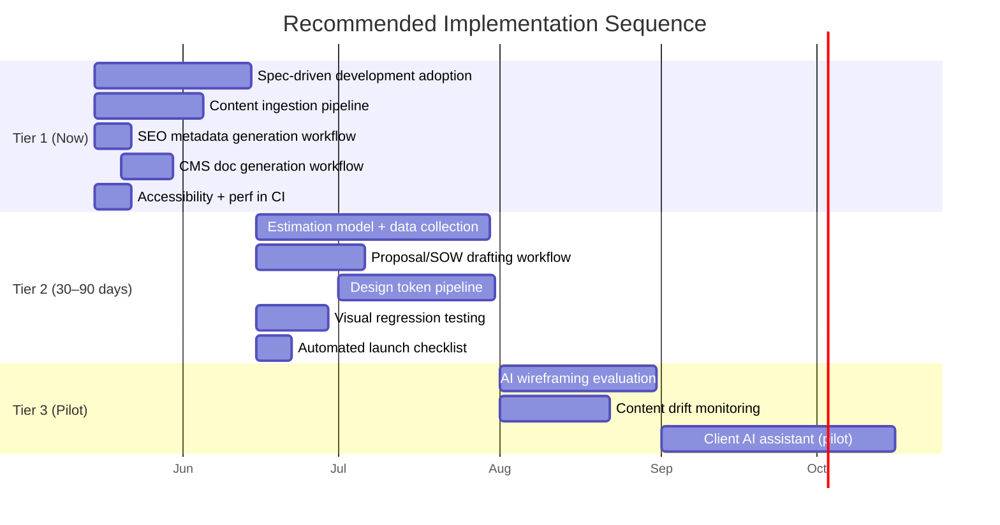

<figure class="report-section-image-wrapper" aria-labelledby="fig-recommendations-caption">
  
  <figcaption id="fig-recommendations-caption">Engineer's workbench with tools arranged by priority tier</figcaption>
</figure>

# 4. Prioritised Recommendations

Interventions ranked by **expected impact on margin, quality, and delivery speed** — weighted for the Elixirr Digital context (WordPress/Laravel, consultancy model, existing tooling).

## Priority Tiers

### Tier 1: High Impact, Ready Now (0–30 days)

These require minimal new tooling. The constraint is process adoption, not technology.

| # | Intervention | Phase | Expected Impact | Effort |
|---|-------------|-------|----------------|--------|
| 1 | **Adopt spec-driven development** (Specify → Plan → Tasks) with LLM assistance | 5. Technical Spec | Reduces build-phase rework by 30–50%; makes agent-assisted coding dramatically more effective | Medium — templates, rules, team training |
| 2 | **Build a content ingestion pipeline** (source → LLM transform → dry-run → WP-CLI import) | 7. Content Population | Reduces content population time by 60–80%; removes the most common launch blocker | Medium — scripts, templates, per-project config |
| 3 | **Auto-generate SEO metadata** (titles, descriptions, alt text) from page content | 7. Content Population | Saves 1–2 days per project; improves SEO baseline consistency | Low — prompt workflow + spot-check review |
| 4 | **Auto-generate CMS documentation** from the content model | 9. Training | Eliminates the most commonly skipped deliverable; reduces post-launch support load | Low — prompt workflow, template |
| 5 | **Integrate accessibility and performance checks into CI** (axe-core, Lighthouse CI) | 8. QA | Catches issues during build instead of QA; reduces late-stage bug cost | Low — CI config only |

### Tier 2: High Impact, Requires Setup (30–90 days)

These need some infrastructure, tooling, or process change before they deliver value.

| # | Intervention | Phase | Expected Impact | Effort |
|---|-------------|-------|----------------|--------|
| 6 | **Estimation model from historical data** (time-tracking → calibrated ranges) | 1. Estimation | Improves margin accuracy; reduces under-scoping | Medium — requires clean time data and a model |
| 7 | **AI-assisted proposal/SOW drafting** from structured scope inputs | 1. Estimation | Reduces proposal turnaround from days to hours | Medium — templates, prompt workflows, review process |
| 8 | **Design-to-dev token pipeline** (Figma → Tokens Studio → code) | 4. Design → 6. Build | Reduces handoff loss; improves design-build consistency | Medium — tooling setup, design team adoption |
| 9 | **Visual regression testing** (Percy/BackstopJS in CI) | 8. QA | Catches unintended visual changes automatically | Medium — setup, baseline capture, CI integration |
| 10 | **Automated launch checklist** (runnable script/CI job) | 10. Launch | Eliminates checklist gaps; makes launch repeatable | Low–Medium — script the current manual checklist |

### Tier 3: Medium Impact, Emerging (90+ days / pilot)

Worth exploring but not yet reliable enough or high-enough impact to prioritise.

| # | Intervention | Phase | Expected Impact | Effort |
|---|-------------|-------|----------------|--------|
| 11 | **AI-generated wireframes/layouts** from page intents | 4. Design | Could reduce wireframing time; quality still requires heavy human refinement | Medium — tool evaluation, workflow design |
| 12 | **Content quality drift detection** (post-launch automated audits) | 11. Post-Launch | Catches governance failures early | Medium — monitoring setup, threshold definition |
| 13 | **Client self-service AI assistant** (CMS help chatbot) | 11. Post-Launch | Reduces support tickets; improves client autonomy | Medium–High — RAG setup, content model indexing |
| 14 | **Competitive scan automation** (LLM + SEMrush/Ahrefs data) | 2. Discovery | Speeds up discovery; directional quality only | Low — prompt workflow |

---

## Implementation Sequence

---

## What This Does NOT Cover

- **Sales and lead generation.** Pre-estimation commercial activity is outside the design-and-build project flow.
- **Creative strategy and brand.** Subjective creative decisions remain human-led; AI assists with execution, not strategy.
- **Organisational change.** Team structure, hiring, and career path changes needed to support new workflows are covered in the [Dark Factory report](/reports/dark-factory/10-adopting-the-shift) (skills by level, role evolution).
- **Governance and compliance.** GDPR, data handling, and AI governance controls are covered in the [AI Governance](/reports/ai-governance/) and [AI-Augmented Dev Pipeline](/reports/ai-augmented-dev-pipeline/08-governance-and-controls) reports.

---

## Measuring Success

For each intervention, track:

| Metric | Baseline | Target |
|--------|----------|--------|
| **Estimation accuracy** | Actual hours / estimated hours per project | Within ±15% |
| **Content population time** | Hours per 100 pages (current manual rate) | 60–80% reduction |
| **Build-phase rework** | % of build hours spent on rework/scope change | 30–50% reduction |
| **QA bug density** | Bugs found in QA per project | Shift-left: more found in build, fewer in QA |
| **Launch delay frequency** | % of projects launching on scheduled date | Improve from baseline |
| **Post-launch support tickets** | Tickets per month in first 3 months | 30% reduction (via documentation + governance) |
| **Proposal turnaround** | Days from brief to proposal delivery | 50% reduction |

---

## Relationship to Existing Reports

This analysis sits above and across the existing reports, connecting them to the full project lifecycle:

| Existing Report | Lifecycle Phases Covered |
|----------------|------------------------|
| [Dark Factory](/reports/dark-factory/) | 5 (Spec), 6 (Build) — spec-driven development, agent implementation |
| [AI-Augmented Dev Pipeline](/reports/ai-augmented-dev-pipeline/) | 6 (Build), 8 (QA) — CI, PR review, refactoring, testing |
| [SPDD](/reports/structured-prompt-driven/) | 5 (Spec) — structured prompts as first-class artifacts |
| [PR Review Continuity](/reports/pr-review-continuity/) | 6 (Build) — review capacity under constraints |
| [AI Governance](/reports/ai-governance/) | Cross-cutting — GDPR, data handling, controls |
| **This report** | **1–11 — full lifecycle from estimation to post-launch** |

The gap in existing research was the phases outside of build: estimation, discovery, content planning, content population, training, and post-launch governance. This report fills that gap.
