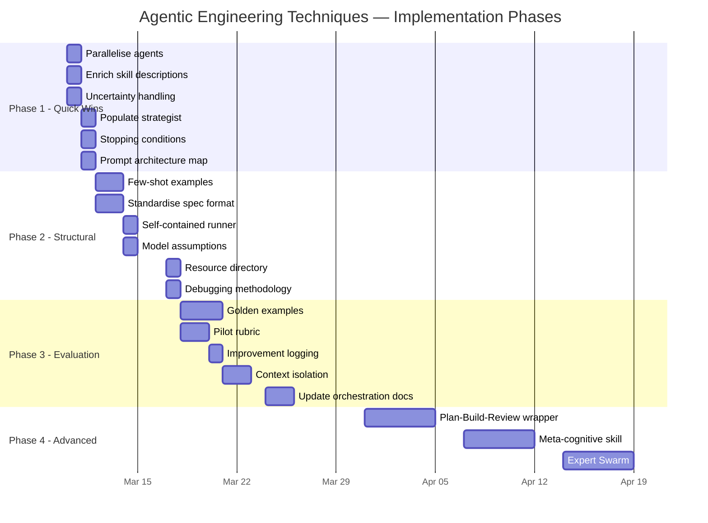

<figure class="report-section-image-wrapper" aria-labelledby="fig-action-caption">
  
  <figcaption id="fig-action-caption">A phased ascent from quick wins to advanced capabilities</figcaption>
</figure>

## 7. Action Plan

Recommendations are grouped into four phases, ranked by impact-to-effort ratio. Each phase builds on the previous — complete Phase 1 before starting Phase 2.

### Phase 1: Quick Wins (1–2 days)

Low-effort changes that improve quality and speed immediately.

| # | Action | Effort | Impact | Gap ref |
|---|--------|--------|--------|---------|
| 1 | **Parallelise Phase 1 agents** — update orchestration docs to run architect + dev-lead + devops + governance in a single Task message | 1 hr | High | A |
| 2 | **Enrich skill descriptions** — add trigger terms and "NOT for" scope boundaries to all skill frontmatter | 2 hrs | High | H |
| 3 | **Add uncertainty handling** — add standardised `## Handling Uncertainty` section to all skills | 2 hrs | High | D |
| 4 | **Populate the strategist skill** — create SKILL.md with role, focus, constraints, and output structure | 2 hrs | High | — |
| 5 | **Add stopping conditions** — add explicit stop criteria to the one-shot runner and critic skill | 1 hr | Medium | — |
| 6 | **Create prompt architecture map** — document context composition by phase in `PROMPT_ARCHITECTURE.md` | 1 hr | Medium | L |

**Expected outcome:** More consistent agent activation, better handling of ambiguous inputs, and a documented orchestration structure for debugging.

### Phase 2: Structural Improvements (3–5 days)

Changes that require creating new content but don't alter the fundamental workflow.

| # | Action | Effort | Impact | Gap ref |
|---|--------|--------|--------|---------|
| 7 | **Add few-shot examples** — add one truncated input/output example to architect, critic, and reconciliation skills | 4 hrs | High | C |
| 8 | **Standardise spec format** — create a structured initiative intake format with YAML frontmatter that agents can reference by path | 3 hrs | High | F |
| 9 | **Make one-shot runner self-contained** — reference spec file path, inline agent directory with trigger terms and scope boundaries | 3 hrs | Medium | — |
| 10 | **Add model assumptions** — add `## Model Assumptions` section to domain-dependent skills (architect, governance, devops) | 2 hrs | Medium | G |
| 11 | **Create resource directory** — add `resources/` alongside key skills with approved tooling lists and reference checklists | 3 hrs | Medium | J |
| 12 | **Document debugging methodology** — add agent debugging process (Classify → Isolate → Verbose → Simplify → Contrast) to orchestration folder | 1 hr | Medium | K |

**Expected outcome:** Skills produce more consistent output, the one-shot runner is reproducible, and there's a methodology for diagnosing quality issues.

### Phase 3: Evaluation and Learning (1–2 weeks)

Changes that require developing evaluation infrastructure and feedback mechanisms.

| # | Action | Effort | Impact | Gap ref |
|---|--------|--------|--------|---------|
| 13 | **Create golden examples** — for architect, critic, and reconciliation: one known-good input paired with expected output and 3–5 constraint checks | 6 hrs | High | E |
| 14 | **Pilot the rubric** — run the 15-criteria evaluation rubric against the top 3 skills, score results, record findings | 3 hrs | Medium | — |
| 15 | **Add improvement logging** — create a post-run improvement log template and discipline to fill it after each workflow run | 2 hrs | Medium | I |
| 16 | **Implement context isolation** — restructure the one-shot runner to use Cursor's Task tool, with each agent running as a subagent returning structured summaries | 4 hrs | High | B |
| 17 | **Update orchestration docs** — update `02_RUN_WORKFLOW.md`, `06_ONE_SHOT_RUNNER_PROMPT.md`, and `08_ORCHESTRATION_CHECKLIST.md` to reflect new parallel + isolated structure | 3 hrs | Medium | — |

**Expected outcome:** Systematic quality measurement, a feedback loop for continuous improvement, and context-isolated agent execution.

### Phase 4: Advanced (future)

Larger changes to pursue once Phases 1–3 are stable.

| # | Action | Effort | Impact | Gap ref |
|---|--------|--------|--------|---------|
| 18 | **Add Plan-Build-Review wrapper** — create Plan phase (orchestrator reviews intake, creates research plan) and Review phase (run rubric against reconciled output) around the existing Build workflow | 1 week | High | — |
| 19 | **Build meta-cognitive skill** — create a skill that audits other skills against the evaluation rubric and proposes improvements | 1 week | Medium | — |
| 20 | **Implement Expert Swarm** — for portfolio workflow, run multiple initiatives in parallel using the Expert Swarm pattern with shared expertise inheritance | 1 week | Medium | — |
| 21 | **Create eval-driven development workflow** — write eval cases before modifying skills; run smoke tests on every skill change | 1 week | Medium | — |

**Expected outcome:** The workflow advances from Level 4–5 to Level 5–6 on the Prompt Maturity Model, with systematic self-improvement.

---

### Implementation priorities visualised

---

### Techniques deliberately excluded

These techniques are present in the book but not recommended for this workflow at this stage:

| Technique | Reason for exclusion |
|-----------|---------------------|
| A/B testing for prompts | Research-oriented workflow, not user-facing; insufficient run volume to generate statistical significance |
| Agent Teams / TeammateTool | Experimental feature, not stable for production research workflows |
| Automated CI/CD eval integration | Overkill for a research site; target "scripted" evaluation tier instead |
| Context Contracts with JSON schemas | Premature; agent count is manageable without formal schemas |
| Token-level cost tracking | Requires API-level access not available in Cursor; cost-governor skill handles policy-level budgeting |
| Model-Native Swarm Orchestration | Kimi K2.5-specific pattern, not applicable to Cursor/Claude |
| Production Multi-Agent Systems | Scale (10+ agents in production with recovery) not needed for research workflow |

---

### Key takeaway

The existing workflow has strong prompt principles (clarity, structure, constraints) and well-designed agent specialisation. The book validates these choices.

The four highest-leverage improvements are:

1. **Parallelise** independent agents — immediate speed gain, zero quality risk
2. **Add examples** to skills — highest impact on output consistency
3. **Start evaluating** with golden examples — transforms tinkering into engineering
4. **Implement context isolation** — prevents quality degradation in reconciliation

These four changes address the book's central thesis: that agentic engineering succeeds through disciplined context management, structured evaluation, and design over improvisation.

---

### References

- [Agentic Engineering Book](https://jayminwest.com/agentic-engineering-book) — Jaymin West
- [Chapter 2: Prompt](https://jayminwest.com/agentic-engineering-book/2-prompt)
- [Chapter 4: Context](https://jayminwest.com/agentic-engineering-book/4-context)
- [Chapter 5: Tool Use — Skills and Meta-Tools](https://jayminwest.com/agentic-engineering-book/5-tool-use/5-skills-and-meta-tools)
- [Chapter 6: Patterns — Orchestrator Pattern](https://jayminwest.com/agentic-engineering-book/6-patterns/3-orchestrator-pattern)
- [Chapter 6: Patterns — Expert Swarm](https://jayminwest.com/agentic-engineering-book/6-patterns/8-expert-swarm-pattern)
- [Chapter 7: Practices — Evaluation](https://jayminwest.com/agentic-engineering-book/7-practices/2-evaluation)
- [Chapter 8: Mental Models — Prompt Maturity Model](https://jayminwest.com/agentic-engineering-book/8-mental-models/2-prompt-maturity-model)
- [Chapter 8: Mental Models — Specs as Source Code](https://jayminwest.com/agentic-engineering-book/8-mental-models/3-specs-as-source-code)
