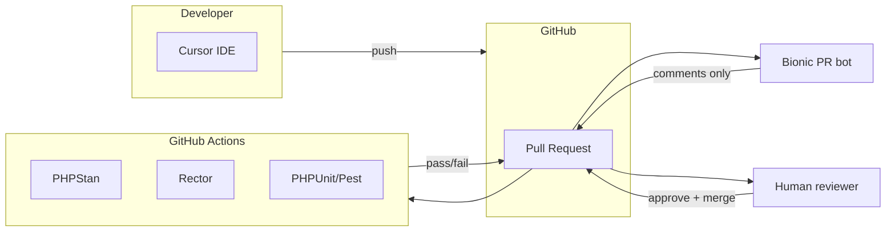

<figure class="report-section-image-wrapper" aria-labelledby="fig-overview-caption">
  
  <figcaption id="fig-overview-caption">Pipeline overview: two channels rejoining at a human gate</figcaption>
</figure>

# AI-Augmented Development Pipelines — Overview

## 1. Problem Context

WordPress + Laravel team with legacy ACF-heavy WordPress, Laravel services/queues/APIs, and GitHub-based CI/CD needs structured AI integration *beyond* code completion. Goals: improve PR quality and speed, reduce refactoring risk, de-risk PHP 7.4 → 8.x and WP/plugin migrations, increase test coverage, and improve documentation freshness — without destabilising client delivery. Constraints: no autonomous merges, must be reversible, no client data exposure. **Cursor is a team-based subscription with limits** (fixed cost or cap per seat); budget ceiling £200/month (pilot) or £500/month applies to Bionic and any other AI tools, not Cursor. Cursor rate limits follow the subscription plan (e.g. fast requests/month, premium caps). UK GDPR applies.

## 2. AI Opportunity

AI is used only where humans remain in control: first-pass PR review (diff comments), IDE-assisted refactor/migration/test/doc suggestions (human edits and commits). No AI in CI; no AI in deploy path. Opportunity is faster, more consistent review; safer upgrades via Rector + optional runbook drafting; and better test/doc coverage with human-curated AI suggestions.

## 3. Proposed Architecture

Reconciled choice: **Option A** for pilot — CI (PHPStan, Rector, PHPUnit/Pest) + Bionic (OSS or free tier) for PR comments only + team Cursor subscription for local use. No CodeRabbit, no Copilot. Budget ceiling £200 (or £500) applies to Bionic and other AI tools. All agents agreed; Critic and Strategist recommended Option A and 2–3 KPIs for pilot.

## 4. Tooling Options (OSS vs SaaS)

| Layer | Selected for pilot | Alternative |
|-------|--------------------|-------------|
| CI | GitHub Actions, PHPStan, Rector, PHPUnit/Pest (all OSS) | — |
| PR review | Bionic (OSS or free tier) | CodeRabbit (SaaS; excluded at £200) |
| IDE | Team Cursor subscription only | Copilot (excluded) |

No AI in CI; no paid indexing. Cost Governor: Bionic within budget; Cursor via team subscription with plan limits.

## 5. Guardrails & Controls

- **No autonomous merge:** Branch protection requires CI pass + human review; bot has no merge rights.
- **No client data in AI path:** PR template checklist; .cursorrules "no client names, URLs, credentials, PII"; diff-only to bot; max 30k tokens per PR.
- **Reversibility:** Disable Bionic via GitHub App; revert CI workflow; restrict Cursor by repo.
- **Cost:** £200/month ceiling for Bionic and other AI tools; Cursor via team subscription (plan limits, no overage spend). Weekly spend check for Bionic; alert at £180. Rate limits: 15 PRs/repo/week for bot; Cursor within team plan limits.

## 6. Failure Modes

- **Bot noisy or wrong:** Tune config; 2-week feedback; allow disable per repo.
- **Rector breaks build:** Run on branch; require tests green; version Rector rules.
- **Vendor deprecated or pricing change:** Bionic OSS or free tier; fallback human-only review.
- **Client data in prompt:** Policy + training; stop condition = immediate disable and review; re-enable when incident review done and remediation applied (reconciled from Critic).

## 7. KPIs

- **PR cycle time:** ≥15% reduction for PRs with AI review (median open→merge, with vs without bot).
- **Regression rate:** No increase (or reduce) vs baseline.
- **Test coverage (optional):** +5% or N new tests if test trial runs.

Upgrade planning and documentation frequency deferred to post-pilot (Critic/Strategist).

## 8. Actionable Next Steps

1. Choose pilot repo and confirm budget ceiling for Bionic/other tools (£200 or £500); confirm team Cursor subscription and document plan limits.
2. Add PHPStan + Rector to pilot repo CI (WP/Laravel lead).
3. Publish one-pager and PR template; add .cursorrules (Lead + governance).
4. Install Bionic on pilot repo; document "no client data" (DevOps/Lead).
5. Record baseline (PR cycle time, regression rate, coverage); name cost owner; schedule 4- and 12-week reviews.
