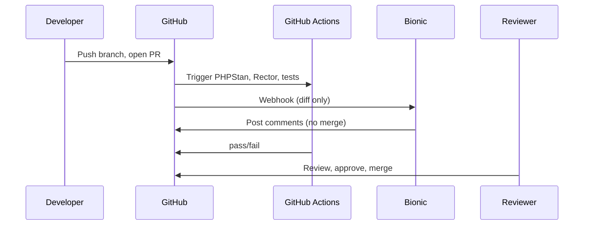

<figure class="report-section-image-wrapper" aria-labelledby="fig-pr-review-caption">
  
  <figcaption id="fig-pr-review-caption">Manuscript with margin notes and human hand adding approval</figcaption>
</figure>

# PR Review (AI-Augmented)

## 1. Problem Context

PR review is a bottleneck: reviewer availability and consistency vary; PHP 8.x and WP/Laravel deprecations can be missed. Team needs a first-pass that summarises diffs, flags obvious issues and deprecations, without replacing human judgment or merge authority.

## 2. AI Opportunity

A PR bot (Bionic) receives the diff (and minimal context) and posts comments: summary, security/breaking hints, optional PHP 8.x/WP deprecation flags. Human reviewer still approves and merges; merge never depends on the bot. Only Bionic (OSS or free tier) is used for PR review; CodeRabbit is excluded at pilot budget.

## 3. Proposed Architecture

## 4. Tooling Options (OSS vs SaaS)

| Option | Tool | Pilot choice | Note |
|--------|------|--------------|------|
| OSS | Bionic (GitHub App) | **Yes** | OSS or free tier; diff-only; 30k tokens/PR cap. |
| SaaS | CodeRabbit | No at pilot budget | Allowed only if budget is £500 and cost controlled. |

Cursor is not used for "review entire PR" in pipeline; that is the bot's role. Local Cursor remains for completion and ad-hoc explain/refactor.

## 5. Guardrails & Controls

- **Input:** Bot receives diff only (or diff + minimal context). No `.env`, `wp-config`, or credentials in paths. Max 30k tokens per PR (Cost Governor).
- **Redaction:** PR title/description and branch name must not contain client names, production URLs, API keys, or PII. PR template checklist: "I confirm no client names, URLs, credentials, or PII in this PR."
- **Merge:** Bot has no merge rights. Branch protection: CI pass + human review required.
- **Audit:** "AI-assisted review: yes" in PR template or label. Optional: log PR numbers that received bot comments.
- **Rate limit:** 15 PRs per repo per week (Cost Governor).

## 6. Failure Modes

- **Noisy or wrong suggestions:** Conservative config; tune or disable categories; 2-week feedback loop. Allow disable per repo.
- **Bot down or rate-limited:** Human review continues; merge still gated on CI + human. No dependency on bot for merge (DevOps).
- **Client data in diff:** Stop condition: immediate disable and review; redaction policy and training to prevent.

## 7. KPIs

- **PR cycle time:** ≥15% reduction for PRs with bot comment vs without (same repo, median open→merge). Most attributable KPI (Critic).
- **Regression rate:** No increase vs baseline (post-merge defect/revert rate).

## 8. Actionable Next Steps

1. Install Bionic on pilot repo (OSS or free tier); no merge rights (DevOps/Lead).
2. Set bot config: diff-only, max 30k tokens/PR.
3. Add PR template with "AI-assisted review: yes/no" and redaction checklist.
4. Document data policy in repo (README or CONTRIBUTING).
5. After 8 weeks: team vote on usefulness; if <30% find helpful, pause or reconfigure (stop condition).
