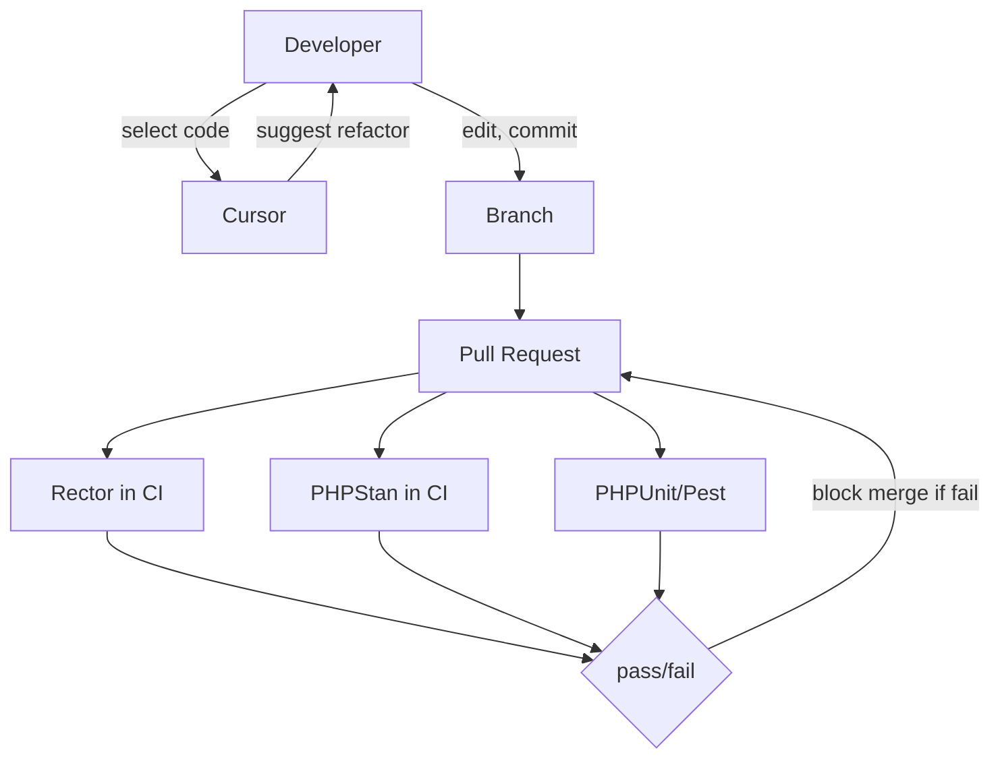

# Refactoring (AI-Assisted)

## 1. Problem Context

Legacy WordPress and Laravel code needs targeted modernisation for PHP 8.x (types, named args, match) and WP/Laravel deprecations. Big-bang refactors are risky; team needs minimal, file-scoped changes and consistent rules enforced in CI.

## 2. AI Opportunity

Rector runs in CI (deterministic; no AI cost). Cursor is used locally for "suggest PHP 8.x refactor" on selection; developer edits and commits. Repo rules (.cursorrules) can align Cursor with WP/Laravel/ACF conventions. No autonomous refactor PRs; human always applies and commits.

## 3. Proposed Architecture

## 4. Tooling Options (OSS vs SaaS)

| Area | OSS | SaaS (local) | Pilot |
|------|-----|--------------|-------|
| Rule execution | Rector (CI), PHPStan (CI) | — | Both in CI |
| Suggestions | — | Cursor | Cursor only; no Copilot at £200 |

Rector: PHP 8.x preset; optional WP rule set after baseline is green. PHPStan: WordPress stubs, Laravel plugin; level 0 initially, then raise in dedicated PRs.

## 5. Guardrails & Controls

- **CI:** Rector runs on every PR (or scoped paths); full test run required. No Rector-only mass PR without agreement; refactor in small PRs.
- **Cursor:** No client data in prompts; no file >500 lines or paste >8k chars (.cursorrules). "Heavy" requests capped (e.g. 25/user/week at £200).
- **Reversibility:** Revert workflow to remove Rector; or exclude paths in config. Cursor use is policy-based; no pipeline dependency.

## 6. Failure Modes

- **Rector rule breaks build or behaviour:** Run on branch first; require CI green including tests; version Rector and rule set; "Rector PRs need extra review" (Dev Lead).
- **Rector vs WP/Laravel versions:** Rule sets can conflict with specific WP/plugin versions. Use preset first; add WP rules only after PHP 8.x set is green. Separate jobs or matrix for WP vs Laravel if monorepo.
- **Baseline creep:** PHPStan baseline or Rector exclusions grow. Mitigation: quarterly "reduce baseline" task; track baseline size (Dev Lead).

## 7. KPIs

- **Regression rate:** No increase (or reduce) after refactor PRs.
- **CI pass rate:** No sustained red on main from Rector/PHPStan.

Refactor-specific KPI (e.g. "N files modernised") is optional; primary signal is regression rate and CI health.

## 8. Actionable Next Steps

1. Add Rector to CI with PHP 8.x preset; scope to relevant paths (WP/Laravel lead).
2. Add .cursorrules: no client data; prefer small selection; WP/Laravel conventions optional.
3. Document "Rector PRs need extra review" in CONTRIBUTING or team guide.
4. Plan one refactor/migration run (PHP 8.x or WP upgrade) in weeks 4–6; document time and issues.
