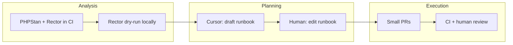

<figure class="report-section-image-wrapper" aria-labelledby="fig-migration-caption">
  
  <figcaption id="fig-migration-caption">Map with segmented route and runbook beside it</figcaption>
</figure>

# Migration Intelligence (PHP / WP / Plugins)

## 1. Problem Context

PHP 7.4 → 8.x and WP/plugin upgrades require impact analysis, runbooks, and ordered execution. Team needs to know what breaks and in what order, without sending client data to AI.

## 2. AI Opportunity

CI (PHPStan + Rector) surfaces deprecations and fixable issues on current code. Rector dry-run/diff lists suggested code changes. Cursor can draft migration runbooks (e.g. "runbook for PHP 7.4 → 8.1 for this repo") from codebase context; human edits and owns execution. No AI in CI for migration; no autonomous execution.

## 3. Proposed Architecture

## 4. Tooling Options (OSS vs SaaS)

| Role | Tool | Type | Note |
|------|------|------|------|
| Deprecation/change list | PHPStan, Rector | OSS, CI | No AI; deterministic. |
| Runbook draft | Cursor | SaaS (local) | Human edits; no client names/URLs/credentials in prompts. |

No migration-specific SaaS beyond Cursor. Runbooks are internal; use placeholders (e.g. CLIENT_SITE_URL) for any client-specific steps.

## 5. Guardrails & Controls

- **Runbook content:** No client names, production URLs, or credentials. Use placeholders or internal-only docs not sent to AI (Governance).
- **Execution:** Human-driven; each change via PR; CI (PHPStan, Rector, tests) must pass. No AI in CI.
- **Cursor:** Sanitised code only; stay within team Cursor subscription plan limits.

## 6. Failure Modes

- **Rector suggests breaking change:** Run on branch; full test pass; review before merge. Version Rector rules.
- **Runbook wrong or incomplete:** Human ownership; runbook is advisory; execute in small PRs with CI.
- **Client data in runbook draft:** Redaction policy; if sent to AI, treat as incident (disable, review).

## 7. KPIs

- **Upgrade planning time:** ≥20% reduction for one PHP or WP upgrade (time from "start planning" to "runbook ready") — deferred to post-pilot unless an upgrade is planned and owner assigned (Critic: one data point per upgrade; weak for 90 days).
- **Migration success:** One completed upgrade (e.g. PHP 8.x or WP) with runbook and no production incident.

## 8. Actionable Next Steps

1. Run Rector dry-run on pilot repo; document list of suggested changes (WP/Laravel lead).
2. Use Cursor to draft runbook for one planned upgrade; human edit and store in repo (no client data in draft).
3. Execute upgrade in small PRs; each passes CI; document time and issues for pilot review.
