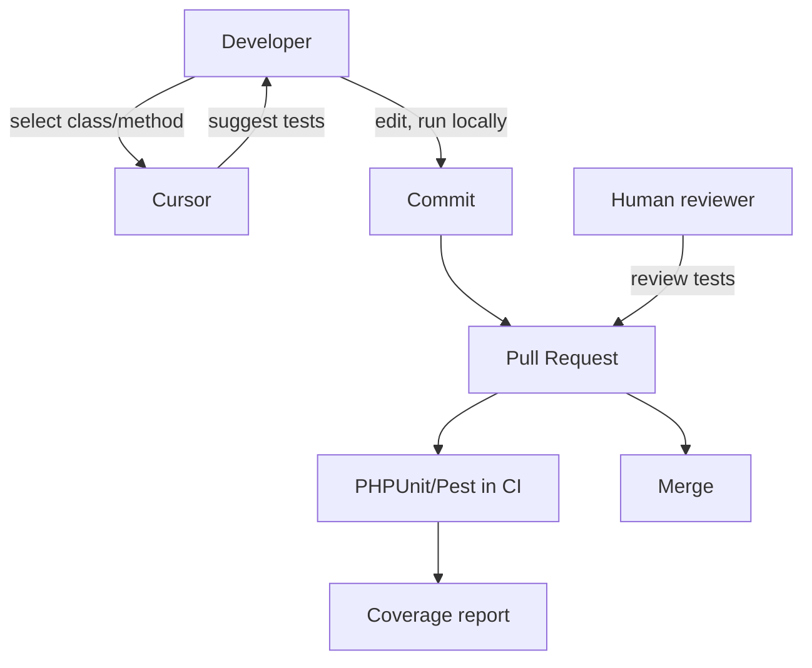

<figure class="report-section-image-wrapper" aria-labelledby="fig-test-gen-caption">
  
  <figcaption id="fig-test-gen-caption">Hand mending a net, adding a strand to fill a gap</figcaption>
</figure>

# Test Generation (AI-Assisted)

## 1. Problem Context

Test coverage is insufficient; writing tests is time-consuming. Team wants to increase coverage without merging unmaintained or low-value tests.

## 2. AI Opportunity

Developer selects class/method in Cursor; asks for PHPUnit/Pest test suggestions. Developer edits (assertions, data providers, mocks) and commits. CI runs tests; no automated "AI creates test PR". At £200: ad-hoc Cursor only; rate limit (e.g. 20 doc+test team/month). Named owner for "generated test quality" so tests are maintained (reconciled from Critic/Dev Lead).

## 3. Proposed Architecture

## 4. Tooling Options (OSS vs SaaS)

| Role | Tool | Pilot |
|------|------|-------|
| Execution | PHPUnit or Pest | In CI |
| Suggestions | Cursor | Yes; no Copilot at £200 |
| Scaffolding | PHPUnit/Pest + manual or scripts | Optional |

No separate test-generation API or SaaS; Cursor only, within rate limits.

## 5. Guardrails & Controls

- **Output:** All generated tests reviewed and edited by a human before commit. No autonomous test PRs (Governance).
- **Input:** Sanitised code only; no credentials or client data in prompts. .cursorrules: no client names, production URLs, credentials, PII (Governance).
- **Ownership:** Named owner for "generated test quality" and maintenance (Reconciliation, Dev Lead).
- **Rate:** 20 doc+test team/month (Cost Governor at £200).

## 6. Failure Modes

- **Generated tests low quality or brittle:** Human review and ownership; treat as normal PR review. Owner responsible for maintenance.
- **Coverage delta small:** Critic: "1–2 services" may not move repo-wide % much. KPI is +5% or N new tests if trial runs; optional for pilot.
- **Cursor overage:** Enforce rate limit; prefer small selection; no full-file paste.

## 7. KPIs

- **Test coverage:** +5% in pilot repo or N new tests merged from AI suggestions (optional for pilot; measure if test trial runs in weeks 6–8).
- **Regression rate:** No increase from new tests (tests should not introduce flake or false positives).

## 8. Actionable Next Steps

1. Assign named owner for "generated test quality" (Lead).
2. In weeks 6–8 (optional): generate and human-edit tests for 1–2 services; merge and measure coverage delta (Laravel/WP).
3. Add .cursorrules for test prompts: sanitised code only; no client data.
4. Track "test PRs from AI assistance" if desired for KPI (optional).
