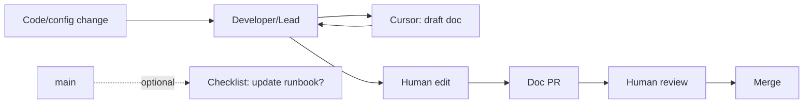

<figure class="report-section-image-wrapper" aria-labelledby="fig-documentation-caption">
  
  <figcaption id="fig-documentation-caption">Open ledger with hand editing a line and reference note</figcaption>
</figure>

# Documentation (AI-Assisted)

## 1. Problem Context

README, runbooks, and API/hook docs drift as code and deployment change. Team needs fresher docs without autonomous doc PRs or client data in AI.

## 2. AI Opportunity

Developer or lead uses Cursor to draft README/runbook/ADR updates from code or config context; human approves and commits. Optional: "on merge to main" checklist or issue template ("if deployment/env changed, update runbook"). No AI in CI that pushes doc changes. At £200: ad-hoc only; no dedicated doc-generation runs; optional checklist (Strategist).

## 3. Proposed Architecture

## 4. Tooling Options (OSS vs SaaS)

| Role | Tool | Pilot |
|------|------|-------|
| Draft | Cursor | Yes; ad-hoc |
| Site | MkDocs, Docusaurus, or /docs in repo | Existing or new; human-maintained |
| CI | No AI; optional link check or build | Optional |

No Sweep or autonomous doc bot; Cursor only, human commits.

## 5. Guardrails & Controls

- **Content:** No client names, production URLs, or credentials in prompts or in public docs (Governance). Internal runbooks: same redaction for content sent to AI.
- **Output:** All doc changes approved and committed by a human. No autonomous doc PRs (Governance).
- **Ownership:** Named owner for "documentation update frequency" (Reconciliation, Dev Lead); avoids vague "someone will do it" (Critic).
- **Rate:** Part of 20 doc+test team/month at £200 if doc drafts use "heavy" Cursor.

## 6. Failure Modes

- **Docs still stale:** Only improves if owner and process exist. Assign owner and optional checklist/reminder (Critic).
- **Client data in draft:** Redaction policy; if sent to AI, incident process (disable, review).
- **Doc PRs never merged:** Define "doc update frequency" (e.g. ≥1 doc PR/month) and assign owner; add to team checklist or retro.

## 7. KPIs

- **Documentation update frequency:** ≥1 doc PR merged per month (pilot repo or /docs) — deferred to post-pilot unless owner assigned (Strategist). Clear definition: count of doc PRs merged (Critic).

## 8. Actionable Next Steps

1. Assign named owner for "documentation update frequency" (Lead).
2. Define "doc update frequency" (e.g. ≥1 doc PR/month or README/runbook within 2 sprints of change); document in pilot (Dev Lead).
3. Optional: add "on merge to main" checklist or issue template for runbook updates (weeks 8–10).
4. One doc PR in pilot window (e.g. README or runbook) to validate process.
