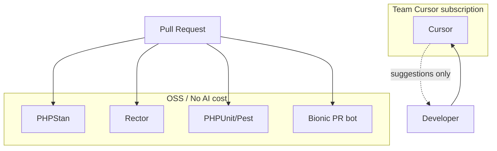

<figure class="report-section-image-wrapper" aria-labelledby="fig-tooling-caption">
  
  <figcaption id="fig-tooling-caption">Two conduits feeding one container with a max level marked</figcaption>
</figure>

# Tooling Comparison (OSS vs SaaS)

## 1. Problem Context

Pipeline needs proven tools only; no hallucinated or speculative tooling. Cursor is a team subscription with limits (fixed/cap per seat). Budget £200 (or £500) applies to Bionic and other AI tools; Bionic only for PR at pilot, no CodeRabbit or Copilot.

## 2. AI Opportunity

AI is used only in PR bot (Bionic) and local IDE (Cursor). CI is deterministic (PHPStan, Rector, PHPUnit/Pest). No AI in CI; no paid indexing. Opportunity is cost control and reversibility while still getting first-pass review and local suggestions.

## 3. Proposed Architecture

## 4. Tooling Options (OSS vs SaaS)

**Comparison table (OSS vs SaaS)**

| Area | OSS / self-hosted | SaaS | Pilot choice |
|------|-------------------|------|--------------|
| PR review | Bionic (GitHub App), Reviewpad | CodeRabbit, GitHub Copilot for PRs | **Bionic only** (budget £200); £500 allows CodeRabbit |
| Static analysis | PHPStan, Psalm, Rector, PHPCompatibility | — | **PHPStan, Rector** in CI |
| Refactor / migration | Rector (CI), PHPStan | Cursor, Copilot (local) | **Rector in CI; team Cursor local** |
| Test generation | PHPUnit, Pest, scaffolding | Cursor, Copilot | **Team Cursor only** (ad-hoc, within plan limits) |
| Documentation | MkDocs, Docusaurus, phpDocumentor | Cursor, Copilot, Sweep | **Team Cursor only** (ad-hoc, within plan limits) |
| IDE / local | — | Cursor, GitHub Copilot | **Team Cursor subscription only** |

**Cursor:** Team-based subscription with limits. Cost is fixed or cap per seat; £200/£500 budget applies to Bionic (and CodeRabbit at £500), not Cursor. Rate limits follow the subscription plan (e.g. fast/slow request caps per month); align internal guidance (e.g. “prefer small selection”, “no full-file paste”) to stay within plan. No overage spend for Cursor when within plan; hitting plan limits is a usage/availability issue, not a cost breach. Reversibility: reduce seats or change plan rather than only restrict by repo.

## 5. Guardrails & Controls

- **CI:** No SaaS AI in GitHub Actions. Grep on PR for `openai`, `anthropic`, etc. in workflows (Cost Governor).
- **PR bot:** Bionic: 15 PRs/repo/week; 30k tokens/PR max. No CodeRabbit at pilot budget.
- **Cursor:** Team subscription only; stay within plan limits (e.g. fast/slow caps); default model, no paid index. Document plan caps; align internal guidance.

## 6. Failure Modes

- **Vendor deprecated or pricing change:** Bionic OSS or free tier; fallback human-only review. Cursor: policy to restrict by repo if needed.
- **Tool substitution:** If Bionic unavailable, human-only review until replacement (no new tool without Architect/Cost Governor alignment).

## 7. KPIs

- **Cost:** Bionic and other AI tools: monthly spend ≤ £200 (or £500 if agreed); weekly check; alert at £180 (or £450). Cursor: team subscription, no separate spend tracking when within plan.
- **CI health:** No AI in CI; workflow success and job duration as per DevOps checklist.

## 8. Actionable Next Steps

1. Confirm budget ceiling for Bionic/other (£200 or £500) and lock tool set; confirm team Cursor subscription and document plan limits.
2. Document chosen stack in repo (README or docs) and in one-pager.
3. Enforce "no AI in CI" via code review of every workflow change.
