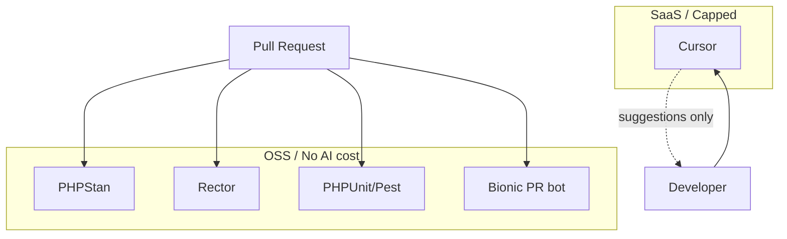

# Tooling Comparison (OSS vs SaaS)

## 1. Problem Context

Pipeline needs proven tools only; no hallucinated or speculative tooling. Budget (£200 pilot) forces trade-offs: Bionic only for PR, Cursor only for IDE, no CodeRabbit or Copilot at £200.

## 2. AI Opportunity

AI is used only in PR bot (Bionic) and local IDE (Cursor). CI is deterministic (PHPStan, Rector, PHPUnit/Pest). No AI in CI; no paid indexing. Opportunity is cost control and reversibility while still getting first-pass review and local suggestions.

## 3. Proposed Architecture

## 4. Tooling Options (OSS vs SaaS)

**Comparison table (OSS vs SaaS)**

| Area | OSS / self-hosted | SaaS | Pilot choice (£200) | Pilot choice (£500) |
|------|-------------------|------|---------------------|----------------------|
| PR review | Bionic (GitHub App), Reviewpad | CodeRabbit, GitHub Copilot for PRs | **Bionic only** | Bionic or CodeRabbit |
| Static analysis | PHPStan, Psalm, Rector, PHPCompatibility | — | **PHPStan, Rector** in CI | Same |
| Refactor / migration | Rector (CI), PHPStan | Cursor, Copilot (local) | **Rector in CI; Cursor local** | Same; Copilot optional |
| Test generation | PHPUnit, Pest, scaffolding | Cursor, Copilot | **Cursor only** (ad-hoc) | Cursor; Copilot optional |
| Documentation | MkDocs, Docusaurus, phpDocumentor | Cursor, Copilot, Sweep | **Cursor only** (ad-hoc) | Cursor; optional Sweep |
| IDE / local | — | Cursor, GitHub Copilot | **Cursor only** | Cursor + optional Copilot |

**Conflict resolution:** Cost Governor and Strategist: at £200, Bionic only, Cursor only, no CodeRabbit, no Copilot. Architect and Dev Lead: Option A (Bionic, Cursor) is safe to pilot. Reconciled: Option A is the recommended architecture; £500 allows CodeRabbit and Copilot with rate limits and alerts.

## 5. Guardrails & Controls

- **CI:** No SaaS AI in GitHub Actions. Grep on PR for `openai`, `anthropic`, etc. in workflows (Cost Governor).
- **PR bot:** Bionic: 15 PRs/repo/week; 30k tokens/PR max. No CodeRabbit at £200.
- **Cursor:** Default model only; no premium; 25 heavy/user/week, 20 doc+test team/month; no paid index (Cost Governor).

## 6. Failure Modes

- **Vendor deprecated or pricing change:** Bionic OSS or free tier; fallback human-only review. Cursor: policy to restrict by repo if needed.
- **Tool substitution:** If Bionic unavailable, human-only review until replacement (no new tool without Architect/Cost Governor alignment).

## 7. KPIs

- **Cost:** Monthly spend ≤ £200 (or £500 if agreed); weekly check; alert at £180 (or £450).
- **CI health:** No AI in CI; workflow success and job duration as per DevOps checklist.

## 8. Actionable Next Steps

1. Confirm budget ceiling (£200 or £500) and lock tool set (Bionic only vs Bionic or CodeRabbit; Cursor only vs Cursor + Copilot).
2. Document chosen stack in repo (README or docs) and in one-pager.
3. Enforce "no AI in CI" via code review of every workflow change.
