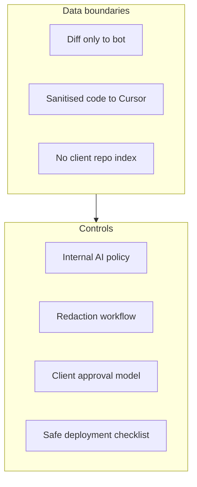

<figure class="report-section-image-wrapper" aria-labelledby="fig-governance-caption">
  
  <figcaption id="fig-governance-caption">Walled garden with one gate and figure with checklist</figcaption>
</figure>

# Governance and Controls

## 1. Problem Context

UK GDPR, client data exposure risk, and need for auditability require clear data boundaries, redaction, client communication, and safe deployment. All agents agreed: safe with controls; compliance risk 2/5 with controls (Governance).

## 2. AI Opportunity

AI is used only on code/diffs and sanitised context; no client data or PII in AI path. Opportunity is faster, safer development without increasing compliance risk when controls are enforced.

## 3. Proposed Architecture

## 4. Tooling Options (OSS vs SaaS)

Governance does not prescribe specific tools beyond: PR bot receives diff only; Cursor used with sanitised code; DPAs/SCCs for SaaS (Cursor, and CodeRabbit if used at £500). Prefer Bionic OSS or self-hosted to reduce sub-processor surface at £200.

## 5. Guardrails & Controls

**Internal AI usage policy summary**

- **Purpose:** Development assistance only (PR review, refactor, migration, test, doc suggestions). No production user data or client PII in AI path.
- **Scope:** Code and diffs only. No `.env`, `wp-config`, credentials, or client names/URLs in PR descriptions, branch names, commit messages, or prompts.
- **Merge:** Humans only. No autonomous merge. Branch protection: CI pass + human review.
- **Reversibility:** Disable PR bot via GitHub App; revert CI workflow; restrict Cursor by repo/org. Document kill switch.
- **Audit:** Record "AI-assisted" on PRs; do not log prompt content without policy. Log incidents (tool disabled, reason, remediation).
- **Ownership:** Named owner for cost check; named owner for doc/test KPIs when those are in scope.

**Client approval model**

- **Transparency:** Inform clients that AI-assisted development tools are used (PR review, code/test/doc suggestions) under strict data and merge policies; no client data or PII sent to AI; no autonomous merges.
- **Formal approval:** If contract or client process requires explicit approval for sub-processors or AI tools, obtain it. Otherwise, document that clients have been informed (Governance).
- **Objection:** If a client objects (e.g. "no AI on our code"), exclude that client's repo from PR bot and from Cursor use on that code until a safe process is agreed. Who decides and how repo is scoped per client to be defined (reconciled from Critic: spell out process).

**Redaction workflow**

1. **Before opening PR:** Author confirms no client names, production URLs, API keys, or PII in title, description, branch name, commit messages, or changed files (or exclude sensitive files from bot context).
2. **PR template:** Checklist: "I confirm no client names, URLs, credentials, or PII in this PR."
3. **Cursor:** .cursorrules: "Do not include client names, production URLs, credentials, or PII in prompts." Onboarding: short training on what must not be sent to AI.
4. **If in doubt:** Redact or exclude; prefer no context over context that might contain client data (Governance).
5. **Breach:** Immediate disable of affected tool; incident review; remediation before re-enable. Re-enable when: incident review done, remediation applied, optionally client informed (reconciled from Critic).

**Safe deployment checklist**

- [ ] No AI in deploy path; deploy gates unchanged (CI + human approval only).
- [ ] PR bot has no merge rights; branch protection requires CI + human review.
- [ ] No client data in PR bot or Cursor prompts; redaction and policy in place.
- [ ] One-pager and PR template published; .cursorrules in pilot repo.
- [ ] Cost owner named; weekly spend check and alert threshold set.
- [ ] Stop conditions and incident recovery (re-enable criteria) documented.
- [ ] Clients informed (and formal approval obtained if required).

## 6. Failure Modes

- **Breach (client data in AI):** Stop condition: immediate disable; review; remediation; re-enable only after criteria met (reconciled).
- **No DPA for vendor:** Pilot may run at risk until DPA signed; Governance and Critic: clarify if DPAs exist; if not, delay or use only OSS/self-hosted where possible.
- **Audit trail incomplete:** Make "AI-assisted" mandatory in PR template or automate (e.g. PR has bot comment ⇒ count as AI-assisted) to strengthen audit (reconciled from Critic).

## 7. KPIs

- **Compliance:** No confirmed data leakage; no breach of redaction policy.
- **Audit:** Able to show (1) policies in place, (2) no client data in AI scope, (3) which PRs were AI-assisted.

## 8. Actionable Next Steps

1. Publish one-pager (no client data; no autonomous merge; reversible; "AI-assisted" on PRs) (Lead + governance).
2. Add PR template and .cursorrules; run onboarding on redaction (Lead).
3. Document incident process and re-enable criteria (Lead).
4. Inform clients and document; obtain formal sign-off where contractually required (Lead/governance).
5. Confirm or negotiate DPAs for Cursor (and CodeRabbit if used) (Lead/governance).
