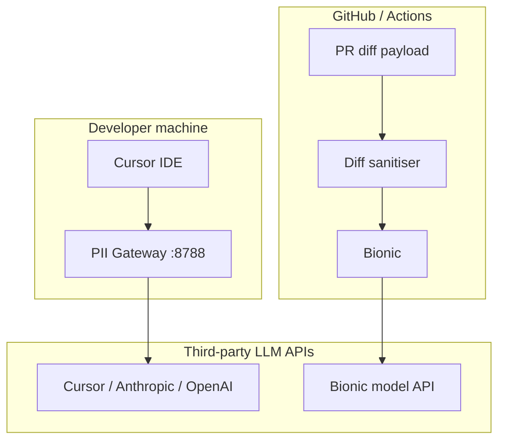

# PII Gateway — Governance Addendum

Addendum to [8. Governance and Controls](/reports/ai-augmented-dev-pipeline/08-governance-and-controls). Extends the manual redaction workflow (PR template, `.cursorrules`, training) with **automated enforcement** at the trust boundary.

## 1. Problem Context

Policy today relies on developer discipline: no client names, production URLs, credentials, or PII in PRs or Cursor prompts. That is necessary but not **testable**. A single mistake sends client data to Cursor or Bionic model APIs. UK GDPR and client contracts require demonstrable controls, not checklist compliance alone.

## 2. AI Opportunity

A local PII gateway makes “no client data in AI path” **enforceable** without blocking the pilot architecture (diff-only Bionic, team Cursor, no AI in CI). Compression tools (e.g. Headroom) are out of scope here — they reduce tokens; they do not anonymise. Redaction runs **before** any optional compression layer.

## 3. Proposed Architecture

Two outbound paths, one gateway design:



| Path | Gateway shape | Default mode | Rehydration |
|------|---------------|--------------|-------------|
| **Cursor** | Local HTTP proxy on `127.0.0.1:8788` | `block` on secrets; `mask` on PII | Optional (off in pilot) |
| **Bionic** | CI or bot pre-hook: `pii-gateway sanitise-diff` | `block` on any client identifier | No — bot output is public on GitHub |

### Component model

| Component | Responsibility |
|-----------|----------------|
| **Ingress adapter** | Normalise OpenAI/Anthropic chat JSON, raw diff text, tool/MCP payloads |
| **Policy engine** | Per-repo/client YAML: detect, block, mask, allowlist |
| **Detector chain** | Regex → Presidio NER → WP/Laravel custom patterns |
| **Redactor** | Replace with `[REDACTED_*]` or stable `[EMAIL_1]` tokens |
| **Session vault** | Encrypted local mapping (pseudonymize mode only); never sent upstream |
| **Audit logger** | Entity counts and policy id; **no** prompt plaintext |
| **Egress adapter** | Forward redacted request to upstream API |

### What the gateway must not do

- Store full prompts in audit logs by default
- Send token↔original mappings to the LLM provider
- Rehydrate into PR comments or GitHub-visible bot output
- Treat compression as redaction
- Default to warn-only in production (pilot uses **hard block** on secrets and client blocklist hits)

## 4. Tooling Options (OSS vs SaaS)

| Option | Fit for pilot | Notes |
|--------|---------------|-------|
| **Presidio + thin local proxy** (recommended) | Yes | OSS, self-hosted, auditable; you own the proxy and policies |
| **Regex + client blocklists only** | Phase 0 MVP | Fast to ship; weak on person/org names |
| **PEyeEye / hosted DLP API** | Later | Adds sub-processor; needs DPA |
| **Headroom as PII layer** | No | CCR stores and retrieves full originals; wrong abstraction |

**Stack (pilot):** Python 3.11+, [Microsoft Presidio](https://github.com/microsoft/presidio), FastAPI or Starlette proxy, encrypted SQLite session vault (pseudonymize mode only), YAML policies under `~/.pii-gateway/policies/`.

## 5. Guardrails & Controls

### Policy modes

| Mode | Behaviour | Pilot use |
|------|-----------|-----------|
| `block` | Request rejected; developer sees policy error | Secrets, API keys, `.env` content, client blocklist |
| `mask` | Irreversible `[REDACTED_EMAIL]` etc. | PII in IDE path when block would be too disruptive |
| `pseudonymize` | Stable `[EMAIL_1]` per session | Post-pilot only; needs vault + response rehydration |
| `allow` | Pass through; audit only | `example.com`, `localhost`, test fixtures |

### Default policy (`policies/default.yaml`)

```yaml
version: 1
mode: mask                    # IDE path default
pr_bot_mode: block            # Stricter for Bionic diffs

block_on_detect:
  - api_key
  - password
  - private_key
  - aws_access_key
  - github_token
  - jwt

mask:
  - email
  - phone_number
  - uk_ni_number
  - credit_card
  - ip_address

presidio_entities:
  - PERSON
  - ORGANIZATION
  - LOCATION
  - EMAIL_ADDRESS
  - PHONE_NUMBER

allowlist_patterns:
  - "@example.com"
  - "@test.com"
  - "localhost"
  - "127.0.0.1"
  - "192.168."

blocked_paths:
  - ".env"
  - ".env.*"
  - "wp-config.php"
  - "wp-config-*.php"
  - "*.pem"
  - "id_rsa"
  - "storage/logs/"

blocked_json_keys:
  - password
  - secret
  - api_key
  - token
  - authorization
  - email
  - phone
  - billing_address

audit:
  log_plaintext: false
  log_entity_counts: true
  retention_days: 90
```

### Per-client overlay (`policies/clients/acme-corp.yaml`)

```yaml
extends: default
client_id: acme-corp

block_strings:
  - "Acme Corporation"
  - "acme-corp"

block_urls:
  - "acme.com"
  - "admin.acme.com"
  - "staging.acme.com"

block_path_fragments:
  - "plugins/acme-crm"
  - "themes/acme"
```

Client overlays are maintained by the governance owner when a new client enters the pilot. Repos map to clients via `repos.yaml` (see spec below).

### Detector chain (WP / Laravel)

Run in order; short-circuit on `block`:

1. **Path guard** — reject if diff touches `blocked_paths`
2. **Secret patterns** — AWS, GitHub, Stripe, JWT, `define('AUTH_KEY'`, `DB_PASSWORD`
3. **Client blocklist** — strings and URLs from per-client YAML
4. **Presidio** — PERSON, ORGANIZATION, EMAIL, PHONE (spaCy `en_core_web_lg`)
5. **Structural JSON** — mask values for `blocked_json_keys` in serialised tool output
6. **PHP/WP heuristics** — `user_email`, `billing_email`, `wp_users` row dumps, Laravel `User::` factory dumps with email fields

### Audit record (metadata only)

```json
{
  "ts": "2026-06-10T14:22:01Z",
  "session_id": "sess_abc123",
  "repo": "agency/acme-wp",
  "client_id": "acme-corp",
  "direction": "outbound",
  "channel": "cursor_proxy",
  "policy": "default",
  "action": "mask",
  "blocked": false,
  "counts": { "email": 2, "api_key": 0, "client_string": 1 }
}
```

### Kill switch

| Action | Effect |
|--------|--------|
| Stop proxy process | Cursor falls back to direct API (document: disable in incident) |
| `pii-gateway serve --mode passthrough --audit-only` | Log only; no redaction (baseline week, not production) |
| Unset `OPENAI_BASE_URL` / Cursor proxy config | Bypass gateway on developer machine |
| Remove Bionic sanitiser step | Bot receives raw diff (incident rollback) |

Incident response unchanged from [Governance §6](/reports/ai-augmented-dev-pipeline/08-governance-and-controls): disable affected tool, review audit log, remediate, re-enable against criteria.

### Updated safe deployment checklist (gateway items)

- [ ] `pii-gateway` diff sanitiser runs before every Bionic API call
- [ ] Pilot developers use Cursor via local gateway **or** documented exception with audit-only week complete
- [ ] Per-client policy files exist for all repos in pilot
- [ ] Audit log path and retention documented; no plaintext prompts
- [ ] Kill switch and bypass procedure in incident runbook
- [ ] Weekly sample: run golden tests (below) against policy changes

## 6. Failure Modes

| Failure | Impact | Mitigation |
|---------|--------|------------|
| **False negative** (PII reaches vendor) | Compliance breach | Block secrets by default; expand client blocklists; golden tests in CI |
| **False positive** (blocks legitimate work) | Developer friction | Allowlists; per-repo relaxations with governance sign-off |
| **Proxy misconfiguration** | Cursor bypasses gateway | Onboarding checklist; optional MDM/script to set base URL |
| **Presidio OOM / slow** | IDE latency | Cache analyser; regex-first; skip Presidio under 500 chars |
| **Vault leak** (pseudonymize mode) | Local data exposure | Pilot uses mask-only; no vault in phase 0–1 |
| **Audit log contains prompt** | Secondary breach | `log_plaintext: false` enforced in code review |

## 7. KPIs

- **Enforcement:** 100% of Bionic diff payloads pass through sanitiser (CI gate on webhook middleware)
- **Golden tests:** Policy test suite green on every policy change
- **Incidents:** Zero confirmed client PII in vendor payloads during pilot
- **Friction:** &lt; 5% of IDE sessions hit block (track via audit); tune allowlists if higher

## 8. Minimal implementation spec (Presidio + Bionic + Cursor)

### Repository layout

```
tools/pii-gateway/
  README.md                 # Install, run, operator guide
  pyproject.toml
  policies/
    default.yaml
    repos.yaml              # repo → client_id mapping
    clients/                # per-client overlays
  pii_gateway/
    __init__.py
    policy.py               # load YAML, merge overlays
    detectors/
      patterns.py           # secrets, UK patterns
      presidio_.py          # NER wrapper
      wp_laravel.py         # domain heuristics
    redact.py               # apply block | mask | pseudonymize
    vault.py                # encrypted session store (phase 2)
    audit.py                # JSONL metadata logger
    proxy/
      server.py             # ASGI forward proxy
      adapters.py           # OpenAI + Anthropic message walk
    cli.py                  # serve | sanitise-diff | test-policy
  tests/
    golden/                 # fixtures: must block / must pass
      secrets_in_diff.patch
      acme_url_in_diff.patch
      clean_refactor.patch
```

### `repos.yaml` example

```yaml
repos:
  agency/acme-wp:
    client_id: acme-corp
  agency/internal-sandbox:
    client_id: internal
    policy_override: relaxed-dev
```

### Dependencies (`pyproject.toml` sketch)

```toml
[project]
name = "pii-gateway"
version = "0.1.0"
requires-python = ">=3.11"
dependencies = [
  "presidio-analyzer>=2.2",
  "presidio-anonymizer>=2.2",
  "spacy>=3.7",
  "fastapi>=0.110",
  "httpx>=0.27",
  "pyyaml>=6.0",
  "cryptography>=42.0",
]

[project.scripts]
pii-gateway = "pii_gateway.cli:main"
```

Post-install: `python -m spacy download en_core_web_lg`

### Core API (`redact.py`)

```python
from dataclasses import dataclass

@dataclass
class RedactResult:
    text: str
    blocked: bool
    reasons: list[str]
    counts: dict[str, int]

def redact(text: str, *, channel: str, repo: str | None = None) -> RedactResult:
    """channel: 'cursor_proxy' | 'pr_bot'"""
    ...
```

### Cursor proxy (`server.py` sketch)

```python
# Listens :8788. For each POST to /v1/chat/completions or /v1/messages:
# 1. Parse JSON body
# 2. Walk messages[].content (string or multipart)
# 3. redact each text part with channel='cursor_proxy'
# 4. If any part blocked → 422 + policy error JSON
# 5. Forward to upstream (Cursor default or ANTHROPIC_API_URL)
# 6. Optional: rehydrate response content (phase 2, off by default)
```

**Developer setup:**

```bash
cd tools/pii-gateway && pip install -e ".[dev]"
pii-gateway serve --port 8788 --upstream https://api.anthropic.com
```

Configure Cursor to use `http://127.0.0.1:8788` as OpenAI-compatible base URL (or system proxy env vars per Cursor docs). Document exact steps in pilot onboarding.

### Bionic diff sanitiser (`cli.py`)

```bash
# In GitHub Action or Bionic webhook middleware, before model call:
git diff "${BASE}...${HEAD}" > /tmp/pr.diff
pii-gateway sanitise-diff /tmp/pr.diff --repo "${GITHUB_REPOSITORY}" --fail-on-block
# stdout → sanitised diff sent to Bionic
```

Exit codes: `0` ok, `1` policy block (fail PR check or skip bot with comment), `2` internal error.

### Golden tests (acceptance criteria)

| Fixture | Expected |
|---------|----------|
| Diff containing `AKIA…` AWS key | `block` |
| Diff with `jane@client.com` | `mask` or `block` (per `pr_bot_mode`) |
| Diff with `https://admin.acme.com` when `acme-corp` policy loaded | `block` |
| Diff touching `.env` | `block` (path guard) |
| Refactor changing only PHP logic, no PII | pass unchanged |
| `DB_PASSWORD='secret'` in wp-config snippet | `block` |

Run: `pytest tests/golden/` and `pii-gateway test-policy policies/default.yaml tests/golden/`

### Rollout phases (fits 90-day pilot)

| Phase | Days | Deliverable |
|-------|------|-------------|
| **0** | 0–14 | `sanitise-diff` CLI + regex/client blocklists; wire into Bionic path |
| **1** | 14–30 | Presidio + golden tests; Cursor proxy for willing pilot devs |
| **2** | 30–60 | Per-client YAML for all pilot repos; audit dashboard or weekly JSONL review |
| **3** | 60+ | Optional Headroom **after** gateway; pseudonymize + vault only if justified |

Phase 0 does not require Presidio. Phase 1 is the recommended “minimal Presidio spec” complete.

## 9. Actionable Next Steps

1. **Governance:** Approve gateway as enforcement layer for pilot; assign policy owner for `policies/clients/`.
2. **Engineering:** Scaffold `tools/pii-gateway` per layout above; ship Phase 0 diff sanitiser.
3. **Bionic:** Add pre-model hook or Action step calling `sanitise-diff --fail-on-block`.
4. **Cursor:** Document proxy setup; add to onboarding alongside `.cursorrules`.
5. **CI:** Run golden policy tests on every change to `policies/`.
6. **Audit:** Define log path (`~/.pii-gateway/audit.jsonl`); include in incident runbook.

---

**Related:** [8. Governance and Controls](/reports/ai-augmented-dev-pipeline/08-governance-and-controls) · [2. PR Review](/reports/ai-augmented-dev-pipeline/02-pr-review) · [9. 90-Day Roadmap](/reports/ai-augmented-dev-pipeline/09-90-day-roadmap)
