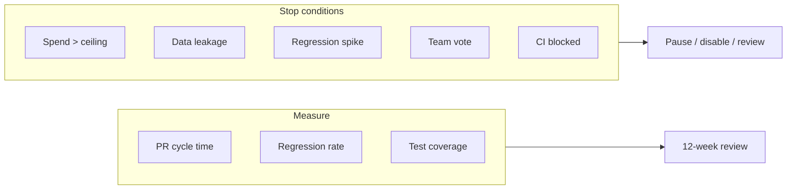

<figure class="report-section-image-wrapper" aria-labelledby="fig-kpis-caption">
  
  <figcaption id="fig-kpis-caption">Balance with tokens on each side and hand with pencil reviewing</figcaption>
</figure>

# KPIs and Risks

## 1. Problem Context

Pilot needs quantifiable KPIs, a risk register, and hard stop conditions. Critic: use 2–3 KPIs; PR cycle time most attributable. Strategist: PR cycle time, regression rate, optional test coverage; defer upgrade planning and doc frequency unless owners assigned.

## 2. AI Opportunity

Measurable improvement in PR cycle time (with vs without bot) and stable or improved regression rate; optional coverage gain. Attribution is clearest for PR cycle time.

## 3. Proposed Architecture

## 4. Tooling Options (OSS vs SaaS)

KPIs are measured via GitHub (PR cycle, merge events), defect/revert tracking (regression rate), and PHPUnit/Pest coverage reports. No extra tooling required; optional spreadsheet or doc for cost and baseline.

## 5. Guardrails & Controls

- **Cost:** Bionic/other: weekly check; alert at £180 (£200 ceiling) or £450 (£500). Cursor: team subscription; document plan limits and name usage owner.
- **Stop conditions:** Hard thresholds below; no override without explicit review and approval.

## 6. Failure Modes

Risks and mitigations are in the risk register below. Reconciled failure mode: data leakage — detection is reactive (self-report or chance); re-enable criteria defined as "incident review done, remediation applied, optionally client informed" (Critic reconciliation).

## 7. KPIs

**Quantifiable KPIs (pilot)**

| KPI | Target | How measured | Owner |
|-----|--------|--------------|-------|
| PR cycle time | ≥15% reduction for PRs with AI review | Median "open → merge" for PRs with bot comment vs without (same repo, same period) | Lead |
| Regression rate | No increase (or reduce) | Post-merge defect/revert rate in pilot repo vs baseline | Lead |
| Test coverage (optional) | +5% or N new tests merged | PHPUnit/Pest coverage report; count of new tests from AI suggestions (if test trial runs) | Laravel/WP |

**Deferred to post-pilot (unless owner assigned):** Upgrade planning time; documentation update frequency.

## 8. Actionable Next Steps

**Risk register**

| Risk | Likelihood | Impact | Mitigation | Owner |
|------|------------|--------|-------------|--------|
| Cost over £200 (or £500) for Bionic/other | Medium | Budget breach | Bionic only within budget; team Cursor (no spend tracking); weekly check; alert at £180/£450 | Cost owner |
| Client or PII data in AI | Low | Compliance; client trust | Redaction policy; PR template; .cursorrules; training; stop condition = immediate disable | Lead / governance |
| Regression rate increase | Low | Quality | Baseline; stop condition >50% vs baseline → pause AI PR review | Lead |
| PR bot noisy or unhelpful | Medium | Adoption | Tune config; 2-week feedback; stop condition <30% find helpful after 8 weeks → pause/reconfigure | Lead |
| Rector breaks build | Low | CI red | Run on branch; tests required; version Rector; "Rector PRs need extra review" | WP/Laravel lead |
| Vendor deprecated or pricing change | Low | Cost or availability | Bionic OSS/free tier; human-only review fallback; document | Lead |
| Baseline or KPIs underpowered | Medium | Unclear pilot result | Min. 4 weeks or 10 PRs for baseline; extend or choose busier repo (Strategist/Critic) | Lead |
| No owner for doc/test KPIs | Medium | Doc/test targets missed | Assign named owner before enabling doc/test phases (Reconciliation) | Lead |

**Stop conditions (hard thresholds)**

| Condition | Action |
|-----------|--------|
| Monthly spend on Bionic/other > budget (£200 or £500) for **two consecutive months** without approval | Pause new AI pipeline spend; disable PR bot or reduce scope until under ceiling; review with Cost Governor |
| **Confirmed** leakage of client or PII data into AI tools | **Immediate** disable of affected tool; incident review; remediation before re-enable; document re-enable criteria |
| Regression rate in pilot repo **>50% vs baseline** | Pause AI PR review on that repo until investigated; human-only review continues |
| **<30%** of team find PR bot helpful **after 8 weeks** | Pause or reconfigure PR bot; document feedback for go/no-go |
| CI blocked (PHPStan/Rector repeatedly failing main) | Revert or relax failing job; fix in branch; no production impact |
| Cursor plan limit hit | Usage/availability issue, not cost; document plan caps; align internal guidance; consider seat or plan change if sustained |

**Next actions**

1. Assign cost owner and document alert threshold for Bionic/other (Lead); document team Cursor plan limits and align internal caps to plan.
2. Record baseline (PR cycle time, regression rate, coverage) by end of week 4 (Lead).
3. Document incident process and re-enable criteria (Lead).
4. Schedule 4-week and 12-week KPI and cost reviews (Lead).
5. At 12 weeks: decide go/no-go for wider rollout; document decision and next steps (All).
