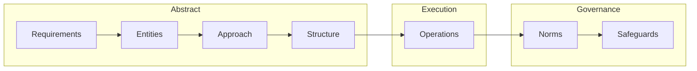

# What SPDD is & the REASONS Canvas

Individual developers gain speed from LLM assistants, but **delivery throughput** is constrained elsewhere: ambiguous requirements, heavier reviews, integration risk, and harder production reasoning when change volume rises. Structured-Prompt-Driven Development (**SPDD**) responds by making AI-assisted change **governable, reviewable, and reusable** at team scale — not only faster typing.

Source: [Structured-Prompt-Driven Development (SPDD)](https://martinfowler.com/articles/structured-prompt-driven/), Martin Fowler, 2026.

---

## Definition

**SPDD** is an engineering method that treats **prompts as first-class delivery artifacts**: version-controlled, reviewable, reusable, and improvable. Structured prompts capture requirements, domain language, design intent, constraints, and task breakdown so the model generates code **inside a defined boundary** — output becomes easier to validate and less dependent on ad hoc chat.

---

## The REASONS Canvas

The **REASONS Canvas** is a seven-part structure that guides a prompt from **intent → design → execution → governance**. It exists so the LLM is guided by clarity rather than guesswork; reviewers reason about **one artifact** instead of scattered chat and partial diffs.

### Dimensions

**Abstract (intent and design)**

| Letter | Focus |
|--------|--------|
| **R** — Requirements | Problem statement and definition of done |
| **E** — Entities | Domain entities and relationships |
| **A** — Approach | Strategy to meet the requirements |
| **S** — Structure | Where the change sits; components and dependencies |

**Specific (execution)**

| Letter | Focus |
|--------|--------|
| **O** — Operations | Concrete, testable implementation steps derived from the strategy |

**Common standards (governance)**

| Letter | Focus |
|--------|--------|
| **N** — Norms | Cross-cutting engineering norms (naming, observability, defensive coding, …) |
| **S** — Safeguards | Non-negotiable boundaries (invariants, performance limits, security rules, …) |

The article uses **REASONS** as the mnemonic (with **Structure** and the second **S** for **Safeguards**).

---

## Flow (conceptual)

Moving uncertainty **left** — before generation — is the recurring theme: the Canvas holds the full specification so review targets **intent and boundaries**, not only line-level noise.

---

## Prompt vs chat

Compared to disposable chat:

- The prompt **persists** as the record of what was intended.
- It spans **requirements through safeguards**, not only “what the system should do”.
- **Prompt and code stay synchronised** when either side changes (see [Workflow & openspdd](/reports/structured-prompt-driven/02-openspdd-and-workflow)).

---

## Relation to spec-driven development

SPDD shares “spec before code” with spec-driven approaches but adds **how** the spec is produced, reviewed, and kept aligned with code — with **REASONS** plus workflow automation. The Fowler article frames this as **spec-anchored** practice (see Birgitta Böckeler’s categorisation in the original piece).

---

**Next:** [Workflow & openspdd commands](/reports/structured-prompt-driven/02-openspdd-and-workflow)
