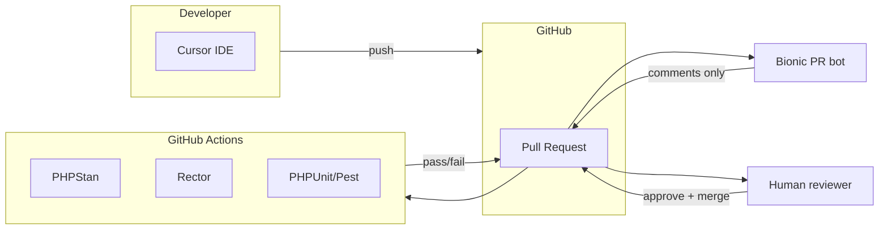
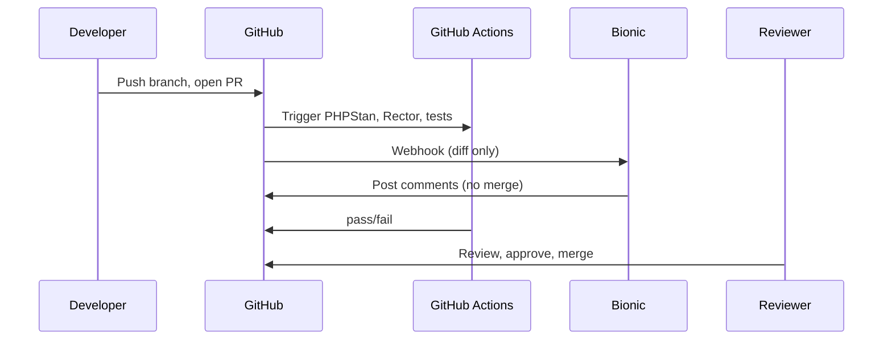
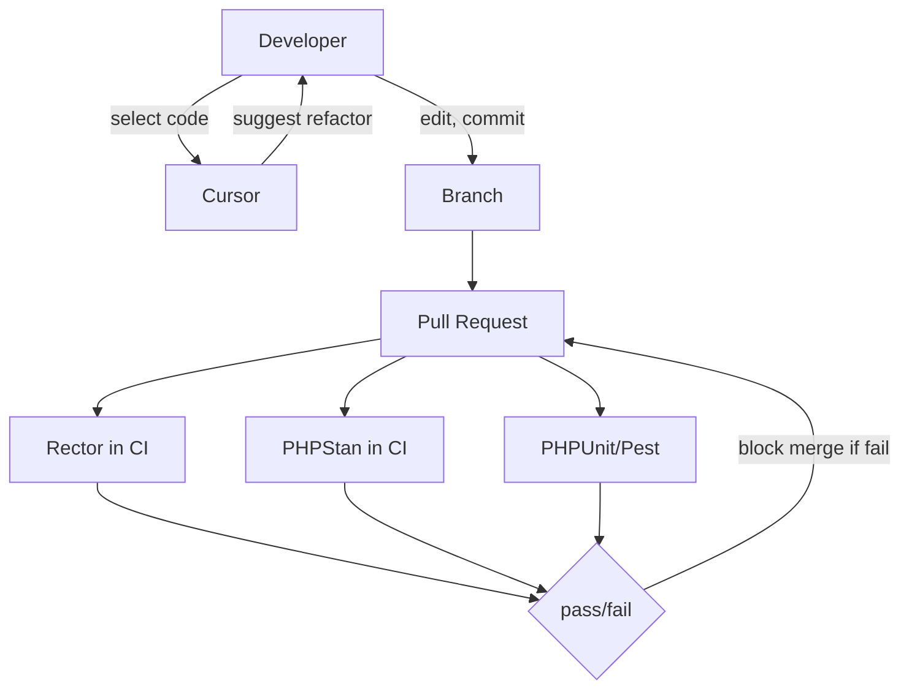
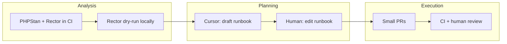
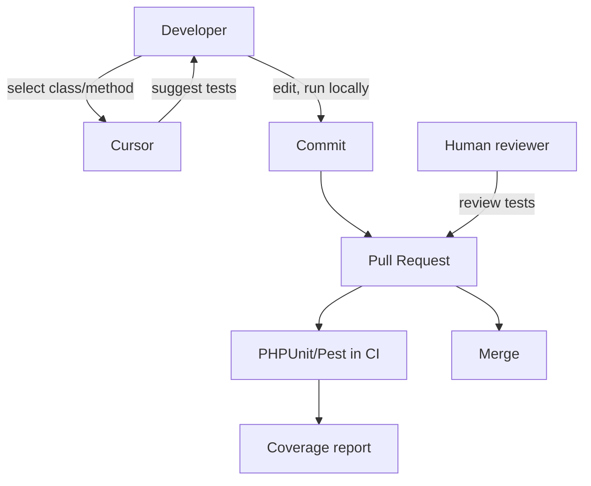
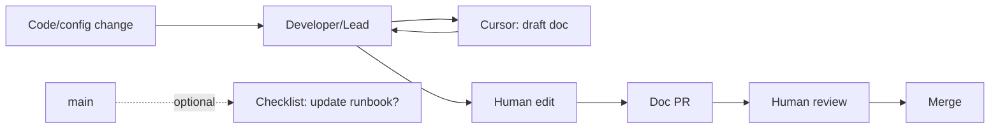
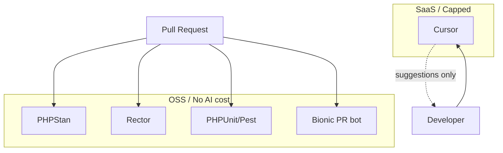
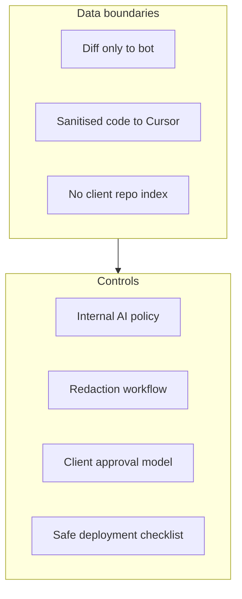
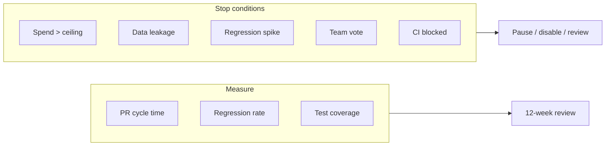

--- PAGE: 01_overview.md ---
# AI-Augmented Development Pipelines — Overview

## 1. Problem Context

WordPress + Laravel team with legacy ACF-heavy WordPress, Laravel services/queues/APIs, and GitHub-based CI/CD needs structured AI integration *beyond* code completion. Goals: improve PR quality and speed, reduce refactoring risk, de-risk PHP 7.4 → 8.x and WP/plugin migrations, increase test coverage, and improve documentation freshness — without destabilising client delivery. Constraints: no autonomous merges, must be reversible, no client data exposure, budget ceiling £200/month (pilot) or £500/month if organisation chooses. UK GDPR applies.

## 2. AI Opportunity

AI is used only where humans remain in control: first-pass PR review (diff comments), IDE-assisted refactor/migration/test/doc suggestions (human edits and commits). No AI in CI; no AI in deploy path. Opportunity is faster, more consistent review; safer upgrades via Rector + optional runbook drafting; and better test/doc coverage with human-curated AI suggestions.

## 3. Proposed Architecture

Reconciled choice: **Option A** for pilot — CI (PHPStan, Rector, PHPUnit/Pest) + Bionic (OSS or free tier) for PR comments only + Cursor for local use. No CodeRabbit, no Copilot, at £200 ceiling. All agents agreed; Critic and Strategist recommended Option A and 2–3 KPIs for pilot.



## 4. Tooling Options (OSS vs SaaS)

| Layer | Selected for pilot | Alternative |
|-------|--------------------|-------------|
| CI | GitHub Actions, PHPStan, Rector, PHPUnit/Pest (all OSS) | — |
| PR review | Bionic (OSS or free tier) | CodeRabbit (SaaS; excluded at £200) |
| IDE | Cursor only | Copilot (excluded at £200) |

No AI in CI; no paid indexing. Cost Governor: at £200, Bionic only, Cursor only, no overage.

## 5. Guardrails & Controls

- **No autonomous merge:** Branch protection requires CI pass + human review; bot has no merge rights.
- **No client data in AI path:** PR template checklist; .cursorrules "no client names, URLs, credentials, PII"; diff-only to bot; max 30k tokens per PR.
- **Reversibility:** Disable Bionic via GitHub App; revert CI workflow; restrict Cursor by repo.
- **Cost:** £200/month ceiling; weekly spend check; alert at £180; rate limits (e.g. 15 PRs/repo/week for bot, 25 heavy Cursor requests/user/week).

## 6. Failure Modes

- **Bot noisy or wrong:** Tune config; 2-week feedback; allow disable per repo.
- **Rector breaks build:** Run on branch; require tests green; version Rector rules.
- **Vendor deprecated or pricing change:** Bionic OSS or free tier; fallback human-only review.
- **Client data in prompt:** Policy + training; stop condition = immediate disable and review; re-enable when incident review done and remediation applied (reconciled from Critic).

## 7. KPIs

- **PR cycle time:** ≥15% reduction for PRs with AI review (median open→merge, with vs without bot).
- **Regression rate:** No increase (or reduce) vs baseline.
- **Test coverage (optional):** +5% or N new tests if test trial runs.

Upgrade planning and documentation frequency deferred to post-pilot (Critic/Strategist).

## 8. Actionable Next Steps

1. Choose pilot repo and confirm budget ceiling (£200 or £500).
2. Add PHPStan + Rector to pilot repo CI (WP/Laravel lead).
3. Publish one-pager and PR template; add .cursorrules (Lead + governance).
4. Install Bionic on pilot repo; document "no client data" (DevOps/Lead).
5. Record baseline (PR cycle time, regression rate, coverage); name cost owner; schedule 4- and 12-week reviews.

--- PAGE: 02_pr-review.md ---
# PR Review (AI-Augmented)

## 1. Problem Context

PR review is a bottleneck: reviewer availability and consistency vary; PHP 8.x and WP/Laravel deprecations can be missed. Team needs a first-pass that summarises diffs, flags obvious issues and deprecations, without replacing human judgment or merge authority.

## 2. AI Opportunity

A PR bot (Bionic) receives the diff (and minimal context) and posts comments: summary, security/breaking hints, optional PHP 8.x/WP deprecation flags. Human reviewer still approves and merges; merge never depends on the bot. At £200, only Bionic (OSS or free tier) is used; CodeRabbit is excluded.

## 3. Proposed Architecture



## 4. Tooling Options (OSS vs SaaS)

| Option | Tool | Pilot choice | Note |
|--------|------|--------------|------|
| OSS | Bionic (GitHub App) | **Yes** | OSS or free tier; diff-only; 30k tokens/PR cap. |
| SaaS | CodeRabbit | No at £200 | Allowed only if budget is £500 and cost controlled. |

Cursor is not used for "review entire PR" in pipeline; that is the bot’s role. Local Cursor remains for completion and ad-hoc explain/refactor.

## 5. Guardrails & Controls

- **Input:** Bot receives diff only (or diff + minimal context). No `.env`, `wp-config`, or credentials in paths. Max 30k tokens per PR (Cost Governor).
- **Redaction:** PR title/description and branch name must not contain client names, production URLs, API keys, or PII. PR template checklist: "I confirm no client names, URLs, credentials, or PII in this PR."
- **Merge:** Bot has no merge rights. Branch protection: CI pass + human review required.
- **Audit:** "AI-assisted review: yes" in PR template or label. Optional: log PR numbers that received bot comments.
- **Rate limit:** 15 PRs per repo per week (Cost Governor at £200).

## 6. Failure Modes

- **Noisy or wrong suggestions:** Conservative config; tune or disable categories; 2-week feedback loop. Allow disable per repo.
- **Bot down or rate-limited:** Human review continues; merge still gated on CI + human. No dependency on bot for merge (DevOps).
- **Client data in diff:** Stop condition: immediate disable and review; redaction policy and training to prevent.

## 7. KPIs

- **PR cycle time:** ≥15% reduction for PRs with bot comment vs without (same repo, median open→merge). Most attributable KPI (Critic).
- **Regression rate:** No increase vs baseline (post-merge defect/revert rate).

## 8. Actionable Next Steps

1. Install Bionic on pilot repo (OSS or free tier); no merge rights (DevOps/Lead).
2. Set bot config: diff-only, max 30k tokens/PR.
3. Add PR template with "AI-assisted review: yes/no" and redaction checklist.
4. Document data policy in repo (README or CONTRIBUTING).
5. After 8 weeks: team vote on usefulness; if <30% find helpful, pause or reconfigure (stop condition).

--- PAGE: 03_refactoring.md ---
# Refactoring (AI-Assisted)

## 1. Problem Context

Legacy WordPress and Laravel code needs targeted modernisation for PHP 8.x (types, named args, match) and WP/Laravel deprecations. Big-bang refactors are risky; team needs minimal, file-scoped changes and consistent rules enforced in CI.

## 2. AI Opportunity

Rector runs in CI (deterministic; no AI cost). Cursor is used locally for "suggest PHP 8.x refactor" on selection; developer edits and commits. Repo rules (.cursorrules) can align Cursor with WP/Laravel/ACF conventions. No autonomous refactor PRs; human always applies and commits.

## 3. Proposed Architecture



## 4. Tooling Options (OSS vs SaaS)

| Area | OSS | SaaS (local) | Pilot |
|------|-----|--------------|-------|
| Rule execution | Rector (CI), PHPStan (CI) | — | Both in CI |
| Suggestions | — | Cursor | Cursor only; no Copilot at £200 |

Rector: PHP 8.x preset; optional WP rule set after baseline is green. PHPStan: WordPress stubs, Laravel plugin; level 0 initially, then raise in dedicated PRs.

## 5. Guardrails & Controls

- **CI:** Rector runs on every PR (or scoped paths); full test run required. No Rector-only mass PR without agreement; refactor in small PRs.
- **Cursor:** No client data in prompts; no file >500 lines or paste >8k chars (.cursorrules). "Heavy" requests capped (e.g. 25/user/week at £200).
- **Reversibility:** Revert workflow to remove Rector; or exclude paths in config. Cursor use is policy-based; no pipeline dependency.

## 6. Failure Modes

- **Rector rule breaks build or behaviour:** Run on branch first; require CI green including tests; version Rector and rule set; "Rector PRs need extra review" (Dev Lead).
- **Rector vs WP/Laravel versions:** Rule sets can conflict with specific WP/plugin versions. Use preset first; add WP rules only after PHP 8.x set is green. Separate jobs or matrix for WP vs Laravel if monorepo.
- **Baseline creep:** PHPStan baseline or Rector exclusions grow. Mitigation: quarterly "reduce baseline" task; track baseline size (Dev Lead).

## 7. KPIs

- **Regression rate:** No increase (or reduce) after refactor PRs.
- **CI pass rate:** No sustained red on main from Rector/PHPStan.

Refactor-specific KPI (e.g. "N files modernised") is optional; primary signal is regression rate and CI health.

## 8. Actionable Next Steps

1. Add Rector to CI with PHP 8.x preset; scope to relevant paths (WP/Laravel lead).
2. Add .cursorrules: no client data; prefer small selection; WP/Laravel conventions optional.
3. Document "Rector PRs need extra review" in CONTRIBUTING or team guide.
4. Plan one refactor/migration run (PHP 8.x or WP upgrade) in weeks 4–6; document time and issues.

--- PAGE: 04_migration-intelligence.md ---
# Migration Intelligence (PHP / WP / Plugins)

## 1. Problem Context

PHP 7.4 → 8.x and WP/plugin upgrades require impact analysis, runbooks, and ordered execution. Team needs to know what breaks and in what order, without sending client data to AI.

## 2. AI Opportunity

CI (PHPStan + Rector) surfaces deprecations and fixable issues on current code. Rector dry-run/diff lists suggested code changes. Cursor can draft migration runbooks (e.g. "runbook for PHP 7.4 → 8.1 for this repo") from codebase context; human edits and owns execution. No AI in CI for migration; no autonomous execution.

## 3. Proposed Architecture



## 4. Tooling Options (OSS vs SaaS)

| Role | Tool | Type | Note |
|------|------|------|------|
| Deprecation/change list | PHPStan, Rector | OSS, CI | No AI; deterministic. |
| Runbook draft | Cursor | SaaS (local) | Human edits; no client names/URLs/credentials in prompts. |

No migration-specific SaaS beyond Cursor. Runbooks are internal; use placeholders (e.g. CLIENT_SITE_URL) for any client-specific steps.

## 5. Guardrails & Controls

- **Runbook content:** No client names, production URLs, or credentials. Use placeholders or internal-only docs not sent to AI (Governance).
- **Execution:** Human-driven; each change via PR; CI (PHPStan, Rector, tests) must pass. No AI in CI.
- **Cursor:** Sanitised code only; rate limits (e.g. 25 heavy/user/week, 20 doc+test team/month at £200).

## 6. Failure Modes

- **Rector suggests breaking change:** Run on branch; full test pass; review before merge. Version Rector rules.
- **Runbook wrong or incomplete:** Human ownership; runbook is advisory; execute in small PRs with CI.
- **Client data in runbook draft:** Redaction policy; if sent to AI, treat as incident (disable, review).

## 7. KPIs

- **Upgrade planning time:** ≥20% reduction for one PHP or WP upgrade (time from "start planning" to "runbook ready") — deferred to post-pilot unless an upgrade is planned and owner assigned (Critic: one data point per upgrade; weak for 90 days).
- **Migration success:** One completed upgrade (e.g. PHP 8.x or WP) with runbook and no production incident.

## 8. Actionable Next Steps

1. Run Rector dry-run on pilot repo; document list of suggested changes (WP/Laravel lead).
2. Use Cursor to draft runbook for one planned upgrade; human edit and store in repo (no client data in draft).
3. Execute upgrade in small PRs; each passes CI; document time and issues for pilot review.

--- PAGE: 05_test-generation.md ---
# Test Generation (AI-Assisted)

## 1. Problem Context

Test coverage is insufficient; writing tests is time-consuming. Team wants to increase coverage without merging unmaintained or low-value tests.

## 2. AI Opportunity

Developer selects class/method in Cursor; asks for PHPUnit/Pest test suggestions. Developer edits (assertions, data providers, mocks) and commits. CI runs tests; no automated "AI creates test PR". At £200: ad-hoc Cursor only; rate limit (e.g. 20 doc+test team/month). Named owner for "generated test quality" so tests are maintained (reconciled from Critic/Dev Lead).

## 3. Proposed Architecture



## 4. Tooling Options (OSS vs SaaS)

| Role | Tool | Pilot |
|------|------|-------|
| Execution | PHPUnit or Pest | In CI |
| Suggestions | Cursor | Yes; no Copilot at £200 |
| Scaffolding | PHPUnit/Pest + manual or scripts | Optional |

No separate test-generation API or SaaS; Cursor only, within rate limits.

## 5. Guardrails & Controls

- **Output:** All generated tests reviewed and edited by a human before commit. No autonomous test PRs (Governance).
- **Input:** Sanitised code only; no credentials or client data in prompts. .cursorrules: no client names, production URLs, credentials, PII (Governance).
- **Ownership:** Named owner for "generated test quality" and maintenance (Reconciliation, Dev Lead).
- **Rate:** 20 doc+test team/month (Cost Governor at £200).

## 6. Failure Modes

- **Generated tests low quality or brittle:** Human review and ownership; treat as normal PR review. Owner responsible for maintenance.
- **Coverage delta small:** Critic: "1–2 services" may not move repo-wide % much. KPI is +5% or N new tests if trial runs; optional for pilot.
- **Cursor overage:** Enforce rate limit; prefer small selection; no full-file paste.

## 7. KPIs

- **Test coverage:** +5% in pilot repo or N new tests merged from AI suggestions (optional for pilot; measure if test trial runs in weeks 6–8).
- **Regression rate:** No increase from new tests (tests should not introduce flake or false positives).

## 8. Actionable Next Steps

1. Assign named owner for "generated test quality" (Lead).
2. In weeks 6–8 (optional): generate and human-edit tests for 1–2 services; merge and measure coverage delta (Laravel/WP).
3. Add .cursorrules for test prompts: sanitised code only; no client data.
4. Track "test PRs from AI assistance" if desired for KPI (optional).

--- PAGE: 06_documentation.md ---
# Documentation (AI-Assisted)

## 1. Problem Context

README, runbooks, and API/hook docs drift as code and deployment change. Team needs fresher docs without autonomous doc PRs or client data in AI.

## 2. AI Opportunity

Developer or lead uses Cursor to draft README/runbook/ADR updates from code or config context; human approves and commits. Optional: "on merge to main" checklist or issue template ("if deployment/env changed, update runbook"). No AI in CI that pushes doc changes. At £200: ad-hoc only; no dedicated doc-generation runs; optional checklist (Strategist).

## 3. Proposed Architecture



## 4. Tooling Options (OSS vs SaaS)

| Role | Tool | Pilot |
|------|------|-------|
| Draft | Cursor | Yes; ad-hoc |
| Site | MkDocs, Docusaurus, or /docs in repo | Existing or new; human-maintained |
| CI | No AI; optional link check or build | Optional |

No Sweep or autonomous doc bot; Cursor only, human commits.

## 5. Guardrails & Controls

- **Content:** No client names, production URLs, or credentials in prompts or in public docs (Governance). Internal runbooks: same redaction for content sent to AI.
- **Output:** All doc changes approved and committed by a human. No autonomous doc PRs (Governance).
- **Ownership:** Named owner for "documentation update frequency" (Reconciliation, Dev Lead); avoids vague "someone will do it" (Critic).
- **Rate:** Part of 20 doc+test team/month at £200 if doc drafts use "heavy" Cursor.

## 6. Failure Modes

- **Docs still stale:** Only improves if owner and process exist. Assign owner and optional checklist/reminder (Critic).
- **Client data in draft:** Redaction policy; if sent to AI, incident process (disable, review).
- **Doc PRs never merged:** Define "doc update frequency" (e.g. ≥1 doc PR/month) and assign owner; add to team checklist or retro.

## 7. KPIs

- **Documentation update frequency:** ≥1 doc PR merged per month (pilot repo or /docs) — deferred to post-pilot unless owner assigned (Strategist). Clear definition: count of doc PRs merged (Critic).

## 8. Actionable Next Steps

1. Assign named owner for "documentation update frequency" (Lead).
2. Define "doc update frequency" (e.g. ≥1 doc PR/month or README/runbook within 2 sprints of change); document in pilot (Dev Lead).
3. Optional: add "on merge to main" checklist or issue template for runbook updates (weeks 8–10).
4. One doc PR in pilot window (e.g. README or runbook) to validate process.

--- PAGE: 07_tooling-comparison.md ---
# Tooling Comparison (OSS vs SaaS)

## 1. Problem Context

Pipeline needs proven tools only; no hallucinated or speculative tooling. Budget (£200 pilot) forces trade-offs: Bionic only for PR, Cursor only for IDE, no CodeRabbit or Copilot at £200.

## 2. AI Opportunity

AI is used only in PR bot (Bionic) and local IDE (Cursor). CI is deterministic (PHPStan, Rector, PHPUnit/Pest). No AI in CI; no paid indexing. Opportunity is cost control and reversibility while still getting first-pass review and local suggestions.

## 3. Proposed Architecture



## 4. Tooling Options (OSS vs SaaS)

**Comparison table (OSS vs SaaS)**

| Area | OSS / self-hosted | SaaS | Pilot choice (£200) | Pilot choice (£500) |
|------|-------------------|------|---------------------|----------------------|
| PR review | Bionic (GitHub App), Reviewpad | CodeRabbit, GitHub Copilot for PRs | **Bionic only** | Bionic or CodeRabbit |
| Static analysis | PHPStan, Psalm, Rector, PHPCompatibility | — | **PHPStan, Rector** in CI | Same |
| Refactor / migration | Rector (CI), PHPStan | Cursor, Copilot (local) | **Rector in CI; Cursor local** | Same; Copilot optional |
| Test generation | PHPUnit, Pest, scaffolding | Cursor, Copilot | **Cursor only** (ad-hoc) | Cursor; Copilot optional |
| Documentation | MkDocs, Docusaurus, phpDocumentor | Cursor, Copilot, Sweep | **Cursor only** (ad-hoc) | Cursor; optional Sweep |
| IDE / local | — | Cursor, GitHub Copilot | **Cursor only** | Cursor + optional Copilot |

**Conflict resolution:** Cost Governor and Strategist: at £200, Bionic only, Cursor only, no CodeRabbit, no Copilot. Architect and Dev Lead: Option A (Bionic, Cursor) is safe to pilot. Reconciled: Option A is the recommended architecture; £500 allows CodeRabbit and Copilot with rate limits and alerts.

## 5. Guardrails & Controls

- **CI:** No SaaS AI in GitHub Actions. Grep on PR for `openai`, `anthropic`, etc. in workflows (Cost Governor).
- **PR bot:** Bionic: 15 PRs/repo/week; 30k tokens/PR max. No CodeRabbit at £200.
- **Cursor:** Default model only; no premium; 25 heavy/user/week, 20 doc+test team/month; no paid index (Cost Governor).

## 6. Failure Modes

- **Vendor deprecated or pricing change:** Bionic OSS or free tier; fallback human-only review. Cursor: policy to restrict by repo if needed.
- **Tool substitution:** If Bionic unavailable, human-only review until replacement (no new tool without Architect/Cost Governor alignment).

## 7. KPIs

- **Cost:** Monthly spend ≤ £200 (or £500 if agreed); weekly check; alert at £180 (or £450).
- **CI health:** No AI in CI; workflow success and job duration as per DevOps checklist.

## 8. Actionable Next Steps

1. Confirm budget ceiling (£200 or £500) and lock tool set (Bionic only vs Bionic or CodeRabbit; Cursor only vs Cursor + Copilot).
2. Document chosen stack in repo (README or docs) and in one-pager.
3. Enforce "no AI in CI" via code review of every workflow change.

--- PAGE: 08_governance-and-controls.md ---
# Governance and Controls

## 1. Problem Context

UK GDPR, client data exposure risk, and need for auditability require clear data boundaries, redaction, client communication, and safe deployment. All agents agreed: safe with controls; compliance risk 2/5 with controls (Governance).

## 2. AI Opportunity

AI is used only on code/diffs and sanitised context; no client data or PII in AI path. Opportunity is faster, safer development without increasing compliance risk when controls are enforced.

## 3. Proposed Architecture



## 4. Tooling Options (OSS vs SaaS)

Governance does not prescribe specific tools beyond: PR bot receives diff only; Cursor used with sanitised code; DPAs/SCCs for SaaS (Cursor, and CodeRabbit if used at £500). Prefer Bionic OSS or self-hosted to reduce sub-processor surface at £200.

## 5. Guardrails & Controls

**Internal AI usage policy summary**

- **Purpose:** Development assistance only (PR review, refactor, migration, test, doc suggestions). No production user data or client PII in AI path.
- **Scope:** Code and diffs only. No `.env`, `wp-config`, credentials, or client names/URLs in PR descriptions, branch names, commit messages, or prompts.
- **Merge:** Humans only. No autonomous merge. Branch protection: CI pass + human review.
- **Reversibility:** Disable PR bot via GitHub App; revert CI workflow; restrict Cursor by repo/org. Document kill switch.
- **Audit:** Record "AI-assisted" on PRs; do not log prompt content without policy. Log incidents (tool disabled, reason, remediation).
- **Ownership:** Named owner for cost check; named owner for doc/test KPIs when those are in scope.

**Client approval model**

- **Transparency:** Inform clients that AI-assisted development tools are used (PR review, code/test/doc suggestions) under strict data and merge policies; no client data or PII sent to AI; no autonomous merges.
- **Formal approval:** If contract or client process requires explicit approval for sub-processors or AI tools, obtain it. Otherwise, document that clients have been informed (Governance).
- **Objection:** If a client objects (e.g. "no AI on our code"), exclude that client’s repo from PR bot and from Cursor use on that code until a safe process is agreed. Who decides and how repo is scoped per client to be defined (reconciled from Critic: spell out process).

**Redaction workflow**

1. **Before opening PR:** Author confirms no client names, production URLs, API keys, or PII in title, description, branch name, commit messages, or changed files (or exclude sensitive files from bot context).
2. **PR template:** Checklist: "I confirm no client names, URLs, credentials, or PII in this PR."
3. **Cursor:** .cursorrules: "Do not include client names, production URLs, credentials, or PII in prompts." Onboarding: short training on what must not be sent to AI.
4. **If in doubt:** Redact or exclude; prefer no context over context that might contain client data (Governance).
5. **Breach:** Immediate disable of affected tool; incident review; remediation before re-enable. Re-enable when: incident review done, remediation applied, optionally client informed (reconciled from Critic).

**Safe deployment checklist**

- [ ] No AI in deploy path; deploy gates unchanged (CI + human approval only).
- [ ] PR bot has no merge rights; branch protection requires CI + human review.
- [ ] No client data in PR bot or Cursor prompts; redaction and policy in place.
- [ ] One-pager and PR template published; .cursorrules in pilot repo.
- [ ] Cost owner named; weekly spend check and alert threshold set.
- [ ] Stop conditions and incident recovery (re-enable criteria) documented.
- [ ] Clients informed (and formal approval obtained if required).

## 6. Failure Modes

- **Breach (client data in AI):** Stop condition: immediate disable; review; remediation; re-enable only after criteria met (reconciled).
- **No DPA for vendor:** Pilot may run at risk until DPA signed; Governance and Critic: clarify if DPAs exist; if not, delay or use only OSS/self-hosted where possible.
- **Audit trail incomplete:** Make "AI-assisted" mandatory in PR template or automate (e.g. PR has bot comment ⇒ count as AI-assisted) to strengthen audit (reconciled from Critic).

## 7. KPIs

- **Compliance:** No confirmed data leakage; no breach of redaction policy.
- **Audit:** Able to show (1) policies in place, (2) no client data in AI scope, (3) which PRs were AI-assisted.

## 8. Actionable Next Steps

1. Publish one-pager (no client data; no autonomous merge; reversible; "AI-assisted" on PRs) (Lead + governance).
2. Add PR template and .cursorrules; run onboarding on redaction (Lead).
3. Document incident process and re-enable criteria (Lead).
4. Inform clients and document; obtain formal sign-off where contractually required (Lead/governance).
5. Confirm or negotiate DPAs for Cursor (and CodeRabbit if used) (Lead/governance).

--- PAGE: 09_90-day-roadmap.md ---
# 90-Day Roadmap

## 1. Problem Context

Pilot must validate CI + PR bot + policy in one repo without destabilising client delivery. Strategist: Pilot decision; Option A; 2–3 KPIs; budget £200 or £500. Dev Lead: CI first, then policy, then bot; optional test/doc in second half.

## 2. AI Opportunity

Structured 90-day run with clear phases, owners, and success criteria so the initiative is measurable and reversible.

## 3. Proposed Architecture

```mermaid
gantt
  title 90-day pilot
  dateFormat YYYY-MM-DD
  section 0-30
  CI + baseline     :a1, 0, 14d
  Policy + guardrails :a2, 7, 14d
  PR bot Bionic     :a3, 14, 7d
  Baseline metrics  :a4, 21, 10d
  section 30-60
  Refactor/migration run :b1, 30, 14d
  Optional test trial :b2, 44, 14d
  section 60-90
  Optional docs     :c1, 60, 14d
  Review and decide :c2, 74, 16d
```

## 4. Tooling Options (OSS vs SaaS)

Same as reconciled: Bionic (OSS or free tier), Cursor only at £200; optional CodeRabbit/Copilot at £500. No new tools mid-pilot without Cost Governor and Architect alignment.

## 5. Guardrails & Controls

- **Budget:** £200/month (or £500) hard ceiling; weekly cost check; alert at £180 (or £450).
- **Scope:** One pilot repo for PR bot; no AI in CI; human merge only.
- **Stop conditions:** Spend, data leakage, regression spike, team vote, CI blocked — as in page 10.

## 6. Failure Modes

- **Pilot slips:** If team is stretched, defer optional (test/doc) phases; keep weeks 1–4 mandatory (Dev Lead, Critic).
- **Baseline noisy:** Min. 4 weeks or 10 PRs for baseline (Strategist/Critic); extend or choose busier repo if needed.

## 7. KPIs

- **0–30 days:** CI green; Bionic live; baseline recorded; no stop condition; cost within ceiling.
- **30–60 days:** At least one refactor/migration run documented; optional test trial if capacity.
- **60–90 days:** KPI review (PR cycle time, regression rate, optional coverage); go/no-go decision.

## 8. Actionable Next Steps

**0–30 days**

| Week | Milestone | Owner | Deliverables | Success criteria |
|------|-----------|--------|--------------|-------------------|
| 1 | CI + static analysis | WP/Laravel lead | Pilot repo chosen; PHPStan in GitHub Actions; baseline config so main green | Main branch green; PHPStan runs on PR |
| 1 | Rector | WP/Laravel lead | Rector in same workflow (PHP 8.x preset); branch protection requires both | Rector runs on PR; merge blocked if fail |
| 2 | Policy and guardrails | Lead + governance | One-pager; PR template "AI-assisted" + redaction checklist; .cursorrules draft | Team has seen and acknowledged |
| 3 | PR bot | DevOps / Lead | Bionic on pilot repo (OSS or free tier); no merge rights; diff-only, 30k tokens/PR | Bot posts comments; merge still human+CI |
| 3 | Data policy | Lead | "No client data" and data policy in repo (README or CONTRIBUTING) | Documented in repo |
| 4 | Baseline and cost | Lead; Cost owner | Baseline: PR cycle time, regression rate, coverage %; first weekly cost check; alert £180 or £450 | Numbers recorded; spend logged |
| 4 | 30-day review | Lead | CI stable? Bot useful? Any stop condition? | Gate for month 2 passed |

**30–60 days**

| Week | Milestone | Owner | Deliverables | Success criteria |
|------|-----------|--------|--------------|-------------------|
| 4–6 | Refactor/migration | WP/Laravel | One PHP 8.x or WP upgrade run using Cursor + Rector; document time and issues | Runbook or checklist; upgrade or refactor done |
| 6–8 | Optional: test generation | Laravel/WP | Generate + human-edit tests for 1–2 services; measure coverage delta; name owner for test quality | Tests merged; coverage delta recorded (if run) |

**60–90 days**

| Week | Milestone | Owner | Deliverables | Success criteria |
|------|-----------|--------|--------------|-------------------|
| 8–10 | Optional: docs | Lead | Define "doc update frequency"; optional checklist on merge; name owner for doc KPI | At least one doc PR merged if run; owner named |
| 10–12 | Review and decide | All | KPI review; cost vs ceiling; team feedback; go/no-go for wider rollout or revert | Decision documented; next steps clear |

--- PAGE: 10_kpis-and-risks.md ---
# KPIs and Risks

## 1. Problem Context

Pilot needs quantifiable KPIs, a risk register, and hard stop conditions. Critic: use 2–3 KPIs; PR cycle time most attributable. Strategist: PR cycle time, regression rate, optional test coverage; defer upgrade planning and doc frequency unless owners assigned.

## 2. AI Opportunity

Measurable improvement in PR cycle time (with vs without bot) and stable or improved regression rate; optional coverage gain. Attribution is clearest for PR cycle time.

## 3. Proposed Architecture



## 4. Tooling Options (OSS vs SaaS)

KPIs are measured via GitHub (PR cycle, merge events), defect/revert tracking (regression rate), and PHPUnit/Pest coverage reports. No extra tooling required; optional spreadsheet or doc for cost and baseline.

## 5. Guardrails & Controls

- **Cost:** Weekly check; alert at £180 (£200 ceiling) or £450 (£500); named cost owner.
- **Stop conditions:** Hard thresholds below; no override without explicit review and approval.

## 6. Failure Modes

Risks and mitigations are in the risk register below. Reconciled failure mode: data leakage — detection is reactive (self-report or chance); re-enable criteria defined as "incident review done, remediation applied, optionally client informed" (Critic reconciliation).

## 7. KPIs

**Quantifiable KPIs (pilot)**

| KPI | Target | How measured | Owner |
|-----|--------|--------------|-------|
| PR cycle time | ≥15% reduction for PRs with AI review | Median "open → merge" for PRs with bot comment vs without (same repo, same period) | Lead |
| Regression rate | No increase (or reduce) | Post-merge defect/revert rate in pilot repo vs baseline | Lead |
| Test coverage (optional) | +5% or N new tests merged | PHPUnit/Pest coverage report; count of new tests from AI suggestions (if test trial runs) | Laravel/WP |

**Deferred to post-pilot (unless owner assigned):** Upgrade planning time; documentation update frequency.

## 8. Actionable Next Steps

**Risk register**

| Risk | Likelihood | Impact | Mitigation | Owner |
|------|------------|--------|-------------|--------|
| Cost over £200 (or £500) | Medium | Budget breach | Bionic only; Cursor only at £200; rate limits; weekly check; alert at £180/£450 | Cost owner |
| Client or PII data in AI | Low | Compliance; client trust | Redaction policy; PR template; .cursorrules; training; stop condition = immediate disable | Lead / governance |
| Regression rate increase | Low | Quality | Baseline; stop condition >50% vs baseline → pause AI PR review | Lead |
| PR bot noisy or unhelpful | Medium | Adoption | Tune config; 2-week feedback; stop condition <30% find helpful after 8 weeks → pause/reconfigure | Lead |
| Rector breaks build | Low | CI red | Run on branch; tests required; version Rector; "Rector PRs need extra review" | WP/Laravel lead |
| Vendor deprecated or pricing change | Low | Cost or availability | Bionic OSS/free tier; human-only review fallback; document | Lead |
| Baseline or KPIs underpowered | Medium | Unclear pilot result | Min. 4 weeks or 10 PRs for baseline; extend or choose busier repo (Strategist/Critic) | Lead |
| No owner for doc/test KPIs | Medium | Doc/test targets missed | Assign named owner before enabling doc/test phases (Reconciliation) | Lead |

**Stop conditions (hard thresholds)**

| Condition | Action |
|-----------|--------|
| Monthly spend > budget (£200 or £500) for **two consecutive months** without approval | Pause new AI pipeline spend; disable PR bot or reduce scope until under ceiling; review with Cost Governor |
| **Confirmed** leakage of client or PII data into AI tools | **Immediate** disable of affected tool; incident review; remediation before re-enable; document re-enable criteria |
| Regression rate in pilot repo **>50% vs baseline** | Pause AI PR review on that repo until investigated; human-only review continues |
| **<30%** of team find PR bot helpful **after 8 weeks** | Pause or reconfigure PR bot; document feedback for go/no-go |
| CI blocked (PHPStan/Rector repeatedly failing main) | Revert or relax failing job; fix in branch; no production impact |

**Next actions**

1. Assign cost owner and document alert threshold (Lead).
2. Record baseline (PR cycle time, regression rate, coverage) by end of week 4 (Lead).
3. Document incident process and re-enable criteria (Lead).
4. Schedule 4-week and 12-week KPI and cost reviews (Lead).
5. At 12 weeks: decide go/no-go for wider rollout; document decision and next steps (All).
