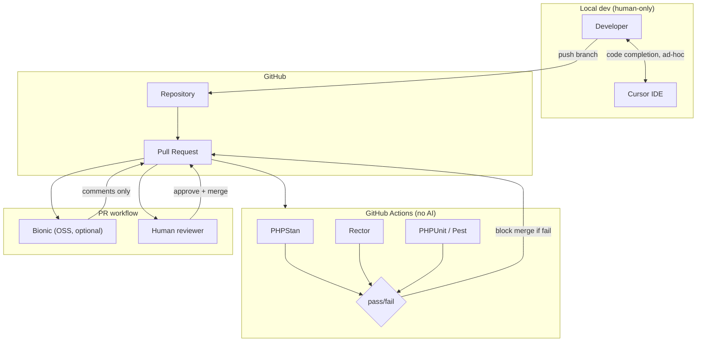
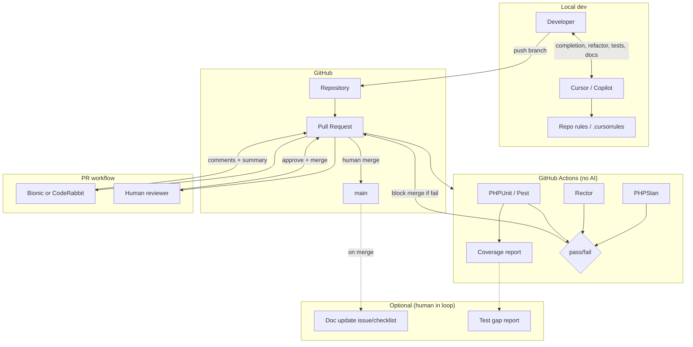

# Initiative Intake

## Title
AI-Augmented Development Pipelines (Beyond Code Completion)

## Problem Statement
We need structured AI integration into the WordPress + Laravel development lifecycle to improve review quality, reduce upgrade friction, increase test coverage, and improve documentation — without destabilising client delivery.

## Context
- Legacy WordPress installs (ACF-heavy, Classic Editor)
- Laravel services, queues, APIs, Passport
- CI/CD via GitHub + deployment tooling
- PHP 7.4 → 8.x transition in progress
- Active client retainers
- UK GDPR constraints

## Objectives
1. Improve PR quality and speed
2. Reduce refactoring risk
3. De-risk migrations (PHP/WP/plugins)
4. Increase automated test coverage
5. Improve documentation freshness

## Constraints
- Budget ceiling: £500/month
- No autonomous merges to production
- Must be reversible
- No client data exposure

## Target Outcomes (Measurable)
- PR cycle time reduction %
- Regression rate reduction %
- Test coverage increase %
- Upgrade planning time reduction %
- Documentation update frequency %

---

## Original Research Brief

Research how AI can be structurally integrated into a WordPress + Laravel development pipeline beyond code completion.

Produce:
1. Opportunities for AI augmentation in:
   - PR review
   - Refactoring
   - Migration (PHP + WP upgrades)
   - Test generation
   - Documentation
2. Tool comparison (OSS vs SaaS)
3. Security and governance considerations
4. 90-day pilot roadmap
5. KPIs
6. Risks and failure modes

---

# Research Output

**Budget note:** Intake states £500/month; original brief stated £200/month. This document uses £500 as the working ceiling; Cost Governor section includes a £200-compatible variant.

---

## 1. Opportunities for AI Augmentation

### PR review
- **Automated first-pass review:** Diff summarisation, obvious bug/security pattern flags, style/consistency checks before human review.
- **Context-aware suggestions:** Use repo/docs context to suggest WordPress/Laravel best practices, ACF patterns, hook usage.
- **Changelog and scope summary:** One-line PR summary and “what changed” for release notes.
- **Constraint checks:** Flag PHP 8.x incompatibilities, deprecated WP/Laravel APIs in changed files.

### Refactoring
- **Targeted modernisation:** Identify files suitable for PHP 8.x types, named args, match; suggest minimal, file-scoped changes.
- **ACF → blocks / patterns:** Suggest incremental migration paths (where ACF fields map to block attributes) without big-bang rewrites.
- **Dependency and dead-code hints:** Unused hooks, unreachable code, safe-to-remove dependencies.

### Migration (PHP + WP upgrades)
- **Upgrade impact analysis:** Per-repo or per-plugin “what breaks on PHP 8.x / WP 6.x” using static analysis + known deprecations.
- **Migration runbooks:** Generate stepwise upgrade checklists (PHP version, extensions, WP core, plugins, tests).
- **Compatibility tagging:** Tag PRs/issues with “PHP 8.1”, “WP 6.4”, etc., from code and dependency data.

### Test generation
- **Unit test scaffolding:** Generate PHPUnit tests for Laravel services/controllers and WP plugin functions from signatures and docblocks.
- **Regression test ideas:** From PR diffs, suggest “test that X still does Y” cases for critical paths.
- **Fixture and mock suggestions:** From existing tests, suggest fixtures and mocks for new code.

### Documentation
- **README and ADRs:** Keep README “how to run / deploy” and “decisions” sections updated from code and config changes.
- **API and hook docs:** Refresh inline docs for REST endpoints, WP hooks, Laravel routes from code.
- **Runbook updates:** Suggest runbook changes when deployment steps or env vars change.

---

## 2. Tool Comparison (OSS vs SaaS)

| Area | OSS / self-hosted | SaaS | Fit for pipeline |
|------|-------------------|------|-------------------|
| **PR review** | **Bionic** (GH App, OSS), **CodeRabbit** (GH), **Reviewpad** (OSS) | GitHub Copilot for PRs, **Cursor** (already in use), **CodeRabbit**, **Sweep** | Prefer: Bionic or CodeRabbit for structured PR comments; Cursor for ad-hoc. No autonomous merge. |
| **Static analysis** | **PHPStan**, **Psalm**, **Rector** (PHP); **PHPCompatibility** | — | Must-have in CI; no AI spend. |
| **Refactor / migration** | **Rector** (PHP rules), **PHPStan** + custom rules | Cursor / Copilot for suggested patches | Rector in CI; AI for “suggest PR” only. |
| **Test generation** | **Pest** / **PHPUnit** + scaffolding scripts | **Cursor**, **Copilot** for test drafts | AI suggests tests; human writes/commits. |
| **Documentation** | **MkDocs** / **Docusaurus** + CI, **phpDocumentor** | **Cursor**, **Copilot**, **Sweep** for doc updates | AI drafts; human approves. Repo-indexed Cursor rules help. |

**Architect — Tooling stack (real tools only)**

- **CI (existing):** GitHub Actions.
- **PR augmentation:** Bionic (OSS, GitHub App) or CodeRabbit — post review comments; no merge rights.
- **PHP:** PHPStan (with WordPress stubs), Rector (PHP 8.x + WP rules), PHPCompatibility in CI.
- **AI for code/tests/docs:** Cursor (existing) + optional GitHub Copilot; all usage human-initiated, no background indexing of client data.
- **Docs site:** Existing or new MkDocs/Docusaurus; AI-generated PRs for doc updates; human merge.

**Architect — Data flow**

- Code/diffs → CI (PHPStan, Rector, tests) → pass/fail.
- PR opened → Bionic/CodeRabbit receives diff + (optional) small context → posts comments; no PII, no client DB.
- Engineer uses Cursor/Copilot in IDE; requests stay in editor; no automatic sending of full repo or client data to AI.
- Doc repo (or `/docs` in repo) → AI suggests patches from changed code; human applies.

**Architect — Integration points**

- **WordPress:** PHPStan WordPress stubs; Rector rules for WP deprecations; no runtime AI in WP.
- **Laravel:** PHPStan Laravel plugin; Rector; tests in CI.
- **CI/CD:** Add PHPStan + Rector jobs; add Bionic/CodeRabbit as GH App; no deploy gates driven by AI.
- **Infrastructure:** No new runtime services for AI; optional dedicated index for Cursor (code only) if needed.

**Architect — Technical complexity:** Medium (CI + one PR bot + existing Cursor usage).

---

## 3. Security and Governance

**GOVERNANCE**

- **Data exposure risk:** **Low**, provided: (1) PR review tools receive only diff + minimal context (no client DB, no production credentials); (2) Cursor/Copilot used only on code/sanitised snippets; (3) no client PII or live data in prompts or indexes.
- **GDPR sensitivity:** Low for code-only pipeline. Higher if any tool indexes issue bodies, comments, or commit messages that might contain PII — restrict or redact; prefer tools that don’t require full repo/org access.
- **External API risk:** Medium for SaaS (OpenAI/Anthropic via Cursor/Copilot/CodeRabbit). Mitigate: no client data in prompts; vendor DPA; optional allow-list of models/endpoints.
- **Client approval required?** Recommended for transparency (“we use AI-assisted review and code generation under strict data and merge policies”); not necessarily a formal sign-off if no client data is processed.
- **Logging & audit:** Log which PRs received AI review; retain “AI-assisted” in PR description/template; do not log prompt content that could contain code from client repos in central systems without policy.
- **Redaction:** Ensure PR bot and AI prompts never receive: client names, URLs, credentials, API keys, or PII. Use repo-level rules.
- **Compliance risk score:** 2/5 with controls above.
- **Recommendation:** Safe with controls: data boundaries documented, no production/client data in AI path, reversible (disable bot, stop using AI for a repo).

---

## 4. Cost Governor

- **Budget constraint:** Ceiling **£500/month** (intake). Original brief **£200/month** — achievable with reduced scope (see below).
- **One-off:** Up to ~5–8 engineering days for CI + PR bot + policy/docs.

**Primary cost drivers**

- Cursor/Copilot subscription (per-seat).
- CodeRabbit or other SaaS PR review (per repo or per seat).
- Any extra AI API usage (e.g. doc generation) if not covered by Cursor/Copilot.

**Cost estimate (rough)**

| Scenario | Monthly | Assumptions |
|----------|--------|-------------|
| Low | ~£100–150 | Cursor existing; Bionic (OSS) for PR; no CodeRabbit; minimal API |
| Expected | ~£250–400 | Cursor + CodeRabbit (or similar) for 1–2 repos; light doc generation |
| Worst-case | £500+ | Multiple SaaS PR tools; high API usage; no caps |

**Cost controls**

- Rate limits: e.g. 20 AI-assisted PR reviews per repo per week; 50 doc-generation requests per month.
- Caching: PR bot caches by diff hash where supported; no re-call for same diff.
- Max context: PR bot receives only changed files + small context window (e.g. &lt;50k tokens per PR).
- Indexing: No continuous full-repo indexing of client repos to external AI; Cursor local/index only as per policy.
- Kill switch: Disable GH App for PR bot; revoke Cursor/Copilot for a repo or org.

**Cheaper alternatives (for £200 target)**

- Use **Bionic** (OSS) instead of CodeRabbit for PR review.
- Restrict AI PR review to 1 repo and critical path PRs only.
- No dedicated “doc generation” runs; only ad-hoc Cursor usage for docs.
- Rely on PHPStan + Rector only for migration/refactor (no AI for migration suggestions).

**Monitoring & alerts**

- Track: monthly spend per tool; PRs commented by bot per week; API call count if applicable.
- Alert: if projected monthly spend &gt; £450.
- Weekly: 10-minute check of spend vs budget and usage.

**Recommendation:** Fits with controls at £500; fits at £200 with Bionic-only PR review and no extra SaaS. **For a hard £200/month ceiling**, see **Cost Governor: £200/month Hard Ceiling** (later in this document) for concrete rate limits, context caps, model tier, caching, CI enforcement, and minimal redesign.

---

## 5. Dev Lead

- **Required skill profile:** PHP (WordPress + Laravel), GitHub Actions, basic YAML; no ML expertise.
- **Estimated engineering weeks:** 2–3 weeks (CI jobs, PR bot setup, docs, policy).
- **Maintenance burden:** Medium (Rector/PHPStan rule updates, PR bot config, occasional Cursor rule updates).
- **Risk of future technical debt:** Low if AI suggests only patches and humans always commit; medium if “AI-generated” PRs are merged without review.
- **Impact on legacy support:** Positive if migration/refactor suggestions are scoped and optional.
- **Hidden complexity:** PR bot tuning (noise vs signal); keeping Rector/PHPStan rules aligned with PHP 8.x and WP versions.
- **Practicality score:** 4/5.
- **Recommendation:** Safe to pilot with clear “human-only merge” and “no client data in AI” rules.

---

## 6. DevOps

- **Infrastructure footprint:** No new runtime services; GitHub App and CI only.
- **Runtime cost:** Low (CI minutes; existing runners).
- **Monitoring:** CI job success/failure; PR bot availability (GH App); no new infra metrics.
- **Failure recovery:** If PR bot is down, PRs get human-only review; CI still runs PHPStan/Rector.
- **Blast radius if misconfigured:** Low (bot can’t merge; CI can’t deploy without existing gates).
- **Performance impact:** Negligible; PR bot is async; CI adds ~1–3 min per PR.
- **Operational complexity:** Low.
- **Recommendation:** Safe for production; pilot in one repo first.

---

## 7. Critic

- **Unrealistic assumptions:** “Documentation freshness” may not improve unless someone is explicitly responsible for applying AI-suggested doc PRs. “Test coverage increase” is only achievable if generated tests are reviewed and maintained.
- **Hidden complexity:** Tuning PR bot to avoid noise (e.g. style nitpicks) so engineers don’t ignore it; maintaining Rector rule sets across PHP/WP versions.
- **Over-engineering risk:** Adding many AI touchpoints (PR + refactor + migration + tests + docs) at once could dilute focus; prefer phased rollout.
- **Cost blind spots:** CodeRabbit (or similar) per-seat or per-repo can grow with repos; Cursor/Copilot usage can spike with onboarding.
- **Operational fragility:** Reliance on third-party PR bot availability; no impact on deploy path.
- **Governance gaps:** Ensure “no client data” is enforced in PR descriptions and branch naming (e.g. no client names in diffs sent to bots).
- **Weak metrics:** “PR cycle time reduction %” can be confounded by other factors; attribute only to “PRs that received AI review” vs “without” in same repo. “Documentation update frequency” needs a clear definition (e.g. “doc PRs merged per month”).
- **What would break this?** Team ignores bot comments; Rector introduces a breaking change in a rule; a vendor changes API or pricing and we exceed £500.
- **Confidence adjustment:** Slightly reduced confidence on “documentation freshness” and “test coverage” until ownership and process are clear; otherwise solid for PR review and migration de-risking.

---

## 8. 90-Day Pilot Roadmap

| Week | Milestone | Owner | Deliverables |
|------|-----------|--------|--------------|
| 1–2 | CI + static analysis | Laravel/WP | PHPStan (WP stubs) + Rector in GitHub Actions; baseline for 1 repo |
| 2–3 | PR review bot | DevOps / lead | Bionic or CodeRabbit installed on 1 repo; no merge rights; data policy documented |
| 3–4 | Policy and guardrails | Lead + governance | One-pager: no client data in AI; no autonomous merge; reversible; log “AI-assisted” on PRs |
| 4–6 | Pilot metrics | Lead | Baseline: PR cycle time, regression rate, test coverage % for pilot repo |
| 6–8 | Refactor/migration use | WP/Laravel | Use Cursor/Rector for 1 PHP 8.x or WP upgrade run; document time saved |
| 8–10 | Test generation trial | Laravel/WP | Generate and human-edit tests for 1–2 services; measure coverage delta |
| 10–12 | Docs trial | Lead | AI-suggested doc PRs for one docs folder; define “doc update frequency” |
| 12 | Review and decide | All | KPI review; go/no-go for wider rollout; cost vs £500 |

---

## 9. KPIs and Stop Conditions

**KPIs (measurable, attributable)**

| KPI | Target (pilot) | How measured |
|-----|----------------|---------------|
| PR cycle time | Reduce by ≥15% for PRs with AI review | Compare median “open → merge” for PRs with vs without bot comments (same repo) |
| Regression rate | No increase (or reduce) | Post-merge defect/revert rate in pilot repo |
| Test coverage | +5% in pilot repo (or N new tests) | PHPUnit/Pest coverage report; count of new tests from AI suggestions merged |
| Upgrade planning time | ≥20% reduction for one PHP or WP upgrade | Time from “start planning” to “runbook ready” vs previous upgrade |
| Documentation update frequency | ≥1 doc PR merged per month (pilot repo or /docs) | Count doc PRs merged |

**Stop conditions (hard thresholds)**

- Monthly spend &gt; £500 for two consecutive months without approval.
- Any confirmed leakage of client or PII data into AI tools → immediate disable of affected tool and review.
- Regression rate in pilot repo increases by &gt;50% vs baseline → pause AI PR review until investigated.
- Team vote “not useful” (e.g. &lt;30% find PR bot helpful) after 8 weeks → pause or reconfigure PR bot.

---

## 10. Risks and Failure Modes

**Architect — Failure modes**

- PR bot returns noisy or wrong suggestions → engineers disable or ignore; mitigate with conservative config and feedback loop.
- Rector rule breaks build or behaviour → run on branch first; gate on green tests; version Rector rules.
- Third-party PR bot deprecation or pricing change → prefer OSS (Bionic) or have fallback “human-only review”.

**Risks summary**

- **Cost creep:** Mitigate with caps, alerts, and £200-scope option.
- **Governance:** Mitigate with explicit “no client data” and redaction; client transparency.
- **Delivery disruption:** Mitigate by no autonomous merge; pilot in one repo; reversible.
- **Weak outcomes:** Mitigate by clear KPI ownership and stop conditions; phased rollout (PR first, then tests/docs).

---

## 11. Reconciliation

**Executive summary**

- **What:** Add AI-augmented PR review (bot), static analysis (PHPStan, Rector) in CI, and optional use of Cursor/Copilot for refactor, migration, tests, and docs — all human-approved and reversible.
- **Why now:** PHP 7.4 → 8.x and WP/plugin upgrades benefit from consistent review and migration tooling; PR and doc quality improvements support client delivery without increasing headcount.
- **Expected outcome:** Measurable improvement in PR cycle time and upgrade planning time; stable or improved regression rate; modest test coverage and doc freshness gains.

**Points of agreement**

- Use only proven tools (PHPStan, Rector, Bionic or CodeRabbit); no autonomous merge; no client data in AI path.
- Pilot in one repo; 90-day roadmap; cost ceiling £500 with controls.
- Governance: low data exposure with documented controls; client transparency recommended.

**Points of conflict**

- **Budget:** Brief £200 vs intake £500. **Resolution:** Use £500 as pilot ceiling; Cost Governor provided £200-compatible scope (Bionic-only, single repo, no extra SaaS).
- **Documentation and test KPIs:** Critic flagged vague ownership. **Resolution:** Assign “doc update frequency” and “test coverage” to a single owner; KPIs defined as above with stop conditions.
- **Phasing:** Critic warned against many AI touchpoints at once. **Resolution:** Phase 1 = CI + PR bot; Phase 2 = refactor/migration + tests/docs in weeks 6–12.

**Final recommended architecture**

```
[Developer] → PR (GitHub)
       ↓
[CI: PHPStan, Rector, PHPUnit] → pass/fail
       ↓
[PR bot: Bionic or CodeRabbit] → comments only (no merge)
       ↓
[Human review + merge]
       ↓
[Cursor/Copilot optional: refactor, tests, docs] → human commits only
```

- No AI in deploy path; no indexing of client data; reversible by disabling bot and restricting Cursor use.

**Implementation plan (pilot)**

- Weeks 1–2: CI (PHPStan, Rector) on one repo.
- Weeks 2–3: PR bot on same repo; data policy.
- Weeks 3–4: Guardrails doc; baseline KPIs.
- Weeks 4–12: Use refactor/migration and test/doc flows; measure KPIs; weekly cost check.

**Controls & guardrails**

- Security: no client PII/credentials in PR bot or prompts; redaction and repo rules.
- Operational: no merge rights for bot; CI gates unchanged.
- Cost: monthly cap £500; alert at £450; optional £200 scope.

**Open questions & assumptions**

- Which repo is pilot (main product vs internal)?
- Formal client communication required or internal-only?
- Who is named owner for “doc update frequency” and “test coverage” KPIs?

**Next actions**

1. Choose pilot repo and PR bot (Bionic vs CodeRabbit).
2. Add PHPStan + Rector to pilot repo CI (ticket).
3. Install and configure PR bot; document “no client data” (ticket).
4. Publish one-pager on AI use and reversibility (ticket).
5. Record baseline PR cycle time and regression rate (ticket).
6. Schedule 4-week and 12-week KPI and cost reviews.

---

# Architect: Structural AI Integration (Options A & B)

## 1. Problem Definition

**Scope:** Structural integration of AI into the WordPress + Laravel development pipeline *beyond* code completion — i.e. PR review, refactor/migration support, test and doc assistance — while keeping production stable, reversible, and free of client data exposure.

**Technical context:** ACF-heavy WordPress, Laravel services/queues/APIs, GitHub + existing deployment tooling, PHP 7.4 → 8.x migration, UK GDPR.

**Constraints (from intake):** No autonomous merges; must be reversible; no client data in AI path; budget ceiling £500/month.

---

## 2. Option A: Minimal, Low-Risk

**Design:** Add deterministic static analysis in CI; optional OSS PR bot (comments only). AI only in the IDE (Cursor), human-initiated. No AI in CI, no automated test/doc generation.



**Option A — Tooling stack**

| Layer | Tool | Role |
|-------|------|------|
| CI | GitHub Actions, PHPStan, Rector, PHPUnit/Pest | Static analysis, deprecations, tests; no AI |
| PR | Bionic (OSS, GitHub App) — optional | First-pass comments only; no merge rights |
| Local | Cursor (existing) | Code completion and ad-hoc prompts; no background indexing of client data |
| WordPress | PHPStan WordPress stubs, Rector WP rules | In CI only |
| Laravel | PHPStan Laravel plugin, Rector | In CI only |

**Option A — Characteristics**

- **Reversible:** Disable Bionic; remove or bypass PHPStan/Rector jobs.
- **Low third-party risk:** One optional OSS PR bot; no SaaS AI in pipeline.
- **No AI in CI:** All checks deterministic; no token spend in Actions.
- **Guardrails:** No merge rights for bot; no client PII in PR descriptions/diffs (policy); Cursor used only on code/sanitised snippets.

---

## 3. Option B: More Advanced

**Design:** Option A plus: richer PR review (OSS or SaaS bot with repo context); structured use of Cursor/Copilot for refactor, migration, test, and doc suggestions (human creates commits); optional doc-sync workflow (e.g. issue or checklist on merge). CI remains non-AI; optional scheduled job that *reports* test-coverage gaps (no AI in CI, or a separate “suggestion” flow with human in the loop).



**Option B — Tooling stack**

| Layer | Tool | Role |
|-------|------|------|
| CI | GitHub Actions, PHPStan, Rector, PHPUnit/Pest, coverage report | Same as A; plus coverage artefact for test-gap visibility |
| PR | Bionic (OSS) or CodeRabbit (SaaS) | Comments, PR summary, optional PHP 8.x/WP deprecation hints |
| Local | Cursor + optional Copilot, repo rules | Refactor, migration, test, and doc suggestions; human applies |
| Docs | MkDocs/Docusaurus or /docs in repo | Optional: on merge, create issue or checklist for doc updates (no autonomous AI doc PR unless human-triggered) |
| WordPress | PHPStan WP stubs, Rector WP rules; Cursor rules for ACF/WP patterns | CI + local guidance |
| Laravel | PHPStan Laravel, Rector; Cursor rules for Laravel | CI + local guidance |

**Option B — Characteristics**

- **Reversible:** Same as A; plus disable CodeRabbit or switch back to Bionic-only; tighten Cursor/Copilot use by repo.
- **Higher leverage:** Better PR summaries, refactor/test/doc suggestions in IDE; optional doc and test-gap visibility.
- **More third-party:** CodeRabbit (or similar) may be SaaS; Cursor/Copilot use increases.
- **Guardrails:** Rate limits on PR bot; no PII in diffs/context; cost alerts; kill switch; “AI-assisted” in PR template.

---

## 4. Tool Comparison (OSS vs SaaS)

| Area | OSS / self-hosted | SaaS | Option A | Option B |
|------|-------------------|------|----------|----------|
| **PR review** | **Bionic** (GitHub App, OSS) | **CodeRabbit** (GitHub), GitHub Copilot for PRs | Bionic optional | Bionic or CodeRabbit |
| **Static analysis** | **PHPStan**, **Psalm**, **Rector**, **PHPCompatibility** | — | PHPStan, Rector in CI | Same |
| **Refactor / migration** | **Rector** (CI); Cursor/Copilot (local) | Cursor, Copilot | Local only | Local + repo rules |
| **Test generation** | **PHPUnit**/ **Pest** + scaffolding | Cursor, Copilot | Ad-hoc in IDE | Structured use + test-gap report |
| **Documentation** | **MkDocs**, **phpDocumentor** | Cursor, Copilot, Sweep | Ad-hoc | Optional doc issue/checklist on merge |
| **IDE / local** | — | **Cursor**, **GitHub Copilot** | Cursor only | Cursor + Copilot optional |

**Selection guidance**

- **Option A:** Prefer **Bionic** (OSS) for PR if any bot; no SaaS PR tool required.
- **Option B:** **CodeRabbit** or Bionic; CodeRabbit can give richer summaries and may have better WP/Laravel awareness; Bionic keeps everything OSS and avoids vendor lock-in.
- **CI:** No SaaS AI in GitHub Actions; PHPStan, Rector, PHPCompatibility are OSS and run in Actions.
- **Local:** Cursor is existing; Copilot is optional for Option B; both are human-initiated only.

---

## 5. Integration Points

### 5.1 GitHub Actions

| Concern | Option A | Option B |
|---------|----------|----------|
| **Jobs** | PHPStan, Rector, PHPUnit/Pest on PR (and optionally main) | Same; add coverage report upload (e.g. codecov or artifact) |
| **Secrets** | None for AI (no AI in CI) | None for AI |
| **Triggers** | `pull_request`, `push` to main | Same |
| **Failure behaviour** | Block merge on fail (branch protection) | Same |
| **WP/Laravel** | PHPStan with WP stubs + Laravel plugin; Rector with PHP 8.x and WP rule sets; separate jobs or matrix for WP vs Laravel if monorepo | Same |

**Example (conceptual):** One workflow file; jobs: `phpstan`, `rector`, `test`; each runs on PR; all must pass for merge. No API calls to external AI from Actions.

### 5.2 PR Workflow

| Step | Option A | Option B |
|------|----------|----------|
| **Open PR** | Bionic (if enabled) receives webhook; posts comments on diff | Bionic or CodeRabbit posts comments + optional PR summary |
| **Context sent to bot** | Diff only (or diff + small context window) | Diff + optional repo rules / file list; no client data, no credentials |
| **Merge** | Human only; branch protection requires human review and CI green | Same |
| **Guardrail** | Bot has no write to repo except comments | Same; rate limit on bot API if SaaS |

### 5.3 Local Dev

| Concern | Option A | Option B |
|---------|----------|----------|
| **Cursor** | Code completion; ad-hoc “explain/refactor” on selection; no automatic full-repo or client data send | Same; plus use for “suggest migration”, “suggest tests”, “update README” with repo rules |
| **Copilot** | Not required | Optional; same guardrails as Cursor |
| **Repo rules** | Optional `.cursorrules` / Cursor rules for “no client data” | Recommended: WP/Laravel conventions, ACF patterns, “no PII in prompts” |
| **WP/Laravel** | Developer uses Cursor on PHP/JS; no runtime AI inside WP or Laravel app | Same |

### 5.4 WordPress Specifics

- **CI:** PHPStan with `phpstan/phpstan-wordpress` (or community WP stubs); Rector with WP-specific rule set (e.g. deprecated functions, constructor changes). Run against theme/plugin paths only.
- **PR bot:** No access to WP admin or DB; only code diff. Avoid sending `wp-config` or env in context.
- **Local:** Cursor rules can reference WP coding standards, ACF field patterns, and “no client site URLs or data in prompts”.

### 5.5 Laravel Specifics

- **CI:** PHPStan with Laravel plugin; Rector for PHP 8.x and Laravel upgrade rules. Run against `app/`, `routes/`, etc.; exclude vendor.
- **PR bot:** Same as WP; no `.env` or credentials in diff/context.
- **Local:** Cursor rules for Laravel conventions, Passport/API patterns; “no production URLs or tokens in prompts”.

---

## 6. Failure Modes

| Failure mode | Mitigation (A & B) |
|--------------|--------------------|
| **PR bot returns noisy or wrong suggestions** | Conservative config; allow “dismiss” or “disable for this repo”; tune context size and rules; feedback loop to reduce noise. |
| **Rector rule breaks build or behaviour** | Run Rector on branch; require CI green including tests; version Rector and rule set; review Rector PRs like any other change. |
| **Third-party PR bot deprecated or pricing change** | Prefer Bionic (OSS) for Option A; for Option B, have fallback to Bionic; document “human-only review” as default. |
| **Engineer sends client data in Cursor/Copilot prompt** | Policy + .cursorrules: “no client names, URLs, credentials, PII”; training; audit spot-checks. |
| **CI dependency (PHPStan/Rector) breaks or slows** | Pin versions; cache Composer and tools in Actions; run analysis on changed paths only if needed. |
| **PR bot down or rate-limited** | Human review continues; merge still gated on CI and human approval; no dependency on bot for merge. |

**Option B only**

| Failure mode | Mitigation |
|--------------|------------|
| **Cost overrun (CodeRabbit / API)** | Monthly cap and alert; rate limit PR bot; fallback to Bionic. |
| **Doc/test “suggestion” workflow creates noise** | Optional workflows; human creates issues/PRs; no auto-open of large numbers of issues. |

---

## 7. Guardrails

**Both options**

- **No autonomous merge:** Only humans merge; branch protection enforces CI pass + human review.
- **No client data in AI path:** Policy: no client names, site URLs, credentials, or PII in PR descriptions, branch names, or Cursor/Copilot prompts; repo rules and PR template reminder.
- **Reversibility:** Disable PR bot via GitHub App; remove or bypass CI jobs; restrict Cursor/Copilot by repo or org.
- **CI is deterministic:** No AI calls in GitHub Actions; results reproducible.

**Option A**

- **Minimal surface:** One optional OSS PR bot; no SaaS AI in pipeline; Cursor use is existing and ad-hoc.
- **No rate/cost in pipeline:** No PR bot API spend if Bionic is self-hosted or within free tier; Cursor cost is existing.

**Option B**

- **Rate limits:** Cap PR bot comments per repo per day/week if SaaS; avoid large context windows per PR.
- **Cost alert:** Alert when projected monthly spend &gt; £450 (or chosen threshold).
- **Kill switch:** Disable CodeRabbit/Bionic; revoke or restrict Cursor/Copilot for a repo.
- **“AI-assisted” visibility:** PR template checkbox or line: “AI used for [review / suggestions]”; log which PRs received bot comments.
- **Doc/test suggestions:** Only human-triggered or human-created issues/PRs; no autonomous doc or test PRs.

---

## 8. Summary

| Dimension | Option A (minimal) | Option B (advanced) |
|-----------|--------------------|---------------------|
| **Technical complexity** | Low | Medium |
| **CI** | PHPStan, Rector, tests; no AI | Same + coverage report |
| **PR** | Optional OSS bot (Bionic); comments only | OSS or SaaS bot; comments + summary |
| **Local** | Cursor only, ad-hoc | Cursor + optional Copilot; repo rules for refactor/test/docs |
| **Failure surface** | Low | Medium (more third-party, cost) |
| **Reversibility** | High | High (with documented kill switch) |
| **Guardrails** | No merge bot; no client data; reversible | Same + rate limits; cost alert; “AI-assisted” visibility |

---

# Dev Lead: Review of Intake + Architect Output

## 1. Required Skill Profile

| Skill | Level | Where used |
|-------|--------|------------|
| **PHP (WordPress + Laravel)** | Strong | CI config (paths, stubs), Rector rules, reviewing bot/Rector output |
| **GitHub Actions / YAML** | Working | Workflow files, branch protection, caching |
| **Composer, PHPUnit/Pest** | Working | CI jobs, test runs, coverage |
| **PHPStan** | Basic | Reading level/errors; adding baseline; WP/Laravel extensions |
| **Rector** | Basic | Running rule sets; adding/excluding rules; not writing custom rules initially |
| **GitHub App / OAuth** | Basic | Installing Bionic or CodeRabbit; no custom app dev |
| **Cursor / Copilot** | Working | Daily use; applying suggestions; not configuring org-wide |
| **Technical writing** | Basic | One-pager, PR template, .cursorrules |

**No ML/AI engineering required.** One person who can own CI + one who can own "AI in pipeline" policy is enough; can be same person.

---

## 2. Estimated Engineering Weeks

**By phase (recommended sequencing)**

| Phase | Scope | Option A | Option B | Notes |
|-------|--------|----------|----------|--------|
| **1 — CI only** | PHPStan + Rector + tests in GitHub Actions (1 repo) | 1–1.5 w | 1–1.5 w | Same; includes baseline, paths, WP/Laravel stubs |
| **2 — PR bot** | Install Bionic or CodeRabbit; config; data policy | 0.5–1 w | 0.5–1 w | Bionic may need more config; CodeRabbit quicker to first comment |
| **3 — Policy & guardrails** | One-pager, PR template, .cursorrules draft | 0.5 w | 0.5 w | Shared |
| **4 — Baseline & metrics** | PR cycle time, regression rate, coverage % (pilot repo) | 0.5 w | 0.5 w | Shared |
| **5 — Refactor/migration use** | Use Cursor + Rector for one PHP 8.x or WP upgrade; document | 0.5–1 w | 1 w | Option B: add repo rules, more structured use |
| **6 — Test generation trial** | Generate + human-edit tests for 1–2 services | — | 1 w | Option B only; Option A = ad-hoc only |
| **7 — Docs trial** | Doc update process; optional "on merge" checklist | — | 0.5 w | Option B only; Option A = ad-hoc only |
| **8 — Coverage report (CI)** | Upload coverage artifact or codecov | — | 0.25 w | Option B only |

**Totals**

- **Option A (minimal):** **2.5–4 weeks** (CI + optional PR bot + policy + baseline + one refactor/migration run). No dedicated test-generation or docs workflow.
- **Option B (advanced):** **4–6 weeks** (same as A through phase 5; plus coverage job, test-generation trial, docs trial, repo rules).

**Assumptions:** 1 pilot repo; existing tests runnable in CI; one engineer leading, others contributing. If monorepo or multiple PHP/WordPress versions, add 0.5–1 week for matrix/paths.

---

## 3. Maintenance Burden

| Area | Option A | Option B |
|------|----------|----------|
| **CI (PHPStan, Rector, tests)** | **Medium** — PHPStan/Rector and WP/Laravel stubs need version bumps; Rector rule sets may need tuning per PHP/WP version | Same as A |
| **PR bot** | **Low** — Bionic: config and dependency updates; no per-PR tuning if kept minimal | **Medium** — CodeRabbit: config, rate limits, possible per-repo rules; Bionic: same as A |
| **Cursor / Copilot** | **Low** — Existing usage; occasional .cursorrules update | **Medium** — Repo rules for WP/Laravel/ACF; keep in sync with conventions; onboarding reminders |
| **Coverage / test-gap report** | — | **Low** — Once set up, mostly stable |
| **Doc workflow (on-merge checklist etc.)** | — | **Low** — Template/issue template; rarely changed |
| **Overall** | **Low–Medium** | **Medium** |

**Ongoing time:** ~2–4 hours/month Option A (CI + bot bumps, policy tweaks); ~4–8 hours/month Option B (+ repo rules, cost/usage check, test/doc workflow tweaks).

---

## 4. Risk of Future Technical Debt

- **Low** if: (1) All AI output is treated as suggestion — human always edits and commits; (2) Rector runs are reviewed like any other PR; (3) No "AI-generated" PRs merged without full human review; (4) Baseline and rule sets are versioned and documented.
- **Medium** if: Generated tests or doc snippets are merged with minimal review and drift from real behaviour; or Rector rules are expanded without test coverage and introduce subtle breaks.
- **Mitigation:** Explicit rule: "AI suggests, human decides"; Rector and PHPStan changes go through normal PR review; assign an owner for "generated test quality" and "doc freshness" so they don't become orphaned.

---

## 5. Impact on Legacy Support

- **Positive:** PHPStan + Rector in CI give consistent signals on PHP 8.x and deprecations across legacy WP/Laravel code; PR bot can flag deprecated usage in changed files; Cursor can suggest small, file-scoped modernisation without big-bang refactors.
- **Neutral/risk:** Legacy codebases often have large baselines (PHPStan level 0, many Rector exclusions). Adding CI can mean "many failures" until baseline is set. **Recommendation:** Start with baseline that passes (level 0, exclude legacy paths if needed); tighten gradually in dedicated PRs so client work isn't blocked.
- **Safe sequencing:** Enable CI on new or recently touched code first; expand to legacy paths in a separate "static analysis cleanup" initiative so retainer work isn't mixed with tooling.

---

## 6. Hidden Complexity Risks

| Risk | Why it's hidden | Mitigation |
|------|------------------|------------|
| **PR bot noise** | Bot may comment on style or minor nits; team starts ignoring all comments | Start with "summary + security/breaking only"; tune or disable categories; 2-week feedback loop to reduce noise before widening |
| **Rector vs. WP/Laravel versions** | Rector rule sets and WP core/plugin versions can conflict; "fix deprecation" can break behaviour | Run Rector on a branch; require full test pass; version Rector and rule set in composer; document "Rector PRs need extra review" |
| **Monorepo / mixed stacks** | Single workflow may not fit "WP plugin + Laravel app" in one repo; paths and stubs differ | Separate jobs or matrix for WP vs Laravel; clear path lists so PHPStan/Rector only see relevant code |
| **Baseline creep** | PHPStan baseline grows and never shrinks; Rector exclude list grows | Quarterly "reduce baseline" task; track baseline size in metrics |
| **Ownership of "doc" and "test" KPIs** | Everyone assumes someone else will do doc updates or review generated tests | Assign named owner in pilot; add to team checklist or retro until habit forms |
| **Cursor/Copilot context leakage** | Developer pastes code that accidentally includes client URL or token | .cursorrules + PR template: "no client names, URLs, credentials"; short training; no logging of prompt content without policy |

---

## 7. Skill Gaps

| Gap | Severity | How to close |
|-----|----------|--------------|
| **Rector rule authoring** | Low | Use preset/community rules only; don't write custom rules in pilot |
| **GitHub App / bot config** | Low | Bionic/CodeRabbit docs + "install and restrict to 1 repo"; no custom app |
| **PHPStan level/extension tuning** | Medium | Start at level 0; use WP/Laravel community configs; raise level in dedicated PRs |
| **Defining "doc update frequency"** | Low | Decide once: e.g. "≥1 doc PR per month" or "README/runbook updated within 2 sprints of code change"; document in pilot |
| **Cost/usage monitoring** | Low | Simple spreadsheet or doc: spend per tool per month; calendar reminder for weekly check |

No hire required; existing PHP + GitHub + Cursor experience is enough. If no one has run PHPStan/Rector before, budget 1–2 days for reading and first green run.

---

## 8. Safe Sequencing

**Order of rollout (recommended)**

1. **CI only (no PR bot, no new AI workflows)** — PHPStan + Rector + existing tests on 1 repo; baseline so main is green. **Gate:** Merge only when CI green. No AI in pipeline yet.
2. **Policy and guardrails** — One-pager ("no client data in AI; no autonomous merge; reversible"); PR template "AI-assisted" line; .cursorrules draft. **Gate:** Team has seen and acknowledged.
3. **PR bot (optional for Option A)** — Install Bionic (or CodeRabbit) on same repo; comments only; no merge rights. **Gate:** 2-week trial; if useful, keep; if noisy, tune or disable.
4. **Baseline metrics** — Record PR cycle time, regression rate, coverage % for pilot repo. **Gate:** Numbers recorded so later KPIs are comparable.
5. **Refactor/migration use** — One real PHP 8.x or WP upgrade using Cursor + Rector; document time and issues. **Gate:** Upgrade done and runbook updated; no new tooling in CI.
6. **Test generation (Option B only)** — Generate tests for 1–2 services with Cursor; human edits and merges; measure coverage delta. **Gate:** Tests merged and green; owner for "review generated tests" named.
7. **Docs trial (Option B only)** — Define "doc update frequency"; optional "on merge to main" checklist or issue. **Gate:** At least one doc PR merged; owner named.
8. **Review and widen** — 12-week review; decide rollout to more repos or revert.

**Do not:** Add PR bot and Rector and test-generation and doc workflow in the same week. **Do:** Land CI first, then bot, then policy, then optional workflows.

---

## 9. What to Simplify First

| If short on time or people | Simplify to |
|----------------------------|------------|
| **Full Option B** | Option A: CI + optional Bionic only; no CodeRabbit, no coverage report, no formal test/doc workflows. Refactor/test/docs stay ad-hoc in Cursor. |
| **CI scope** | Single job: PHPStan only (no Rector in week 1). Add Rector in a follow-up PR once PHPStan is stable. |
| **PR bot** | Defer PR bot to phase 2; run pilot with "human review + CI only" and measure baseline; add bot only if capacity allows. |
| **Multiple repos** | Pilot one repo only; don't enable bot or new CI on all repos until pilot is reviewed. |
| **Rector rule set** | Use one preset (e.g. PHP 8.x set) only; no WP-specific Rector rules until PHP 8.x set is green and reviewed. |
| **Docs and test KPIs** | Drop "documentation update frequency" and "test coverage %" from pilot KPIs; keep "PR cycle time" and "regression rate" only. Add doc/test later. |

**First simplification to adopt:** Start with **CI (PHPStan first, then Rector) + policy** and **no PR bot**. Add PR bot only after 2–4 weeks of stable CI and baseline metrics. That keeps engineering weeks to ~1.5–2 for "first value" and avoids PR bot tuning eating time early.

---

## 10. Practical Workflow Maps

### 10.1 PR review

```text
Developer pushes branch → Opens PR
       ↓
GitHub Actions: PHPStan, Rector, PHPUnit run (required to pass)
       ↓
PR bot (Bionic or CodeRabbit): receives diff (+ optional small context)
       ↓
Bot posts comment: summary, security/breaking hints, optional deprecation flags
       ↓
Human reviewer: reads bot comment + diff, approves or requests changes
       ↓
Developer: addresses feedback; no merge until CI green + human approval
       ↓
Human merges (bot has no merge rights)
```

**Local:** Developer uses Cursor for code completion and ad-hoc "explain this" on selection only; no "review entire PR" in IDE in pipeline — that's the bot's job.

**Guardrails:** Bot gets diff only (no client URLs, no .env); PR template includes "AI-assisted review: yes/no"; human always has final say.

---

### 10.2 Refactoring

```text
Target: modernise for PHP 8.x / reduce tech debt in a file or module
       ↓
Option A: Developer selects code in Cursor → "Suggest PHP 8.x refactor" → applies/edit locally → runs Rector in CI on PR
Option B: Same + repo rules (WP/Laravel/ACF) so Cursor suggestions align with project
       ↓
CI: Rector runs on PR (same rule set as project); PHPStan passes
       ↓
Human review: confirm behaviour unchanged; tests green
       ↓
Merge
```

**Rector:** Run in CI on every PR (or on paths under refactor). No "Rector-only" mass PR without prior agreement; refactor in small PRs.

**Guardrails:** Rector runs on branch; full test run required; no autonomous refactor PRs.

---

### 10.3 Migration planning (PHP / WP / plugins)

```text
Goal: plan upgrade (e.g. PHP 7.4 → 8.1, WP 5.x → 6.x)
       ↓
CI (already in place): PHPStan + Rector on current codebase surface deprecations and fixable issues
       ↓
Developer/lead: runs Rector with "dry run" or "diff" locally (or on branch) to list suggested changes
       ↓
Cursor (optional): "Generate migration runbook for PHP 7.4 → 8.1 for this repo" using codebase context; human edits runbook
       ↓
Runbook: steps for PHP version, extensions, WP core, plugins, tests; order of operations
       ↓
Execute in small PRs; each PR goes through CI + human review
```

**No AI in CI for migration.** Migration "plan" is human-owned; Cursor can draft runbook or checklist; Rector and PHPStan provide the raw list of code-level changes.

**Guardrails:** Runbook is internal; no client data in prompts; execution is human-driven with CI gates.

---

### 10.4 Test generation

```text
Target: add or extend tests for a service/controller/plugin
       ↓
Developer: selects class/method in Cursor → "Generate PHPUnit/Pest tests for this"
       ↓
Cursor: suggests test file (or methods); developer edits (assertions, data providers, mocks)
       ↓
Developer: runs tests locally; pushes branch
       ↓
CI: PHPUnit/Pest run; coverage report (Option B: uploaded for visibility)
       ↓
Human review: tests are meaningful and maintained by team
       ↓
Merge
```

**No automated "AI creates test PR" in pipeline.** Human always writes or heavily edits the test code; CI runs it. Option B can add "test gap" report (e.g. list of files with no tests) as an artefact or issue — human decides what to test.

**Guardrails:** Generated tests are reviewed like any other code; owner for "test quality" in pilot.

---

### 10.5 Documentation

```text
Trigger: code/config change that should be reflected in README, runbook, or ADRs
       ↓
Option A: Ad-hoc — developer or lead asks Cursor "Update README for this change" and applies edit manually
       ↓
Option B: Optional "on merge to main" — checklist or issue template: "If deployment/env changed, update runbook"; or scheduled "doc freshness" reminder
       ↓
Doc update: human creates PR to /docs or README; no autonomous AI doc PR
       ↓
Merge; "doc update frequency" KPI = count of doc PRs merged per month
```

**No AI in CI that pushes doc changes.** Cursor can draft README/runbook snippets; human approves and commits. Option B: lightweight process (checklist or monthly reminder) so someone is prompted to update docs.

**Guardrails:** "Documentation update frequency" has a named owner; no client-specific details in public docs; doc PRs are reviewed.

---

## 11. Practicality Score and Recommendation

| Criterion | Option A | Option B |
|-----------|----------|----------|
| Engineering weeks | 2.5–4 | 4–6 |
| Maintenance | Low–Medium | Medium |
| Skill fit | Yes (existing team) | Yes |
| Legacy impact | Positive if baseline handled | Same |
| Hidden complexity | Manageable (CI + optional bot) | Higher (bot tuning, repo rules, doc/test process) |
| Reversibility | High | High |

**Practicality score:** **Option A: 4/5.** **Option B: 3.5/5** (more moving parts and ownership needs).

**Recommendation**

- **Safe to pilot:** **Option A** — CI (PHPStan, then Rector) + optional Bionic + policy + baseline metrics. Add refactor/migration use when CI is stable. Keep test and doc as ad-hoc Cursor use.
- **Option B:** **Safe to pilot with simplification** — Same as A for phases 1–4; add coverage report and "structured" Cursor use (repo rules) before adding test-generation and docs workflows. Introduce test and doc workflows only after PR bot and CI have been stable for 4+ weeks and ownership for doc/test KPIs is assigned.
- **Simplify first:** Start with **CI + policy only** (no PR bot in week 1). Get CI green and baseline metrics; then add PR bot. That minimises risk and engineering weeks for first value.

---

# DevOps: Review of Intake + Architect Output

## 1. Infrastructure Footprint Estimate

- **No new runtime services.** All pipeline changes are:
  - **GitHub Actions** (existing): additional jobs (PHPStan, Rector, PHPUnit/Pest; Option B: coverage upload).
  - **GitHub App** (PR bot): Bionic or CodeRabbit runs in vendor/external infrastructure; no self-hosted runners or new VMs.
- **Application stack (WordPress, Laravel, Redis, MySQL, queues):** Unchanged. No AI or new agents in production or staging.
- **Cursor/Copilot:** Client-side or existing SaaS; no new server-side footprint.

**Footprint:** **None** for application infra; **CI only** (Actions minutes + optional GH App).

---

## 2. CI Runtime Impact

| Job | Typical duration (estimate) | Trigger | Blocks merge? |
|-----|-----------------------------|---------|----------------|
| **PHPStan** | 1–4 min | PR / push | Yes (if required by branch protection) |
| **Rector** (dry-run / check) | 1–3 min | PR / push | Yes |
| **PHPUnit / Pest** | 2–8 min (repo-dependent) | PR / push | Yes |
| **Coverage report (Option B)** | +0.5–1 min (upload artifact or codecov) | PR / push | No (informational) |

**Total added CI time per PR (Option A):** ~4–15 min (PHPStan + Rector + existing tests). Depends on codebase size and existing test suite; **often ~2–5 min** for PHPStan + Rector alone if paths are scoped and Composer/cache is used.

**Mitigation:** Use `actions/cache` for Composer and vendor; run PHPStan/Rector only on relevant paths (e.g. `app/`, `src/`, plugin dirs); parallel jobs where possible so total wall-clock is max(job) not sum(job).

**AI in CI:** **None.** Architect design explicitly keeps all AI out of GitHub Actions. No API calls to AI from workflows; no token spend or latency from AI in CI.

---

## 3. GitHub Actions Cost

- **Pricing model:** GitHub-hosted runners bill by job minutes (Linux: 2,000 min/month free for private repos; then per-minute).
- **Extra minutes per PR (rough):** ~3–10 min per PR for PHPStan + Rector + (if not already present) PHPUnit. Option B: +~1 min for coverage upload.
- **Impact:** For a small team (e.g. 20–40 PRs/month), **~60–400 extra minutes/month** — often within free tier for private repos; if over, cost is still low (order of dollars, not hundreds).
- **No AI-related cost in Actions:** No third-party API calls from workflows; no AI spend in CI.

**Runtime cost estimate:** **Low** (CI minutes only; no new infrastructure or AI in CI).

---

## 4. Reliability Risk

| Component | Risk | Mitigation |
|----------|------|------------|
| **GitHub Actions** | Outage or degraded GitHub; job queue delay | Use standard Actions; no custom critical path; deploy is not gated on AI. |
| **PHPStan / Rector** | New job fails (config, version, path) | Pin versions in composer; run on branch before merge; baseline so main stays green; document required PHP/extensions. |
| **PR bot (Bionic / CodeRabbit)** | Bot down or rate-limited; slow or missing comments | **Merge does not depend on bot.** Human review + CI pass are sufficient. Bot is best-effort first pass. |
| **Branch protection** | Misconfig allows merge without CI | Keep branch protection requiring CI success + human review; no “require PR bot approval”. |

**Deploy path:** Unchanged. No AI or PR bot in deploy gates. Reliability of **production deployments** is unaffected; only **PR review experience** is affected if the bot is down.

**Operational complexity:** **Low** (deterministic CI + optional external bot).

---

## 5. Observability Requirements

| What to observe | Where | Purpose |
|-----------------|--------|---------|
| **Workflow run status** | GitHub Actions → Actions tab, or API | See pass/fail per PR; no need for separate dashboard if team uses GitHub. |
| **Job duration** | GitHub Actions (job summary) | Detect slowdown (e.g. PHPStan 10 min); tune caching or paths. |
| **PR bot presence** | Optional: count PRs with bot comment (e.g. weekly) | Confirm bot is firing; not required for merge. |
| **Spend (if SaaS PR bot)** | Vendor dashboard / billing | Cost control; not CI-internal. |

**No custom metrics server or APM required.** GitHub’s UI and optional export (e.g. API for “workflow runs”) are sufficient. If desired, a simple scheduled job can query GitHub API for “workflow runs last 7 days” and post to Slack or a doc.

**AI-in-CI:** There is no AI in CI to observe. Observability is “CI health” and optional “PR bot active”.

---

## 6. Failure Recovery Model

| Failure | Recovery |
|---------|----------|
| **PHPStan or Rector job fails on main (e.g. bad rule)** | Revert the workflow or the rule-set PR; or temporarily exclude path in config; fix in branch and re-merge. |
| **CI red for many PRs (e.g. new baseline)** | Restore previous baseline or path exclusions so main is green; fix baseline in dedicated PR(s). |
| **PR bot down or wrong comments** | No action required for merge. Optionally: disable GH App until fixed; human review only. |
| **GitHub outage** | Same as today: wait for GitHub; no pipeline-specific playbook. |

**No database or production state to restore.** Rollback is “revert workflow file and/or disable PR bot”.

---

## 7. Kill Switch and Rollback Strategy

**Kill switch (stop AI-related pipeline behaviour quickly):**

1. **PR bot:** In GitHub: **Settings → Integrations → GitHub Apps → [Bionic or CodeRabbit] → Uninstall** (or disable for the repo). Immediate effect: no new bot comments; existing comments remain.
2. **CI (PHPStan/Rector):** Option A — **Branch protection:** temporarily remove requirement for the new status check so merges can proceed without it. Option B — **Revert** the commit that added the PHPStan/Rector job(s) so the workflow no longer runs them. Option C — **Allow failure:** change the job to `continue-on-error: true` so it does not block merge (not recommended long-term).
3. **Cursor/Copilot:** Org/repo policy: stop using for that repo; revoke or restrict access if managed centrally.

**Rollback (restore previous pipeline state):**

1. **Workflow:** `git revert <commit that added PHPStan/Rector jobs>` and push. Branch protection can stay as-is if the reverted workflow no longer reports that check.
2. **PR bot:** Reinstall or re-enable the GH App when ready.
3. **Document:** Keep a one-line runbook: “Pipeline rollback: revert `.github/workflows/<file>` for CI; uninstall [PR bot] under GitHub Apps.”

**Blast radius if misconfigured:** **Low.** Bot cannot merge. CI cannot deploy by itself. Worst case: CI is red and PRs can’t merge until fixed or check is disabled; no production impact.

---

## 8. Performance Impact Risk

- **Application (production):** **None.** No runtime AI or new services.
- **CI:** Added job time per PR (see §2). Risk: slow PR feedback if jobs are not cached or are run over too many paths. Mitigation: cache Composer; scope paths; parallelise jobs.
- **Developer experience:** PR bot may take 30–90 s to post comments; human can review before bot finishes. No change to merge criteria.

**Performance impact risk:** **Low.**

---

## 9. Minimal AI-in-CI Monitoring Checklist

Because **there is no AI in CI** in the Architect design, this checklist is minimal and focuses on “pipeline health” and “no accidental AI in CI”.

**Weekly (or per release):**

- [ ] **No AI in Actions:** Confirm no workflow step calls external AI APIs (no OpenAI, Anthropic, or similar from `.github/workflows/`). Grep or manual review.
- [ ] **CI green on main:** Main branch has required checks passing (PHPStan, Rector, tests). No prolonged red.
- [ ] **Job duration:** Spot-check last 5–10 workflow runs; no job > ~10 min without reason (e.g. large codebase). If so, tune paths or cache.
- [ ] **PR bot (if enabled):** Optional — “Do we see bot comments on recent PRs?” If not and expected, check GH App installed and repo permissions.

**On change to workflow or bot:**

- [ ] **After adding/changing PHPStan or Rector:** Run workflow on a test branch; confirm main stays green after merge or baseline updated.
- [ ] **After adding PR bot:** Open a draft PR; confirm bot posts (or is disabled); confirm merge still requires human approval and CI.

**Incident:**

- [ ] **If CI broken:** Revert workflow or relax branch protection; fix in branch; no production rollback needed.
- [ ] **If PR bot misbehaves:** Uninstall GH App for repo; human review only until fixed.

**Dashboard:** Optional. E.g. “GitHub Actions” tab + optional weekly digest (run count, failure count). No dedicated AI-in-CI dashboard required.

---

## 10. Recommendation

- **Infrastructure footprint:** None (CI + GH App only).
- **Runtime cost:** Low (Actions minutes; no AI in CI).
- **Monitoring:** Workflow success/duration; optional PR bot activity; no new infra.
- **Failure recovery:** Revert workflow; disable bot; no production impact.
- **Blast radius:** Low (bot can’t merge; CI doesn’t deploy).
- **Performance impact:** Low (CI adds a few minutes per PR).
- **Operational complexity:** Low.

**Recommendation:** **Safe for production.** Pilot in one repo first; use the minimal checklist above; keep no AI in CI as a hard constraint so operational surface stays small and rollback is trivial.

---

# Governance: Review of Intake + Architect Output

## 1. Data Exposure Risk

**Assessment: Low**, provided controls below are in place and enforced.

| Data flow | What is sent | Risk if uncontrolled |
|-----------|--------------|------------------------|
| **PR bot (Bionic/CodeRabbit)** | Diff + optional small context (changed files only) | Commit messages, branch names, or file content could contain client names, URLs, credentials, or PII if not redacted. |
| **Cursor / Copilot** | Human-selected code or prompts | Developer may paste client URLs, tokens, or PII; or full files containing config/env. |
| **CI (GitHub Actions)** | No AI; code only on GitHub-hosted runners | No data sent to AI; repo code is already in GitHub. |
| **Documentation / migration** | Code or runbook text in prompts | Runbooks or doc drafts could reference client sites or env. |

**Conditions for Low:** (1) PR bot receives **diff only** (or diff + minimal context); no `.env`, `wp-config`, or credentials in repo paths sent. (2) **No client names, live URLs, API keys, or PII** in PR title/description, branch names, or commit messages for PRs where bot runs. (3) Cursor/Copilot used only on **sanitised code**; no production credentials or client data in prompts. (4) **No indexing** of client repos to external AI (Cursor local/index only as per policy).

If any of these are violated, risk becomes **Medium**; confirmed PII or credential leakage is **High** and must trigger immediate disable and review.

---

## 2. GDPR Sensitivity Assessment

- **Code and diffs:** Generally not personal data under UK GDPR when limited to application code (no PII in code, no production DB dumps). Risk increases if commit messages, issue bodies, or PR descriptions contain names, emails, or other identifiers.
- **Sub-processors:** Cursor, Copilot, CodeRabbit (or similar) may send prompts/diffs to US or other non-UK providers. Data Processing Agreements (DPAs) and Standard Contractual Clauses (SCCs) where applicable are required for lawful processing.
- **Purpose and minimisation:** Use of AI is for development assistance only; no processing of production user data or client PII in the pipeline. Keep context sent to AI to the minimum necessary (e.g. changed files only, no full repo dump).
- **Rights:** No automated decision-making affecting individuals; no profiling. If prompt content were ever logged centrally, retention and access would need to be defined (recommendation: do not log prompt content without explicit policy and lawful basis).

**Conclusion:** Pipeline is **low sensitivity** for GDPR when code-only and no PII in diffs/prompts. **Higher sensitivity** if PR bot or any tool indexes issue/comment/commit content that may contain PII — restrict or redact; prefer tools that do not require full repo/org access.

---

## 3. External API Risk Assessment

| Vendor / tool | Data sent | Risk | Mitigation |
|---------------|-----------|------|------------|
| **Cursor / Copilot** | Code, prompts (user-initiated) | Medium — code and prompts may be processed by third-party models; vendor terms and DPAs apply. | No client data in prompts; DPA in place; optional allow-list of models/endpoints. |
| **CodeRabbit (or similar SaaS PR bot)** | Diff + optional context | Medium — diffs sent to vendor; possible US or other jurisdiction. | DPA/SCCs; restrict context to diff only; no credentials in repo; redaction policy. |
| **Bionic (OSS)** | Depends on deployment (self-hosted vs hosted) | Lower if self-hosted; if hosted, same as SaaS. | Prefer self-hosted or verify DPA if hosted. |
| **GitHub** | Code, PR metadata (existing) | Accepted — already in use; no new AI processing by GitHub in this design. | N/A. |

**Summary:** External API risk is **Medium** for SaaS AI tools. Mitigate with contractual (DPA, SCCs), technical (no PII/credentials in payloads), and policy controls (redaction, no client data).

---

## 4. Client Approval Required?

**Recommendation: Yes for transparency; formal sign-off depends on contract.**

- **Transparency:** Clients should be informed that AI-assisted development tools are used (PR review, code/test/doc suggestions) under strict data and merge policies, with no client data or PII sent to AI and no autonomous merges.
- **Formal approval:** If the contract or client process requires explicit approval for use of sub-processors or AI tools, obtain it. If there is no such requirement and no client data is processed, a formal sign-off may not be legally required — but **documenting** that clients have been informed is still recommended.
- **Enterprise / public sector:** Some clients may require a questionnaire, DPA, or security annex. Have a one-pager and data boundaries document ready.

**Answer:** **Yes** — at least inform clients and document; **formal sign-off** if contract or client demands it.

---

## 5. Logging & Audit Requirements

| What to log | Where / how | Retention | Purpose |
|-------------|-------------|-----------|---------|
| **Which PRs received AI review** | PR description/template: “AI-assisted: yes”; or lightweight log (e.g. list of PR numbers) | Align with existing PR/audit retention | Demonstrate scope of AI use; support incident review. |
| **PR bot activation** | Optional: weekly count of PRs with bot comments (e.g. in runbook or dashboard) | As needed for pilot | Confirm bot is in use; no need for per-PR central logging if GitHub already retains PR data. |
| **Prompt content** | **Do not** log prompt or code content to central systems without a defined lawful basis, retention, and access policy. | N/A unless policy exists | Avoid storing code or possible PII in logs. |
| **Incidents** | If AI is disabled due to data concern: record date, tool, reason, and remediation. | Per incident response policy | Audit trail for governance. |

**Audit:** On request, be able to show (1) that PR bot and Cursor/Copilot are used only under documented policies, (2) that no client data is in scope for AI, and (3) which PRs were labelled or recorded as AI-assisted.

---

## 6. Redaction Requirements

**Before any diff or code is sent to a PR bot or to Cursor/Copilot:**

- **Must not be present:** Client names, client site URLs (production/staging), API keys, passwords, tokens, `.env` contents, `wp-config` credentials, database connection strings, or any PII (names, emails, phone numbers, etc.) in:
  - PR title and description
  - Branch names
  - Commit messages
  - File content in changed files (or exclude sensitive files from context)
- **Repo-level:** Do not add files containing credentials or client-specific config to paths sent to the PR bot. Use `.cursorignore` or equivalent so that sensitive paths are not included in Cursor context where possible.
- **If in doubt:** Redact or exclude. Prefer “no context” over “context that might contain client data”.

**Operational redaction:** (1) PR template checklist: “I confirm no client names, URLs, credentials, or PII in this PR.” (2) .cursorrules (or equivalent): “Do not include client names, production URLs, credentials, or PII in prompts.” (3) Onboarding: short training on what must not be sent to AI.

---

## 7. Compliance Risk Score

**Score: 2/5** (low to moderate) **with the controls in this section and in the policy controls below.**

- **Without controls:** Score would be 4/5 (high): unconstrained sending of diffs and prompts could lead to PII or credential exposure and GDPR/contract issues.
- **With controls:** Data boundaries are clear; no client data in AI path; reversible; auditable; client transparency. Remaining risk is human error (paste, wrong branch) and vendor compliance (DPA, sub-processor); hence 2/5.

---

## 8. Recommendation

**Safe with Controls.** Proceed with the pipeline only if:

1. Data boundaries and redaction requirements are documented and enforced.
2. PR bot and Cursor/Copilot use are covered by policy (see below) and, where applicable, DPAs.
3. Clients are informed (and formally approved if required by contract).
4. Audit logging (which PRs AI-assisted; incidents) is in place; prompt content is not logged without policy.
5. Kill switch and rollback are documented (disable PR bot; restrict Cursor use).

If any client or repo cannot meet the redaction or “no client data” rule, **exclude that repo or client** from AI-assisted PR review and from use of Cursor/Copilot on that code until a safe process is in place.

---

## 9. Policy Controls by Workflow

### 9.1 PR review (PR bot + human review)

| Control | Requirement |
|---------|-------------|
| **Input** | PR bot receives only **diff** (and optionally minimal context). No full repo, no `.env`, no `wp-config`, no credentials in included paths. |
| **Redaction** | PR title/description and branch name must not contain client names, production URLs, API keys, or PII. Add PR template checklist. |
| **Merge** | Bot has **no merge rights**. Merge only after human review and CI pass. |
| **Audit** | Record “AI-assisted review” on PR (template or label). Optionally log PR numbers for PRs that received bot comments. |
| **Scope** | Allow disabling the bot per repo or per PR if client or sensitivity requires. |
| **Vendor** | If SaaS PR bot: DPA and, where relevant, SCCs; restrict data to diff only. |

### 9.2 Test generation (Cursor/Copilot → human commits)

| Control | Requirement |
|---------|-------------|
| **Input** | Only **sanitised code** (no credentials, no client URLs, no PII) in prompts. Use selection or minimal file scope. |
| **Output** | All generated tests are **reviewed and edited by a human** before commit. No autonomous test PRs. |
| **Redaction** | .cursorrules: “No client names, production URLs, credentials, or PII in prompts.” Do not paste fixtures containing real client data. |
| **Audit** | No need to log prompt content. Optional: track “test PRs created with AI assistance” at project level if desired for KPIs. |
| **Ownership** | Named owner for “generated test quality” so tests are maintained and do not drift. |

### 9.3 Documentation (Cursor/Copilot → human edits)

| Control | Requirement |
|---------|-------------|
| **Input** | No client-specific details (client names, live URLs, credentials) in prompts. Use generic or redacted examples in runbooks. |
| **Output** | All doc changes **approved and committed by a human**. No autonomous doc PRs. |
| **Redaction** | Public or client-facing docs must not contain client names, production URLs, or credentials. Internal runbooks: same redaction for any content that could be sent to AI when drafting. |
| **Audit** | Optional: “Doc PRs merged per month” as KPI; no need to log prompt content. |
| **Ownership** | Named owner for “documentation update frequency” and doc quality. |

### 9.4 Migration planning (runbooks, Rector, Cursor)

| Control | Requirement |
|---------|-------------|
| **Input** | Migration runbooks or checklists drafted with Cursor must not include **client names, production URLs, or credentials**. Use placeholders (e.g. “CLIENT_SITE_URL”) or internal-only runbooks not sent to AI. |
| **Execution** | Migration is **human-driven**; CI (PHPStan, Rector) runs on code only; no AI in CI. |
| **Redaction** | If runbook is generated from codebase context, ensure code excerpts do not contain credentials or client-specific config. |
| **Audit** | No specific logging required for migration planning; standard change management for actual upgrades. |
| **Scope** | Runbooks are internal; do not expose client data in any shared or external artefact. |

---

**Summary:** Data exposure is **Low** with the above controls. Enforce redaction and “no client data in AI path” across all four workflows; require client transparency (and formal approval where contractually required); keep audit to “AI-assisted” visibility and incidents; do not log prompt content without policy. **Compliance risk score: 2/5. Recommendation: Safe with Controls.**
---

# Critic: Stress Test of Intake + All Outputs

*Review of intake, Research Output, Architect, Dev Lead, DevOps, and Governance. No redesign; critique of what exists.*

---

## 1. Unrealistic Assumptions

| Assumption | Why it may not hold |
|------------|---------------------|
| **"PR cycle time" will fall because of the bot** | Cycle time is driven by reviewer availability, scope of change, and iteration count. The bot does not approve or merge; if humans still do two rounds of review, cycle time may not drop. The 15% target is only testable if you compare like-for-like PRs (size, area) with vs without bot and control for reviewer. |
| **"Documentation freshness" improves with AI** | Doc freshness improves only if someone applies AI-suggested changes. The doc KPI (≥1 doc PR/month) does not say who does it. Without a named owner and time allocation, "optional checklist on merge" often yields zero doc PRs. |
| **"Test coverage +5%" is achievable in 90 days** | Coverage delta depends on adding tests to untested code. If the pilot repo is large and tests are sparse, one engineer editing AI-suggested tests for "1–2 services" may not move the needle on repo-wide %. The KPI is measurable but the target may be optimistic for the scope described. |
| **"Upgrade planning time" drops 20%** | Planning time is one-off per upgrade. You get one data point per upgrade; comparing "this upgrade" to "last upgrade" is confounded by different scope, WP/PHP versions, and team familiarity. Causal attribution to AI/runbook is weak. |
| **"No client data in AI path" is enforceable by policy alone** | Relies on developers never pasting a URL, client name, or env snippet. One paste into Cursor or one PR description with a client reference is enough to violate. Policy reduces but does not eliminate risk; detection is reactive (after the fact). |
| **Baseline (PR cycle time, regression rate) is quick to capture** | Requires a period of "normal" PR volume. If the pilot repo has few PRs in weeks 1–4, baseline is noisy or unrepresentative. Dev Lead's 0.5 w for baseline may be tight. |
| **Bionic is "optional" and low-friction** | If Bionic is OSS and self-hosted, "optional" hides setup and maintenance. If Bionic is used as a hosted service, it may have its own pricing and DPA requirements — same sub-processor concerns as CodeRabbit. |

---

## 2. Hidden Complexity

- **PR bot tuning:** The doc says "tune or disable categories" and "2-week feedback loop" but does not specify who tunes, how (config file, vendor UI, or code), or how "noise" is measured. Teams often discover that turning off noise also turns off useful comments; tuning is iterative and can consume more than 0.5–1 w over the pilot.
- **Rector + WP/Laravel version matrix:** In a monorepo or multi-version estate, "Rector with WP rules" may conflict with specific WP or plugin versions. Dev Lead adds 0.5–1 w for matrix/paths; the risk of "Rector breaks build" is acknowledged but the ongoing cost of keeping rule sets aligned with each WP/Laravel version is underplayed.
- **Client communication:** Governance says "inform clients" and "formal sign-off if contract requires." The initiative does not define who drafts the one-pager, who sends it, or how objections are handled. For multiple clients, this can become a non-trivial coordination and tracking task.
- **"Named owner" for doc and test KPIs:** Reconciliation and Dev Lead assign ownership to fix vague KPIs. In a small team, the same person may already own delivery; adding "doc freshness" and "test quality" without explicit time allocation can mean the owner has no bandwidth and the KPI is still unmet.
- **Cost tracking in practice:** Cost Governor and DevOps assume "weekly 10-minute check" and "spreadsheet or doc." If no one owns it, the first time spend is noticed may be when the bill arrives. Alert at "projected > £450" requires something to project from (actuals per tool), which implies at least lightweight tracking from day one.

---

## 3. Over-Engineering Risk

- **Option B vs Option A:** Option B adds coverage report, structured Cursor use (repo rules), test-generation trial, and docs trial. For a team with "limited engineering capacity" and "active client retainers," Option B's 4–6 weeks and four extra workflow touchpoints may be solving "we want better PRs and safer upgrades" with more moving parts than necessary. Option A (CI + optional Bionic + policy + baseline) already addresses the core intake; test and doc could stay ad-hoc until Option A is proven.
- **Five KPIs for a 90-day pilot:** PR cycle time, regression rate, test coverage, upgrade planning time, documentation frequency. That is a lot to measure and attribute in one pilot. Dropping "upgrade planning" and "documentation frequency" for the pilot (as Dev Lead's simplification table suggests) would reduce measurement load and focus on PR quality and regression.
- **Policy surface:** Governance defines four workflow-specific policy tables (PR review, test gen, docs, migration). For a single-repo pilot, a single "no client data; human merges; AI-assisted where used" rule plus PR template and .cursorrules may be enough. The full matrix is defensible for rollout; for pilot it may be more than necessary.
- **Verdict:** The overall design is not over-engineered (no AI in CI, reversible, one PR bot). The risk is **scope** (Option B and all five KPIs in 90 days) rather than the architecture. Phasing (CI first, then bot, then test/doc) and "simplify first" already mitigate; sticking to Option A and 2–3 KPIs for the pilot would reduce over-engineering further.

---

## 4. Cost Blind Spots

| Blind spot | Why it matters |
|------------|----------------|
| **Cursor/Copilot already in use** | Cost Governor treats Cursor as "existing." If the £500 cap is meant to cover *all* AI pipeline spend, and Cursor is already £X/month, the headroom for CodeRabbit + any extra usage is £500 − X. That is not explicit; teams may assume £500 is for *new* tools only. |
| **Per-repo or per-seat PR bot** | CodeRabbit (and similar) may price per repo or per seat. Adding a second pilot repo or more engineers can push monthly cost up in steps. The "£200 scope" uses Bionic-only; if the team later wants CodeRabbit on a second repo, the cost step is not quantified. |
| **API usage outside Cursor subscription** | If Cursor or Copilot usage exceeds subscription quotas, overage can appear on the bill. "Light doc generation" and "50 doc-generation requests per month" are not automatically enforced; without caps or monitoring, overage is a blind spot. |
| **No budget for DPA or legal review** | Governance requires DPAs and possibly client communication. Legal or contract review (even internal) takes time; if external, it can cost. The initiative does not allocate budget or time for that. |
| **Engineering weeks are opportunity cost** | 2.5–6 weeks of engineering time has a cost (delayed features, or overtime). It is not "free" because it is in-house; it competes with client work. The intake's "without destabilising client delivery" assumes that this fits; if the team is already stretched, the pilot may slip or quality may suffer. |

---

## 5. Operational Fragility

- **PR bot as a single point of dependency:** Merge does not depend on the bot, so production is not fragile. But if the team comes to rely on bot comments and the vendor is down, rate-limited, or deprecated, the *habit* of "wait for bot then review" can create perceived fragility (delays, frustration). The doc correctly says "human review continues"; the risk is behavioural (team stops reviewing until bot posts) rather than technical.
- **CI baseline and legacy paths:** If PHPStan/Rector are applied to a legacy repo with no prior static analysis, the first green baseline may require broad exclusions or level 0. "Main stays green" can mask a large baseline that never shrinks; then any new code in excluded paths is unchecked. Operationally, that is fragile for long-term quality — the doc mentions "baseline creep" but the pilot may ship with a big baseline and no scheduled time to reduce it.
- **No automated check that "no client data" is respected:** Redaction is policy and training. There is no technical control (e.g. pre-commit hook or bot that scans PR title/description for client URLs or keys). A single mistake can trigger the Governance stop condition (disable tool, review); operationally, the pipeline is fragile to human error in a way that is acknowledged but not technically mitigated.
- **Verdict:** Production deploy path is not fragile. Fragility is in (1) reliance on PR bot availability for workflow habit, (2) baseline debt if not actively managed, (3) dependence on humans not pasting sensitive data.

---

## 6. Governance Gaps

- **Enforcement of redaction:** Governance defines what must not be sent (client names, URLs, credentials, PII) and recommends PR template checklist and .cursorrules. It does not say what happens when someone breaches (e.g. incident process, who is informed, whether the repo is excluded from the bot). A single breach triggers "immediate disable and review" but the "review" outcome (re-enable with more controls? permanent disable for that repo?) is not defined.
- **Vendor DPAs in practice:** Governance and Cost Governor assume DPAs with Cursor, Copilot, CodeRabbit. Whether these are already in place or need to be negotiated is not stated. If they are not in place, pilot start may be delayed or the pilot may run with unmitigated sub-processor risk until DPA is signed.
- **Client "informed" vs "approved":** Governance says inform clients and get formal sign-off if required by contract. It does not address what to do if a client objects (e.g. "we do not want our code in any AI tool"). Excluding that client's repo is implied; the process (who decides, how repo is scoped per client) is not spelled out.
- **Audit "which PRs received AI review":** The doc suggests PR template "AI-assisted: yes" or a lightweight log. If the template is optional or rarely filled, the audit trail is incomplete. There is no requirement to make the field mandatory or to automate logging (e.g. "PR has bot comment ⇒ count as AI-assisted"). So governance depends on consistent manual disclosure.

---

## 7. Weak Metrics

| KPI | Issue |
|-----|--------|
| **PR cycle time reduction ≥15%** | Confounded by PR size, area, and reviewer. To attribute to the bot, you need a comparison (same repo, similar PRs, with vs without bot). The doc says "compare median open→merge for PRs with vs without bot comments" — that is correct. But if the pilot has low PR volume, the comparison may be underpowered (few data points). Median is also sensitive to outliers (one very long PR skews the result). |
| **Regression rate** | "No increase (or reduce)" and "post-merge defect/revert rate" are measurable. Attribution to AI pipeline is hard: regressions can be caused by many factors. The stop condition (>50% increase) is clear; the positive "we improved because of AI" is not causally strong. |
| **Test coverage +5%** | Measurable (coverage report). The link to "AI-suggested tests merged" is qualitative (count of tests from AI) unless you tag commits or PRs. So you can measure coverage delta but not strictly "coverage gain from AI." |
| **Upgrade planning time ≥20% reduction** | One data point per upgrade. "Time from start planning to runbook ready" is definable but comparison to "previous upgrade" is noisy (different scope, different people). Weak for a 90-day pilot unless an upgrade is already planned. |
| **Documentation update frequency ≥1 doc PR/month** | Clear and measurable. Does not prove "AI improved docs" — only that someone merged a doc PR. Causal link to AI is "we used AI to draft"; that is not measured. |

**Summary:** The KPIs are mostly measurable; attribution to the AI pipeline is weak for regression, upgrade planning, and doc freshness. PR cycle time is the most attributable if measured as "with vs without bot." Reducing to 2–3 KPIs (e.g. PR cycle time, regression rate, and optionally coverage) and defining them tightly would strengthen the pilot.

---

## 8. What Would Break This?

**Scenario: One engineer pastes a client URL into a Cursor prompt while drafting a runbook.**

- The content is sent to the AI vendor. Under Governance, that is a data exposure incident.
- Stop condition: "Any confirmed leakage of client or PII data into AI tools → immediate disable of affected tool and review."
- **What happens:** Cursor (or Copilot) is disabled for that repo or org; incident is logged; review determines cause and remediation. But:
  - **Detection:** How is it "confirmed"? Only if the engineer reports it or someone audits prompts (which the doc says not to log). So detection is by self-report or chance.
  - **Scope of disable:** Doc says "affected tool" and "for a repo or org." If the policy is "disable Cursor for the whole org," the entire team loses Cursor until the review is done. If "disable for that repo only," other repos continue; but the offending paste may have been in a runbook that touches multiple clients.
  - **Recovery:** Re-enable criteria are not defined. "Review" could be "remind everyone of policy" or "mandatory training" or "no Cursor on client repos." The initiative does not specify.
- **Realistic outcome:** The initiative survives (kill switch works, no production impact), but trust in "no client data" is damaged; one client may demand exclusion or assurance. The gap is **detection** (no technical control) and **recovery criteria** (undefined).

---

## 9. Confidence Adjustment

- **Increased confidence:** The design is reversible, has no AI in CI, and keeps merge and deploy in human hands. Architect, DevOps, and Governance outputs are aligned and detailed. Option A is lean and the "simplify first" (CI + policy, then bot) is sensible. Cost controls and stop conditions are stated. These are solid.
- **Reduced confidence:** Assumptions about doc freshness and test coverage improving without explicit ownership and time; weak causal link for several KPIs; cost and DPA/client-approval details not fully specified; detection of data leakage is reactive; recovery after an incident is undefined. Option B and five KPIs in 90 days add scope and measurement load.
- **Verdict:** **Slightly reduced confidence** overall, but **no major rethink**. The initiative is pilotable and the risks are acknowledged. Recommendations:
  - **Pilot with Option A and 2–3 KPIs** (e.g. PR cycle time, regression rate, and optionally coverage). Defer "upgrade planning time" and "documentation update frequency" to a later phase or drop from pilot.
  - **Define incident recovery:** Before go-live, document "if we disable Cursor/bot due to data concern, re-enable when: [e.g. incident review done, remediation applied, and optionally client informed]."
  - **Clarify cost scope:** State explicitly whether £500 includes or excludes existing Cursor/Copilot spend, and who owns the weekly cost check.
  - **Tighten baseline:** Plan baseline capture over a defined window (e.g. 4 weeks) and minimum PR count (e.g. 10) so KPIs are interpretable; if the pilot repo has too few PRs, extend baseline or choose a busier repo.
---

# Cost Governor: £200/month Hard Ceiling

*Assumptions: 5–8 engineers, 1 pilot repo, Cursor may be pre-existing. £200 = total recurring AI spend for this initiative (pipeline tools).*

---

## 1. Budget Constraint

- **Monthly ceiling:** **£200** (hard; no approval for overage).
- **One-off acceptable setup cost:** Up to 3–5 engineering days (CI + Bionic config + policy). No new infra spend; Bionic OSS or free tier only.

---

## 2. Primary Cost Drivers

- **Cursor (or Copilot) subscription** — per seat; if inside £200, limits how many seats or whether Copilot can be added.
- **Cursor/Copilot overage** — usage beyond subscription quota; drives variable API cost.
- **PR review bot (SaaS)** — e.g. CodeRabbit: per repo or per seat; at £200 ceiling, **not allowed** (use Bionic only).
- **Token/request volume** — Cursor/Copilot: more prompts, larger context, or premium models increase spend.
- **Indexing** — continuous or large-codebase indexing in Cursor can increase usage; at £200, **no** paid indexing services; local/index only.

---

## 3. Cost Estimate (Rough) — £200 Ceiling

| Scenario | Monthly range | Assumptions |
|----------|----------------|-------------|
| **Low** | **£0–£80** | Cursor pre-existing (outside £200); Bionic OSS self-hosted or free tier; no Copilot; no overage. £200 is headroom. |
| **Expected** | **£80–£180** | Cursor inside £200 (e.g. 5 seats ≈ £80–120); Bionic only (free/OSS); no CodeRabbit; no Copilot; Cursor usage within subscription (no overage). |
| **Worst-case** | **£200** (cap) | Cursor + Bionic hosted (if any small fee) + light overage or 1–2 Copilot seats; **controls below** keep at or under £200. |

**Worst-case above £200 if uncontrolled:** Cursor + CodeRabbit + Copilot + overage → £300–500+. **Therefore:** CodeRabbit and Copilot are **excluded** at £200; Bionic only; Cursor usage capped.

---

## 4. Cost Controls (Concrete)

### Rate limits

| Control | Default | Notes |
|---------|---------|--------|
| **PR bot (Bionic)** | **15 PRs per repo per week** | If Bionic has usage limits or paid tier, cap PRs reviewed per week so cost is predictable (or £0 if free/self-hosted). |
| **Cursor: "heavy" requests** | **25 per user per week** | "Heavy" = refactor, test gen, doc draft (multi-turn or large context). Completion and short explain don't count. Policy, not tool-enforced unless Cursor supports it. |
| **Cursor: doc/test generation** | **20 per team per month** | Ad-hoc doc or test drafts; prevents runaway usage. |
| **No Copilot** | **0 seats** | At £200, do not add Copilot; Cursor only. |

### Context caps

| Control | Default | Notes |
|---------|---------|--------|
| **PR bot context** | **30k tokens per PR** | Diff + minimal context only; no full repo. Configure Bionic (or equivalent) to limit context window. |
| **Cursor: single request** | **No file > 500 lines**; **no paste > 8k characters** | .cursorrules + training: avoid "review entire repo" or huge paste; selection/snippet only for large files. |
| **Cursor: no background index** | **No paid / cloud index** | Local index only; no continuous full-repo sync to external AI. |

### Model tier selection

| Tool | Tier | Notes |
|------|------|--------|
| **Cursor** | **Default / included model only** | Do not switch to premium or higher-cost model in settings. Use plan's default to avoid overage. |
| **PR bot (Bionic)** | **Most economical** | If Bionic offers model choice, use lowest-cost option that still gives useful review. |
| **No GPT-4 / Claude premium in pipeline** | N/A | Any "heavy" use stays on default Cursor model; no separate API calls to premium models for PR/test/doc. |

### Caching strategy

| Where | Rule |
|-------|------|
| **PR bot** | Cache by **diff hash** (if supported). Same diff = no new API call. Re-review only on new commits. |
| **Cursor** | Rely on **local/conversation cache**; do not re-send same file repeatedly in one session. |
| **CI** | **No AI in CI**; nothing to cache for AI. PHPStan/Rector are deterministic, no per-request cost. |

### CI enforcement limits

| Rule | Enforcement |
|------|-------------|
| **No AI calls in GitHub Actions** | **Code review**: no step in `.github/workflows/*` may call OpenAI, Anthropic, or other AI APIs. Grep in PR for `openai`, `anthropic`, `api.openai`, etc. |
| **No new paid triggers** | No workflow step that would incur per-run AI cost (e.g. "summarise PR" job calling an API). CI runs only PHPStan, Rector, PHPUnit. |
| **Branch protection** | No status check that depends on an external AI service; merge depends only on CI (PHPStan, Rector, tests) + human review. |

*At £200 there is no AI in CI to limit; the enforcement is "keep it that way."*

---

## 5. Cheaper Alternatives (Within Initiative)

| If over £200 | Change |
|--------------|--------|
| **PR bot is paid** | Use **Bionic OSS self-hosted** (or free tier only). Uninstall any paid PR bot. |
| **Cursor overage** | Reduce "heavy" request limit (e.g. 15/user/week); enforce "no full-file paste"; add .cursorrules to prefer small selection. |
| **Multiple repos** | **1 repo only** for PR bot and pilot; no AI PR review on other repos until budget allows. |
| **Copilot in use** | **Remove Copilot**; Cursor only. |
| **Cursor seats > 5** | Cap at **5 seats** for pilot (or whatever fits in £200 with no overage). |

---

## 6. Monitoring & Alerts

| Metric | How | Alert threshold |
|--------|-----|-----------------|
| **Monthly spend per tool** | Billing (Cursor); Bionic dashboard if applicable. | **Projected > £180** for the month → alert owner. |
| **Cursor usage vs plan** | Cursor dashboard (if available) or self-track "heavy" requests. | **Approaching plan limit** (e.g. 80% of quota) → remind team of rate limits. |
| **PR bot calls** | Count PRs with bot comment per week. | Optional; no cost alert unless Bionic is paid. |
| **Weekly review** | **Owner:** named person. **Cadence:** every Monday. **Action:** Log spend to date; if trend > £200, apply cheaper alternatives (section 5). |

---

## 7. Minimal Redesign to Fit £200

If the original design (Option B, CodeRabbit, Copilot) would exceed £200:

1. **PR review:** **Bionic only** (OSS or free tier). No CodeRabbit or other SaaS PR bot.
2. **IDE:** **Cursor only**; no Copilot. Cursor seats capped to fit within £200 (e.g. 5 seats).
3. **Scope:** **1 pilot repo** for PR bot; no AI PR review on other repos.
4. **Workflows:** **No dedicated** doc-generation or test-generation runs that use extra API; ad-hoc Cursor only, within rate limits.
5. **CI:** **No AI in CI** (already the case); no change.
6. **Model:** Cursor default model only; no premium; no separate API calls for PR/test/doc.

This is **Option A + strict caps**: CI (PHPStan, Rector, tests) + Bionic (free/OSS) + Cursor (capped seats and usage). No CodeRabbit, no Copilot, no overage.

---

## 8. Recommendation

- **Fits with controls:** **Yes**, if:
  - Bionic only (no CodeRabbit).
  - Cursor only (no Copilot); Cursor within subscription (no overage) or Cursor cost + Bionic ≤ £200.
  - Rate limits (PR bot 15/repo/week; Cursor 25 heavy/user/week, 20 doc+test team/month).
  - Context caps (PR bot 30k tokens; Cursor no huge paste, no paid index).
  - CI unchanged (no AI); enforcement by review.
- **Does not fit:** If Cursor + CodeRabbit + Copilot or uncapped usage are required; then **minimal redesign** (section 7) applies so recurring stays ≤ £200.

**Recommendation:** **Fits budget at £200** with Bionic-only PR review, Cursor-only IDE use, and the concrete controls above. Assign a single owner for weekly spend check and enforce rate/context caps from day one.

---

# Strategist: Decision and Pilot Plan

## Decision: **Pilot**

**Rationale**

- **Proceed** (full rollout) is not appropriate: the design is unproven in this team and repo; all agents recommend pilot-in-one-repo first.
- **Defer** is not justified: the problem (PR quality, upgrade friction, test coverage, doc freshness) is current; PHP 7.4 → 8.x and client delivery make the timing relevant; the design is coherent and reversible.
- **Reject** is not justified: Architect, Dev Lead, DevOps, Governance, and Cost Governor all conclude the initiative is safe to pilot with controls; Critic reduced confidence only on scope and metrics, not on pilotability.
- **Pilot** fits: validate CI + PR bot + policy in one repo for 90 days; use Option A (Bionic only, no CodeRabbit/Copilot at £200); measure 2–3 KPIs; enforce stop conditions; then go/no-go for wider rollout.

**Budget for pilot:** Apply **£200/month** hard ceiling (Cost Governor); if the organisation prefers £500, the same pilot plan holds with CodeRabbit optional and Cost Governor controls at £500.

---

## 90-Day Roadmap

| Week | Milestone | Owner | Deliverables |
|------|-----------|--------|--------------|
| **1–2** | CI + static analysis | WP/Laravel lead | PHPStan (WP stubs) + Rector in GitHub Actions on 1 repo; baseline so main is green |
| **2** | Policy and guardrails | Lead + governance | One-pager (no client data in AI; no autonomous merge; reversible); PR template "AI-assisted" line; .cursorrules draft |
| **3** | PR review bot | DevOps / lead | Bionic (OSS or free tier) on same repo; no merge rights; data policy in repo docs |
| **3–4** | Baseline metrics | Lead | PR cycle time, regression rate, test coverage % for pilot repo (min. 4 weeks or 10 PRs for baseline) |
| **4–6** | Steady state + refactor use | WP/Laravel | Use Cursor + Rector for one PHP 8.x or WP upgrade run; document time and issues |
| **6–8** | Optional: test generation | Laravel/WP | Generate + human-edit tests for 1–2 services (if capacity); measure coverage delta; name owner for test quality |
| **8–10** | Optional: docs | Lead | Define "doc update frequency"; optional checklist on merge; name owner for doc KPI |
| **10–12** | Review and decide | All | KPI review; cost vs ceiling; team feedback; go/no-go for wider rollout or revert |

**Scope note:** Weeks 1–4 are mandatory; weeks 6–10 (test/doc) are optional if capacity is limited. PR bot is introduced only after CI and policy are in place (per Dev Lead safe sequencing).

---

## KPIs (Pilot)

| KPI | Target | How measured |
|-----|--------|--------------|
| **PR cycle time** | ≥15% reduction for PRs with AI review vs without | Median "open → merge" for PRs with bot comment vs without (same repo, similar period) |
| **Regression rate** | No increase (or reduce) | Post-merge defect/revert rate in pilot repo vs baseline |
| **Test coverage** (optional) | +5% or N new tests merged | PHPUnit/Pest coverage report; count of new tests from AI suggestions (if test trial runs) |

**Attribution:** PR cycle time is the primary attributable KPI (with vs without bot). Regression rate is measurable; causal link to AI is weaker. Upgrade planning and documentation frequency are **deferred** to post-pilot unless an upgrade or doc owner is explicitly assigned.

---

## Stop Conditions

| Condition | Action |
|-----------|--------|
| **Monthly spend > budget** (£200 or £500 per agreed ceiling) for **two consecutive months** without approval | Pause new AI pipeline spend; disable PR bot or reduce scope until back under ceiling; review with Cost Governor |
| **Confirmed leakage** of client or PII data into AI tools | **Immediate** disable of affected tool; incident review; remediation before any re-enable |
| **Regression rate** in pilot repo **>50% vs baseline** | Pause AI PR review on that repo until investigated; human-only review continues |
| **Team vote** "not useful" (e.g. <30% find PR bot helpful) **after 8 weeks** | Pause or reconfigure PR bot; document feedback for go/no-go |
| **CI blocked** (PHPStan/Rector repeatedly failing main) | Revert or relax failing job; fix in branch; no production impact |

---

## First 30-Day Deliverables

| By end of week | Deliverable | Owner |
|----------------|-------------|--------|
| **Week 1** | Pilot repo chosen; PHPStan added to GitHub Actions; baseline config (level 0 or path exclusions) so main is green | WP/Laravel lead |
| **Week 1** | Rector added to same workflow (PHP 8.x preset); CI runs on PR; branch protection requires both jobs | WP/Laravel lead |
| **Week 2** | One-pager published: no client data in AI; no autonomous merge; reversible; "AI-assisted" on PRs | Lead + governance |
| **Week 2** | PR template updated with "AI-assisted review: yes/no" and checklist "No client names, URLs, credentials, PII" | Lead |
| **Week 2** | .cursorrules draft in pilot repo: no client data in prompts; WP/Laravel conventions (optional) | Lead |
| **Week 3** | Bionic installed on pilot repo (OSS or free tier); no merge rights; config: diff-only, max 30k tokens per PR | DevOps / lead |
| **Week 3** | Data policy and "no client data" documented in repo (e.g. README or CONTRIBUTING) | Lead |
| **Week 4** | Baseline recorded: PR cycle time (median), regression rate, test coverage % for pilot repo | Lead |
| **Week 4** | First weekly cost check completed; spend logged; alert threshold set (£180 if £200 ceiling) | Cost owner (named) |
| **Week 4** | 30-day review: CI stable? Bot useful? Any stop condition triggered? Proceed to weeks 5–12 or adjust | Lead |

**Gate for month 2:** CI green on main; Bionic live and non-blocking; baseline metrics recorded; no stop condition triggered; cost within ceiling.
