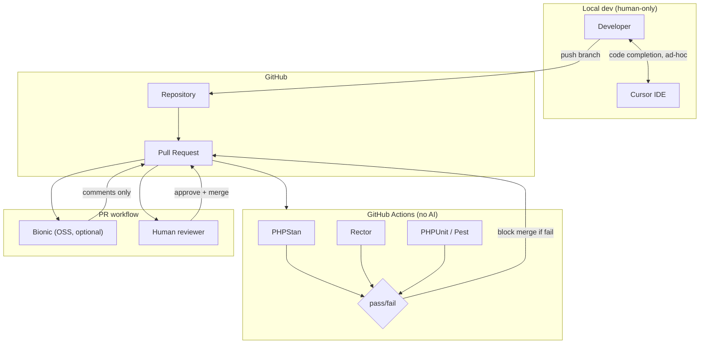
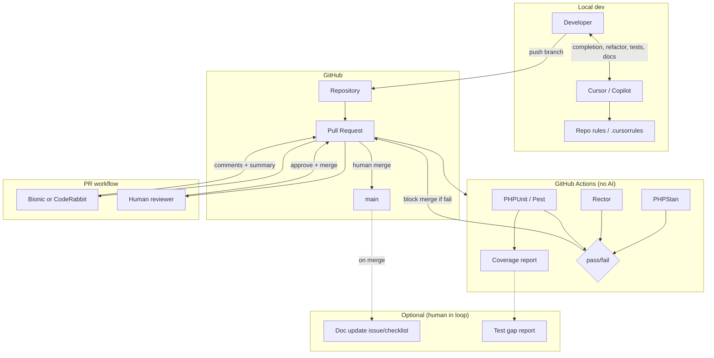

# Initiative Intake

## Title
AI-Augmented Development Pipelines (Beyond Code Completion)

## Problem Statement
We need structured AI integration into the WordPress + Laravel development lifecycle to improve review quality, reduce upgrade friction, increase test coverage, and improve documentation — without destabilising client delivery.

## Context
- Legacy WordPress installs (ACF-heavy, Classic Editor)
- Laravel services, queues, APIs, Passport
- CI/CD via GitHub + deployment tooling
- PHP 7.4 → 8.x transition in progress
- Active client retainers
- UK GDPR constraints

## Objectives
1. Improve PR quality and speed
2. Reduce refactoring risk
3. De-risk migrations (PHP/WP/plugins)
4. Increase automated test coverage
5. Improve documentation freshness

## Constraints
- Budget ceiling: £500/month
- No autonomous merges to production
- Must be reversible
- No client data exposure

## Target Outcomes (Measurable)
- PR cycle time reduction %
- Regression rate reduction %
- Test coverage increase %
- Upgrade planning time reduction %
- Documentation update frequency %

---

## Original Research Brief

Research how AI can be structurally integrated into a WordPress + Laravel development pipeline beyond code completion.

Produce:
1. Opportunities for AI augmentation in:
   - PR review
   - Refactoring
   - Migration (PHP + WP upgrades)
   - Test generation
   - Documentation
2. Tool comparison (OSS vs SaaS)
3. Security and governance considerations
4. 90-day pilot roadmap
5. KPIs
6. Risks and failure modes

---

# Research Output

**Budget note:** Intake states £500/month; original brief stated £200/month. This document uses £500 as the working ceiling; Cost Governor section includes a £200-compatible variant.

---

## 1. Opportunities for AI Augmentation

### PR review
- **Automated first-pass review:** Diff summarisation, obvious bug/security pattern flags, style/consistency checks before human review.
- **Context-aware suggestions:** Use repo/docs context to suggest WordPress/Laravel best practices, ACF patterns, hook usage.
- **Changelog and scope summary:** One-line PR summary and “what changed” for release notes.
- **Constraint checks:** Flag PHP 8.x incompatibilities, deprecated WP/Laravel APIs in changed files.

### Refactoring
- **Targeted modernisation:** Identify files suitable for PHP 8.x types, named args, match; suggest minimal, file-scoped changes.
- **ACF → blocks / patterns:** Suggest incremental migration paths (where ACF fields map to block attributes) without big-bang rewrites.
- **Dependency and dead-code hints:** Unused hooks, unreachable code, safe-to-remove dependencies.

### Migration (PHP + WP upgrades)
- **Upgrade impact analysis:** Per-repo or per-plugin “what breaks on PHP 8.x / WP 6.x” using static analysis + known deprecations.
- **Migration runbooks:** Generate stepwise upgrade checklists (PHP version, extensions, WP core, plugins, tests).
- **Compatibility tagging:** Tag PRs/issues with “PHP 8.1”, “WP 6.4”, etc., from code and dependency data.

### Test generation
- **Unit test scaffolding:** Generate PHPUnit tests for Laravel services/controllers and WP plugin functions from signatures and docblocks.
- **Regression test ideas:** From PR diffs, suggest “test that X still does Y” cases for critical paths.
- **Fixture and mock suggestions:** From existing tests, suggest fixtures and mocks for new code.

### Documentation
- **README and ADRs:** Keep README “how to run / deploy” and “decisions” sections updated from code and config changes.
- **API and hook docs:** Refresh inline docs for REST endpoints, WP hooks, Laravel routes from code.
- **Runbook updates:** Suggest runbook changes when deployment steps or env vars change.

---

## 2. Tool Comparison (OSS vs SaaS)

| Area | OSS / self-hosted | SaaS | Fit for pipeline |
|------|-------------------|------|-------------------|
| **PR review** | **Bionic** (GH App, OSS), **CodeRabbit** (GH), **Reviewpad** (OSS) | GitHub Copilot for PRs, **Cursor** (already in use), **CodeRabbit**, **Sweep** | Prefer: Bionic or CodeRabbit for structured PR comments; Cursor for ad-hoc. No autonomous merge. |
| **Static analysis** | **PHPStan**, **Psalm**, **Rector** (PHP); **PHPCompatibility** | — | Must-have in CI; no AI spend. |
| **Refactor / migration** | **Rector** (PHP rules), **PHPStan** + custom rules | Cursor / Copilot for suggested patches | Rector in CI; AI for “suggest PR” only. |
| **Test generation** | **Pest** / **PHPUnit** + scaffolding scripts | **Cursor**, **Copilot** for test drafts | AI suggests tests; human writes/commits. |
| **Documentation** | **MkDocs** / **Docusaurus** + CI, **phpDocumentor** | **Cursor**, **Copilot**, **Sweep** for doc updates | AI drafts; human approves. Repo-indexed Cursor rules help. |

**Architect — Tooling stack (real tools only)**

- **CI (existing):** GitHub Actions.
- **PR augmentation:** Bionic (OSS, GitHub App) or CodeRabbit — post review comments; no merge rights.
- **PHP:** PHPStan (with WordPress stubs), Rector (PHP 8.x + WP rules), PHPCompatibility in CI.
- **AI for code/tests/docs:** Cursor (existing) + optional GitHub Copilot; all usage human-initiated, no background indexing of client data.
- **Docs site:** Existing or new MkDocs/Docusaurus; AI-generated PRs for doc updates; human merge.

**Architect — Data flow**

- Code/diffs → CI (PHPStan, Rector, tests) → pass/fail.
- PR opened → Bionic/CodeRabbit receives diff + (optional) small context → posts comments; no PII, no client DB.
- Engineer uses Cursor/Copilot in IDE; requests stay in editor; no automatic sending of full repo or client data to AI.
- Doc repo (or `/docs` in repo) → AI suggests patches from changed code; human applies.

**Architect — Integration points**

- **WordPress:** PHPStan WordPress stubs; Rector rules for WP deprecations; no runtime AI in WP.
- **Laravel:** PHPStan Laravel plugin; Rector; tests in CI.
- **CI/CD:** Add PHPStan + Rector jobs; add Bionic/CodeRabbit as GH App; no deploy gates driven by AI.
- **Infrastructure:** No new runtime services for AI; optional dedicated index for Cursor (code only) if needed.

**Architect — Technical complexity:** Medium (CI + one PR bot + existing Cursor usage).

---

## 3. Security and Governance

**GOVERNANCE**

- **Data exposure risk:** **Low**, provided: (1) PR review tools receive only diff + minimal context (no client DB, no production credentials); (2) Cursor/Copilot used only on code/sanitised snippets; (3) no client PII or live data in prompts or indexes.
- **GDPR sensitivity:** Low for code-only pipeline. Higher if any tool indexes issue bodies, comments, or commit messages that might contain PII — restrict or redact; prefer tools that don’t require full repo/org access.
- **External API risk:** Medium for SaaS (OpenAI/Anthropic via Cursor/Copilot/CodeRabbit). Mitigate: no client data in prompts; vendor DPA; optional allow-list of models/endpoints.
- **Client approval required?** Recommended for transparency (“we use AI-assisted review and code generation under strict data and merge policies”); not necessarily a formal sign-off if no client data is processed.
- **Logging & audit:** Log which PRs received AI review; retain “AI-assisted” in PR description/template; do not log prompt content that could contain code from client repos in central systems without policy.
- **Redaction:** Ensure PR bot and AI prompts never receive: client names, URLs, credentials, API keys, or PII. Use repo-level rules.
- **Compliance risk score:** 2/5 with controls above.
- **Recommendation:** Safe with controls: data boundaries documented, no production/client data in AI path, reversible (disable bot, stop using AI for a repo).

---

## 4. Cost Governor

- **Budget constraint:** Ceiling **£500/month** (intake). Original brief **£200/month** — achievable with reduced scope (see below).
- **One-off:** Up to ~5–8 engineering days for CI + PR bot + policy/docs.

**Primary cost drivers**

- Cursor/Copilot subscription (per-seat).
- CodeRabbit or other SaaS PR review (per repo or per seat).
- Any extra AI API usage (e.g. doc generation) if not covered by Cursor/Copilot.

**Cost estimate (rough)**

| Scenario | Monthly | Assumptions |
|----------|--------|-------------|
| Low | ~£100–150 | Cursor existing; Bionic (OSS) for PR; no CodeRabbit; minimal API |
| Expected | ~£250–400 | Cursor + CodeRabbit (or similar) for 1–2 repos; light doc generation |
| Worst-case | £500+ | Multiple SaaS PR tools; high API usage; no caps |

**Cost controls**

- Rate limits: e.g. 20 AI-assisted PR reviews per repo per week; 50 doc-generation requests per month.
- Caching: PR bot caches by diff hash where supported; no re-call for same diff.
- Max context: PR bot receives only changed files + small context window (e.g. &lt;50k tokens per PR).
- Indexing: No continuous full-repo indexing of client repos to external AI; Cursor local/index only as per policy.
- Kill switch: Disable GH App for PR bot; revoke Cursor/Copilot for a repo or org.

**Cheaper alternatives (for £200 target)**

- Use **Bionic** (OSS) instead of CodeRabbit for PR review.
- Restrict AI PR review to 1 repo and critical path PRs only.
- No dedicated “doc generation” runs; only ad-hoc Cursor usage for docs.
- Rely on PHPStan + Rector only for migration/refactor (no AI for migration suggestions).

**Monitoring & alerts**

- Track: monthly spend per tool; PRs commented by bot per week; API call count if applicable.
- Alert: if projected monthly spend &gt; £450.
- Weekly: 10-minute check of spend vs budget and usage.

**Recommendation:** Fits with controls at £500; fits at £200 with Bionic-only PR review and no extra SaaS.

---

## 5. Dev Lead

- **Required skill profile:** PHP (WordPress + Laravel), GitHub Actions, basic YAML; no ML expertise.
- **Estimated engineering weeks:** 2–3 weeks (CI jobs, PR bot setup, docs, policy).
- **Maintenance burden:** Medium (Rector/PHPStan rule updates, PR bot config, occasional Cursor rule updates).
- **Risk of future technical debt:** Low if AI suggests only patches and humans always commit; medium if “AI-generated” PRs are merged without review.
- **Impact on legacy support:** Positive if migration/refactor suggestions are scoped and optional.
- **Hidden complexity:** PR bot tuning (noise vs signal); keeping Rector/PHPStan rules aligned with PHP 8.x and WP versions.
- **Practicality score:** 4/5.
- **Recommendation:** Safe to pilot with clear “human-only merge” and “no client data in AI” rules.

---

## 6. DevOps

- **Infrastructure footprint:** No new runtime services; GitHub App and CI only.
- **Runtime cost:** Low (CI minutes; existing runners).
- **Monitoring:** CI job success/failure; PR bot availability (GH App); no new infra metrics.
- **Failure recovery:** If PR bot is down, PRs get human-only review; CI still runs PHPStan/Rector.
- **Blast radius if misconfigured:** Low (bot can’t merge; CI can’t deploy without existing gates).
- **Performance impact:** Negligible; PR bot is async; CI adds ~1–3 min per PR.
- **Operational complexity:** Low.
- **Recommendation:** Safe for production; pilot in one repo first.

---

## 7. Critic

- **Unrealistic assumptions:** “Documentation freshness” may not improve unless someone is explicitly responsible for applying AI-suggested doc PRs. “Test coverage increase” is only achievable if generated tests are reviewed and maintained.
- **Hidden complexity:** Tuning PR bot to avoid noise (e.g. style nitpicks) so engineers don’t ignore it; maintaining Rector rule sets across PHP/WP versions.
- **Over-engineering risk:** Adding many AI touchpoints (PR + refactor + migration + tests + docs) at once could dilute focus; prefer phased rollout.
- **Cost blind spots:** CodeRabbit (or similar) per-seat or per-repo can grow with repos; Cursor/Copilot usage can spike with onboarding.
- **Operational fragility:** Reliance on third-party PR bot availability; no impact on deploy path.
- **Governance gaps:** Ensure “no client data” is enforced in PR descriptions and branch naming (e.g. no client names in diffs sent to bots).
- **Weak metrics:** “PR cycle time reduction %” can be confounded by other factors; attribute only to “PRs that received AI review” vs “without” in same repo. “Documentation update frequency” needs a clear definition (e.g. “doc PRs merged per month”).
- **What would break this?** Team ignores bot comments; Rector introduces a breaking change in a rule; a vendor changes API or pricing and we exceed £500.
- **Confidence adjustment:** Slightly reduced confidence on “documentation freshness” and “test coverage” until ownership and process are clear; otherwise solid for PR review and migration de-risking.

---

## 8. 90-Day Pilot Roadmap

| Week | Milestone | Owner | Deliverables |
|------|-----------|--------|--------------|
| 1–2 | CI + static analysis | Laravel/WP | PHPStan (WP stubs) + Rector in GitHub Actions; baseline for 1 repo |
| 2–3 | PR review bot | DevOps / lead | Bionic or CodeRabbit installed on 1 repo; no merge rights; data policy documented |
| 3–4 | Policy and guardrails | Lead + governance | One-pager: no client data in AI; no autonomous merge; reversible; log “AI-assisted” on PRs |
| 4–6 | Pilot metrics | Lead | Baseline: PR cycle time, regression rate, test coverage % for pilot repo |
| 6–8 | Refactor/migration use | WP/Laravel | Use Cursor/Rector for 1 PHP 8.x or WP upgrade run; document time saved |
| 8–10 | Test generation trial | Laravel/WP | Generate and human-edit tests for 1–2 services; measure coverage delta |
| 10–12 | Docs trial | Lead | AI-suggested doc PRs for one docs folder; define “doc update frequency” |
| 12 | Review and decide | All | KPI review; go/no-go for wider rollout; cost vs £500 |

---

## 9. KPIs and Stop Conditions

**KPIs (measurable, attributable)**

| KPI | Target (pilot) | How measured |
|-----|----------------|---------------|
| PR cycle time | Reduce by ≥15% for PRs with AI review | Compare median “open → merge” for PRs with vs without bot comments (same repo) |
| Regression rate | No increase (or reduce) | Post-merge defect/revert rate in pilot repo |
| Test coverage | +5% in pilot repo (or N new tests) | PHPUnit/Pest coverage report; count of new tests from AI suggestions merged |
| Upgrade planning time | ≥20% reduction for one PHP or WP upgrade | Time from “start planning” to “runbook ready” vs previous upgrade |
| Documentation update frequency | ≥1 doc PR merged per month (pilot repo or /docs) | Count doc PRs merged |

**Stop conditions (hard thresholds)**

- Monthly spend &gt; £500 for two consecutive months without approval.
- Any confirmed leakage of client or PII data into AI tools → immediate disable of affected tool and review.
- Regression rate in pilot repo increases by &gt;50% vs baseline → pause AI PR review until investigated.
- Team vote “not useful” (e.g. &lt;30% find PR bot helpful) after 8 weeks → pause or reconfigure PR bot.

---

## 10. Risks and Failure Modes

**Architect — Failure modes**

- PR bot returns noisy or wrong suggestions → engineers disable or ignore; mitigate with conservative config and feedback loop.
- Rector rule breaks build or behaviour → run on branch first; gate on green tests; version Rector rules.
- Third-party PR bot deprecation or pricing change → prefer OSS (Bionic) or have fallback “human-only review”.

**Risks summary**

- **Cost creep:** Mitigate with caps, alerts, and £200-scope option.
- **Governance:** Mitigate with explicit “no client data” and redaction; client transparency.
- **Delivery disruption:** Mitigate by no autonomous merge; pilot in one repo; reversible.
- **Weak outcomes:** Mitigate by clear KPI ownership and stop conditions; phased rollout (PR first, then tests/docs).

---

## 11. Reconciliation

**Executive summary**

- **What:** Add AI-augmented PR review (bot), static analysis (PHPStan, Rector) in CI, and optional use of Cursor/Copilot for refactor, migration, tests, and docs — all human-approved and reversible.
- **Why now:** PHP 7.4 → 8.x and WP/plugin upgrades benefit from consistent review and migration tooling; PR and doc quality improvements support client delivery without increasing headcount.
- **Expected outcome:** Measurable improvement in PR cycle time and upgrade planning time; stable or improved regression rate; modest test coverage and doc freshness gains.

**Points of agreement**

- Use only proven tools (PHPStan, Rector, Bionic or CodeRabbit); no autonomous merge; no client data in AI path.
- Pilot in one repo; 90-day roadmap; cost ceiling £500 with controls.
- Governance: low data exposure with documented controls; client transparency recommended.

**Points of conflict**

- **Budget:** Brief £200 vs intake £500. **Resolution:** Use £500 as pilot ceiling; Cost Governor provided £200-compatible scope (Bionic-only, single repo, no extra SaaS).
- **Documentation and test KPIs:** Critic flagged vague ownership. **Resolution:** Assign “doc update frequency” and “test coverage” to a single owner; KPIs defined as above with stop conditions.
- **Phasing:** Critic warned against many AI touchpoints at once. **Resolution:** Phase 1 = CI + PR bot; Phase 2 = refactor/migration + tests/docs in weeks 6–12.

**Final recommended architecture**

```
[Developer] → PR (GitHub)
       ↓
[CI: PHPStan, Rector, PHPUnit] → pass/fail
       ↓
[PR bot: Bionic or CodeRabbit] → comments only (no merge)
       ↓
[Human review + merge]
       ↓
[Cursor/Copilot optional: refactor, tests, docs] → human commits only
```

- No AI in deploy path; no indexing of client data; reversible by disabling bot and restricting Cursor use.

**Implementation plan (pilot)**

- Weeks 1–2: CI (PHPStan, Rector) on one repo.
- Weeks 2–3: PR bot on same repo; data policy.
- Weeks 3–4: Guardrails doc; baseline KPIs.
- Weeks 4–12: Use refactor/migration and test/doc flows; measure KPIs; weekly cost check.

**Controls & guardrails**

- Security: no client PII/credentials in PR bot or prompts; redaction and repo rules.
- Operational: no merge rights for bot; CI gates unchanged.
- Cost: monthly cap £500; alert at £450; optional £200 scope.

**Open questions & assumptions**

- Which repo is pilot (main product vs internal)?
- Formal client communication required or internal-only?
- Who is named owner for “doc update frequency” and “test coverage” KPIs?

**Next actions**

1. Choose pilot repo and PR bot (Bionic vs CodeRabbit).
2. Add PHPStan + Rector to pilot repo CI (ticket).
3. Install and configure PR bot; document “no client data” (ticket).
4. Publish one-pager on AI use and reversibility (ticket).
5. Record baseline PR cycle time and regression rate (ticket).
6. Schedule 4-week and 12-week KPI and cost reviews.

---

# Architect: Structural AI Integration (Options A & B)

## 1. Problem Definition

**Scope:** Structural integration of AI into the WordPress + Laravel development pipeline *beyond* code completion — i.e. PR review, refactor/migration support, test and doc assistance — while keeping production stable, reversible, and free of client data exposure.

**Technical context:** ACF-heavy WordPress, Laravel services/queues/APIs, GitHub + existing deployment tooling, PHP 7.4 → 8.x migration, UK GDPR.

**Constraints (from intake):** No autonomous merges; must be reversible; no client data in AI path; budget ceiling £500/month.

---

## 2. Option A: Minimal, Low-Risk

**Design:** Add deterministic static analysis in CI; optional OSS PR bot (comments only). AI only in the IDE (Cursor), human-initiated. No AI in CI, no automated test/doc generation.



**Option A — Tooling stack**

| Layer | Tool | Role |
|-------|------|------|
| CI | GitHub Actions, PHPStan, Rector, PHPUnit/Pest | Static analysis, deprecations, tests; no AI |
| PR | Bionic (OSS, GitHub App) — optional | First-pass comments only; no merge rights |
| Local | Cursor (existing) | Code completion and ad-hoc prompts; no background indexing of client data |
| WordPress | PHPStan WordPress stubs, Rector WP rules | In CI only |
| Laravel | PHPStan Laravel plugin, Rector | In CI only |

**Option A — Characteristics**

- **Reversible:** Disable Bionic; remove or bypass PHPStan/Rector jobs.
- **Low third-party risk:** One optional OSS PR bot; no SaaS AI in pipeline.
- **No AI in CI:** All checks deterministic; no token spend in Actions.
- **Guardrails:** No merge rights for bot; no client PII in PR descriptions/diffs (policy); Cursor used only on code/sanitised snippets.

---

## 3. Option B: More Advanced

**Design:** Option A plus: richer PR review (OSS or SaaS bot with repo context); structured use of Cursor/Copilot for refactor, migration, test, and doc suggestions (human creates commits); optional doc-sync workflow (e.g. issue or checklist on merge). CI remains non-AI; optional scheduled job that *reports* test-coverage gaps (no AI in CI, or a separate “suggestion” flow with human in the loop).



**Option B — Tooling stack**

| Layer | Tool | Role |
|-------|------|------|
| CI | GitHub Actions, PHPStan, Rector, PHPUnit/Pest, coverage report | Same as A; plus coverage artefact for test-gap visibility |
| PR | Bionic (OSS) or CodeRabbit (SaaS) | Comments, PR summary, optional PHP 8.x/WP deprecation hints |
| Local | Cursor + optional Copilot, repo rules | Refactor, migration, test, and doc suggestions; human applies |
| Docs | MkDocs/Docusaurus or /docs in repo | Optional: on merge, create issue or checklist for doc updates (no autonomous AI doc PR unless human-triggered) |
| WordPress | PHPStan WP stubs, Rector WP rules; Cursor rules for ACF/WP patterns | CI + local guidance |
| Laravel | PHPStan Laravel, Rector; Cursor rules for Laravel | CI + local guidance |

**Option B — Characteristics**

- **Reversible:** Same as A; plus disable CodeRabbit or switch back to Bionic-only; tighten Cursor/Copilot use by repo.
- **Higher leverage:** Better PR summaries, refactor/test/doc suggestions in IDE; optional doc and test-gap visibility.
- **More third-party:** CodeRabbit (or similar) may be SaaS; Cursor/Copilot use increases.
- **Guardrails:** Rate limits on PR bot; no PII in diffs/context; cost alerts; kill switch; “AI-assisted” in PR template.

---

## 4. Tool Comparison (OSS vs SaaS)

| Area | OSS / self-hosted | SaaS | Option A | Option B |
|------|-------------------|------|----------|----------|
| **PR review** | **Bionic** (GitHub App, OSS) | **CodeRabbit** (GitHub), GitHub Copilot for PRs | Bionic optional | Bionic or CodeRabbit |
| **Static analysis** | **PHPStan**, **Psalm**, **Rector**, **PHPCompatibility** | — | PHPStan, Rector in CI | Same |
| **Refactor / migration** | **Rector** (CI); Cursor/Copilot (local) | Cursor, Copilot | Local only | Local + repo rules |
| **Test generation** | **PHPUnit**/ **Pest** + scaffolding | Cursor, Copilot | Ad-hoc in IDE | Structured use + test-gap report |
| **Documentation** | **MkDocs**, **phpDocumentor** | Cursor, Copilot, Sweep | Ad-hoc | Optional doc issue/checklist on merge |
| **IDE / local** | — | **Cursor**, **GitHub Copilot** | Cursor only | Cursor + Copilot optional |

**Selection guidance**

- **Option A:** Prefer **Bionic** (OSS) for PR if any bot; no SaaS PR tool required.
- **Option B:** **CodeRabbit** or Bionic; CodeRabbit can give richer summaries and may have better WP/Laravel awareness; Bionic keeps everything OSS and avoids vendor lock-in.
- **CI:** No SaaS AI in GitHub Actions; PHPStan, Rector, PHPCompatibility are OSS and run in Actions.
- **Local:** Cursor is existing; Copilot is optional for Option B; both are human-initiated only.

---

## 5. Integration Points

### 5.1 GitHub Actions

| Concern | Option A | Option B |
|---------|----------|----------|
| **Jobs** | PHPStan, Rector, PHPUnit/Pest on PR (and optionally main) | Same; add coverage report upload (e.g. codecov or artifact) |
| **Secrets** | None for AI (no AI in CI) | None for AI |
| **Triggers** | `pull_request`, `push` to main | Same |
| **Failure behaviour** | Block merge on fail (branch protection) | Same |
| **WP/Laravel** | PHPStan with WP stubs + Laravel plugin; Rector with PHP 8.x and WP rule sets; separate jobs or matrix for WP vs Laravel if monorepo | Same |

**Example (conceptual):** One workflow file; jobs: `phpstan`, `rector`, `test`; each runs on PR; all must pass for merge. No API calls to external AI from Actions.

### 5.2 PR Workflow

| Step | Option A | Option B |
|------|----------|----------|
| **Open PR** | Bionic (if enabled) receives webhook; posts comments on diff | Bionic or CodeRabbit posts comments + optional PR summary |
| **Context sent to bot** | Diff only (or diff + small context window) | Diff + optional repo rules / file list; no client data, no credentials |
| **Merge** | Human only; branch protection requires human review and CI green | Same |
| **Guardrail** | Bot has no write to repo except comments | Same; rate limit on bot API if SaaS |

### 5.3 Local Dev

| Concern | Option A | Option B |
|---------|----------|----------|
| **Cursor** | Code completion; ad-hoc “explain/refactor” on selection; no automatic full-repo or client data send | Same; plus use for “suggest migration”, “suggest tests”, “update README” with repo rules |
| **Copilot** | Not required | Optional; same guardrails as Cursor |
| **Repo rules** | Optional `.cursorrules` / Cursor rules for “no client data” | Recommended: WP/Laravel conventions, ACF patterns, “no PII in prompts” |
| **WP/Laravel** | Developer uses Cursor on PHP/JS; no runtime AI inside WP or Laravel app | Same |

### 5.4 WordPress Specifics

- **CI:** PHPStan with `phpstan/phpstan-wordpress` (or community WP stubs); Rector with WP-specific rule set (e.g. deprecated functions, constructor changes). Run against theme/plugin paths only.
- **PR bot:** No access to WP admin or DB; only code diff. Avoid sending `wp-config` or env in context.
- **Local:** Cursor rules can reference WP coding standards, ACF field patterns, and “no client site URLs or data in prompts”.

### 5.5 Laravel Specifics

- **CI:** PHPStan with Laravel plugin; Rector for PHP 8.x and Laravel upgrade rules. Run against `app/`, `routes/`, etc.; exclude vendor.
- **PR bot:** Same as WP; no `.env` or credentials in diff/context.
- **Local:** Cursor rules for Laravel conventions, Passport/API patterns; “no production URLs or tokens in prompts”.

---

## 6. Failure Modes

| Failure mode | Mitigation (A & B) |
|--------------|--------------------|
| **PR bot returns noisy or wrong suggestions** | Conservative config; allow “dismiss” or “disable for this repo”; tune context size and rules; feedback loop to reduce noise. |
| **Rector rule breaks build or behaviour** | Run Rector on branch; require CI green including tests; version Rector and rule set; review Rector PRs like any other change. |
| **Third-party PR bot deprecated or pricing change** | Prefer Bionic (OSS) for Option A; for Option B, have fallback to Bionic; document “human-only review” as default. |
| **Engineer sends client data in Cursor/Copilot prompt** | Policy + .cursorrules: “no client names, URLs, credentials, PII”; training; audit spot-checks. |
| **CI dependency (PHPStan/Rector) breaks or slows** | Pin versions; cache Composer and tools in Actions; run analysis on changed paths only if needed. |
| **PR bot down or rate-limited** | Human review continues; merge still gated on CI and human approval; no dependency on bot for merge. |

**Option B only**

| Failure mode | Mitigation |
|--------------|------------|
| **Cost overrun (CodeRabbit / API)** | Monthly cap and alert; rate limit PR bot; fallback to Bionic. |
| **Doc/test “suggestion” workflow creates noise** | Optional workflows; human creates issues/PRs; no auto-open of large numbers of issues. |

---

## 7. Guardrails

**Both options**

- **No autonomous merge:** Only humans merge; branch protection enforces CI pass + human review.
- **No client data in AI path:** Policy: no client names, site URLs, credentials, or PII in PR descriptions, branch names, or Cursor/Copilot prompts; repo rules and PR template reminder.
- **Reversibility:** Disable PR bot via GitHub App; remove or bypass CI jobs; restrict Cursor/Copilot by repo or org.
- **CI is deterministic:** No AI calls in GitHub Actions; results reproducible.

**Option A**

- **Minimal surface:** One optional OSS PR bot; no SaaS AI in pipeline; Cursor use is existing and ad-hoc.
- **No rate/cost in pipeline:** No PR bot API spend if Bionic is self-hosted or within free tier; Cursor cost is existing.

**Option B**

- **Rate limits:** Cap PR bot comments per repo per day/week if SaaS; avoid large context windows per PR.
- **Cost alert:** Alert when projected monthly spend &gt; £450 (or chosen threshold).
- **Kill switch:** Disable CodeRabbit/Bionic; revoke or restrict Cursor/Copilot for a repo.
- **“AI-assisted” visibility:** PR template checkbox or line: “AI used for [review / suggestions]”; log which PRs received bot comments.
- **Doc/test suggestions:** Only human-triggered or human-created issues/PRs; no autonomous doc or test PRs.

---

## 8. Summary

| Dimension | Option A (minimal) | Option B (advanced) |
|-----------|--------------------|---------------------|
| **Technical complexity** | Low | Medium |
| **CI** | PHPStan, Rector, tests; no AI | Same + coverage report |
| **PR** | Optional OSS bot (Bionic); comments only | OSS or SaaS bot; comments + summary |
| **Local** | Cursor only, ad-hoc | Cursor + optional Copilot; repo rules for refactor/test/docs |
| **Failure surface** | Low | Medium (more third-party, cost) |
| **Reversibility** | High | High (with documented kill switch) |
| **Guardrails** | No merge bot; no client data; reversible | Same + rate limits; cost alert; “AI-assisted” visibility |

---

# Dev Lead: Review of Intake + Architect Output

## 1. Required Skill Profile

| Skill | Level | Where used |
|-------|--------|------------|
| **PHP (WordPress + Laravel)** | Strong | CI config (paths, stubs), Rector rules, reviewing bot/Rector output |
| **GitHub Actions / YAML** | Working | Workflow files, branch protection, caching |
| **Composer, PHPUnit/Pest** | Working | CI jobs, test runs, coverage |
| **PHPStan** | Basic | Reading level/errors; adding baseline; WP/Laravel extensions |
| **Rector** | Basic | Running rule sets; adding/excluding rules; not writing custom rules initially |
| **GitHub App / OAuth** | Basic | Installing Bionic or CodeRabbit; no custom app dev |
| **Cursor / Copilot** | Working | Daily use; applying suggestions; not configuring org-wide |
| **Technical writing** | Basic | One-pager, PR template, .cursorrules |

**No ML/AI engineering required.** One person who can own CI + one who can own "AI in pipeline" policy is enough; can be same person.

---

## 2. Estimated Engineering Weeks

**By phase (recommended sequencing)**

| Phase | Scope | Option A | Option B | Notes |
|-------|--------|----------|----------|--------|
| **1 — CI only** | PHPStan + Rector + tests in GitHub Actions (1 repo) | 1–1.5 w | 1–1.5 w | Same; includes baseline, paths, WP/Laravel stubs |
| **2 — PR bot** | Install Bionic or CodeRabbit; config; data policy | 0.5–1 w | 0.5–1 w | Bionic may need more config; CodeRabbit quicker to first comment |
| **3 — Policy & guardrails** | One-pager, PR template, .cursorrules draft | 0.5 w | 0.5 w | Shared |
| **4 — Baseline & metrics** | PR cycle time, regression rate, coverage % (pilot repo) | 0.5 w | 0.5 w | Shared |
| **5 — Refactor/migration use** | Use Cursor + Rector for one PHP 8.x or WP upgrade; document | 0.5–1 w | 1 w | Option B: add repo rules, more structured use |
| **6 — Test generation trial** | Generate + human-edit tests for 1–2 services | — | 1 w | Option B only; Option A = ad-hoc only |
| **7 — Docs trial** | Doc update process; optional "on merge" checklist | — | 0.5 w | Option B only; Option A = ad-hoc only |
| **8 — Coverage report (CI)** | Upload coverage artifact or codecov | — | 0.25 w | Option B only |

**Totals**

- **Option A (minimal):** **2.5–4 weeks** (CI + optional PR bot + policy + baseline + one refactor/migration run). No dedicated test-generation or docs workflow.
- **Option B (advanced):** **4–6 weeks** (same as A through phase 5; plus coverage job, test-generation trial, docs trial, repo rules).

**Assumptions:** 1 pilot repo; existing tests runnable in CI; one engineer leading, others contributing. If monorepo or multiple PHP/WordPress versions, add 0.5–1 week for matrix/paths.

---

## 3. Maintenance Burden

| Area | Option A | Option B |
|------|----------|----------|
| **CI (PHPStan, Rector, tests)** | **Medium** — PHPStan/Rector and WP/Laravel stubs need version bumps; Rector rule sets may need tuning per PHP/WP version | Same as A |
| **PR bot** | **Low** — Bionic: config and dependency updates; no per-PR tuning if kept minimal | **Medium** — CodeRabbit: config, rate limits, possible per-repo rules; Bionic: same as A |
| **Cursor / Copilot** | **Low** — Existing usage; occasional .cursorrules update | **Medium** — Repo rules for WP/Laravel/ACF; keep in sync with conventions; onboarding reminders |
| **Coverage / test-gap report** | — | **Low** — Once set up, mostly stable |
| **Doc workflow (on-merge checklist etc.)** | — | **Low** — Template/issue template; rarely changed |
| **Overall** | **Low–Medium** | **Medium** |

**Ongoing time:** ~2–4 hours/month Option A (CI + bot bumps, policy tweaks); ~4–8 hours/month Option B (+ repo rules, cost/usage check, test/doc workflow tweaks).

---

## 4. Risk of Future Technical Debt

- **Low** if: (1) All AI output is treated as suggestion — human always edits and commits; (2) Rector runs are reviewed like any other PR; (3) No "AI-generated" PRs merged without full human review; (4) Baseline and rule sets are versioned and documented.
- **Medium** if: Generated tests or doc snippets are merged with minimal review and drift from real behaviour; or Rector rules are expanded without test coverage and introduce subtle breaks.
- **Mitigation:** Explicit rule: "AI suggests, human decides"; Rector and PHPStan changes go through normal PR review; assign an owner for "generated test quality" and "doc freshness" so they don't become orphaned.

---

## 5. Impact on Legacy Support

- **Positive:** PHPStan + Rector in CI give consistent signals on PHP 8.x and deprecations across legacy WP/Laravel code; PR bot can flag deprecated usage in changed files; Cursor can suggest small, file-scoped modernisation without big-bang refactors.
- **Neutral/risk:** Legacy codebases often have large baselines (PHPStan level 0, many Rector exclusions). Adding CI can mean "many failures" until baseline is set. **Recommendation:** Start with baseline that passes (level 0, exclude legacy paths if needed); tighten gradually in dedicated PRs so client work isn't blocked.
- **Safe sequencing:** Enable CI on new or recently touched code first; expand to legacy paths in a separate "static analysis cleanup" initiative so retainer work isn't mixed with tooling.

---

## 6. Hidden Complexity Risks

| Risk | Why it's hidden | Mitigation |
|------|------------------|------------|
| **PR bot noise** | Bot may comment on style or minor nits; team starts ignoring all comments | Start with "summary + security/breaking only"; tune or disable categories; 2-week feedback loop to reduce noise before widening |
| **Rector vs. WP/Laravel versions** | Rector rule sets and WP core/plugin versions can conflict; "fix deprecation" can break behaviour | Run Rector on a branch; require full test pass; version Rector and rule set in composer; document "Rector PRs need extra review" |
| **Monorepo / mixed stacks** | Single workflow may not fit "WP plugin + Laravel app" in one repo; paths and stubs differ | Separate jobs or matrix for WP vs Laravel; clear path lists so PHPStan/Rector only see relevant code |
| **Baseline creep** | PHPStan baseline grows and never shrinks; Rector exclude list grows | Quarterly "reduce baseline" task; track baseline size in metrics |
| **Ownership of "doc" and "test" KPIs** | Everyone assumes someone else will do doc updates or review generated tests | Assign named owner in pilot; add to team checklist or retro until habit forms |
| **Cursor/Copilot context leakage** | Developer pastes code that accidentally includes client URL or token | .cursorrules + PR template: "no client names, URLs, credentials"; short training; no logging of prompt content without policy |

---

## 7. Skill Gaps

| Gap | Severity | How to close |
|-----|----------|--------------|
| **Rector rule authoring** | Low | Use preset/community rules only; don't write custom rules in pilot |
| **GitHub App / bot config** | Low | Bionic/CodeRabbit docs + "install and restrict to 1 repo"; no custom app |
| **PHPStan level/extension tuning** | Medium | Start at level 0; use WP/Laravel community configs; raise level in dedicated PRs |
| **Defining "doc update frequency"** | Low | Decide once: e.g. "≥1 doc PR per month" or "README/runbook updated within 2 sprints of code change"; document in pilot |
| **Cost/usage monitoring** | Low | Simple spreadsheet or doc: spend per tool per month; calendar reminder for weekly check |

No hire required; existing PHP + GitHub + Cursor experience is enough. If no one has run PHPStan/Rector before, budget 1–2 days for reading and first green run.

---

## 8. Safe Sequencing

**Order of rollout (recommended)**

1. **CI only (no PR bot, no new AI workflows)** — PHPStan + Rector + existing tests on 1 repo; baseline so main is green. **Gate:** Merge only when CI green. No AI in pipeline yet.
2. **Policy and guardrails** — One-pager ("no client data in AI; no autonomous merge; reversible"); PR template "AI-assisted" line; .cursorrules draft. **Gate:** Team has seen and acknowledged.
3. **PR bot (optional for Option A)** — Install Bionic (or CodeRabbit) on same repo; comments only; no merge rights. **Gate:** 2-week trial; if useful, keep; if noisy, tune or disable.
4. **Baseline metrics** — Record PR cycle time, regression rate, coverage % for pilot repo. **Gate:** Numbers recorded so later KPIs are comparable.
5. **Refactor/migration use** — One real PHP 8.x or WP upgrade using Cursor + Rector; document time and issues. **Gate:** Upgrade done and runbook updated; no new tooling in CI.
6. **Test generation (Option B only)** — Generate tests for 1–2 services with Cursor; human edits and merges; measure coverage delta. **Gate:** Tests merged and green; owner for "review generated tests" named.
7. **Docs trial (Option B only)** — Define "doc update frequency"; optional "on merge to main" checklist or issue. **Gate:** At least one doc PR merged; owner named.
8. **Review and widen** — 12-week review; decide rollout to more repos or revert.

**Do not:** Add PR bot and Rector and test-generation and doc workflow in the same week. **Do:** Land CI first, then bot, then policy, then optional workflows.

---

## 9. What to Simplify First

| If short on time or people | Simplify to |
|----------------------------|------------|
| **Full Option B** | Option A: CI + optional Bionic only; no CodeRabbit, no coverage report, no formal test/doc workflows. Refactor/test/docs stay ad-hoc in Cursor. |
| **CI scope** | Single job: PHPStan only (no Rector in week 1). Add Rector in a follow-up PR once PHPStan is stable. |
| **PR bot** | Defer PR bot to phase 2; run pilot with "human review + CI only" and measure baseline; add bot only if capacity allows. |
| **Multiple repos** | Pilot one repo only; don't enable bot or new CI on all repos until pilot is reviewed. |
| **Rector rule set** | Use one preset (e.g. PHP 8.x set) only; no WP-specific Rector rules until PHP 8.x set is green and reviewed. |
| **Docs and test KPIs** | Drop "documentation update frequency" and "test coverage %" from pilot KPIs; keep "PR cycle time" and "regression rate" only. Add doc/test later. |

**First simplification to adopt:** Start with **CI (PHPStan first, then Rector) + policy** and **no PR bot**. Add PR bot only after 2–4 weeks of stable CI and baseline metrics. That keeps engineering weeks to ~1.5–2 for "first value" and avoids PR bot tuning eating time early.

---

## 10. Practical Workflow Maps

### 10.1 PR review

```text
Developer pushes branch → Opens PR
       ↓
GitHub Actions: PHPStan, Rector, PHPUnit run (required to pass)
       ↓
PR bot (Bionic or CodeRabbit): receives diff (+ optional small context)
       ↓
Bot posts comment: summary, security/breaking hints, optional deprecation flags
       ↓
Human reviewer: reads bot comment + diff, approves or requests changes
       ↓
Developer: addresses feedback; no merge until CI green + human approval
       ↓
Human merges (bot has no merge rights)
```

**Local:** Developer uses Cursor for code completion and ad-hoc "explain this" on selection only; no "review entire PR" in IDE in pipeline — that's the bot's job.

**Guardrails:** Bot gets diff only (no client URLs, no .env); PR template includes "AI-assisted review: yes/no"; human always has final say.

---

### 10.2 Refactoring

```text
Target: modernise for PHP 8.x / reduce tech debt in a file or module
       ↓
Option A: Developer selects code in Cursor → "Suggest PHP 8.x refactor" → applies/edit locally → runs Rector in CI on PR
Option B: Same + repo rules (WP/Laravel/ACF) so Cursor suggestions align with project
       ↓
CI: Rector runs on PR (same rule set as project); PHPStan passes
       ↓
Human review: confirm behaviour unchanged; tests green
       ↓
Merge
```

**Rector:** Run in CI on every PR (or on paths under refactor). No "Rector-only" mass PR without prior agreement; refactor in small PRs.

**Guardrails:** Rector runs on branch; full test run required; no autonomous refactor PRs.

---

### 10.3 Migration planning (PHP / WP / plugins)

```text
Goal: plan upgrade (e.g. PHP 7.4 → 8.1, WP 5.x → 6.x)
       ↓
CI (already in place): PHPStan + Rector on current codebase surface deprecations and fixable issues
       ↓
Developer/lead: runs Rector with "dry run" or "diff" locally (or on branch) to list suggested changes
       ↓
Cursor (optional): "Generate migration runbook for PHP 7.4 → 8.1 for this repo" using codebase context; human edits runbook
       ↓
Runbook: steps for PHP version, extensions, WP core, plugins, tests; order of operations
       ↓
Execute in small PRs; each PR goes through CI + human review
```

**No AI in CI for migration.** Migration "plan" is human-owned; Cursor can draft runbook or checklist; Rector and PHPStan provide the raw list of code-level changes.

**Guardrails:** Runbook is internal; no client data in prompts; execution is human-driven with CI gates.

---

### 10.4 Test generation

```text
Target: add or extend tests for a service/controller/plugin
       ↓
Developer: selects class/method in Cursor → "Generate PHPUnit/Pest tests for this"
       ↓
Cursor: suggests test file (or methods); developer edits (assertions, data providers, mocks)
       ↓
Developer: runs tests locally; pushes branch
       ↓
CI: PHPUnit/Pest run; coverage report (Option B: uploaded for visibility)
       ↓
Human review: tests are meaningful and maintained by team
       ↓
Merge
```

**No automated "AI creates test PR" in pipeline.** Human always writes or heavily edits the test code; CI runs it. Option B can add "test gap" report (e.g. list of files with no tests) as an artefact or issue — human decides what to test.

**Guardrails:** Generated tests are reviewed like any other code; owner for "test quality" in pilot.

---

### 10.5 Documentation

```text
Trigger: code/config change that should be reflected in README, runbook, or ADRs
       ↓
Option A: Ad-hoc — developer or lead asks Cursor "Update README for this change" and applies edit manually
       ↓
Option B: Optional "on merge to main" — checklist or issue template: "If deployment/env changed, update runbook"; or scheduled "doc freshness" reminder
       ↓
Doc update: human creates PR to /docs or README; no autonomous AI doc PR
       ↓
Merge; "doc update frequency" KPI = count of doc PRs merged per month
```

**No AI in CI that pushes doc changes.** Cursor can draft README/runbook snippets; human approves and commits. Option B: lightweight process (checklist or monthly reminder) so someone is prompted to update docs.

**Guardrails:** "Documentation update frequency" has a named owner; no client-specific details in public docs; doc PRs are reviewed.

---

## 11. Practicality Score and Recommendation

| Criterion | Option A | Option B |
|-----------|----------|----------|
| Engineering weeks | 2.5–4 | 4–6 |
| Maintenance | Low–Medium | Medium |
| Skill fit | Yes (existing team) | Yes |
| Legacy impact | Positive if baseline handled | Same |
| Hidden complexity | Manageable (CI + optional bot) | Higher (bot tuning, repo rules, doc/test process) |
| Reversibility | High | High |

**Practicality score:** **Option A: 4/5.** **Option B: 3.5/5** (more moving parts and ownership needs).

**Recommendation**

- **Safe to pilot:** **Option A** — CI (PHPStan, then Rector) + optional Bionic + policy + baseline metrics. Add refactor/migration use when CI is stable. Keep test and doc as ad-hoc Cursor use.
- **Option B:** **Safe to pilot with simplification** — Same as A for phases 1–4; add coverage report and "structured" Cursor use (repo rules) before adding test-generation and docs workflows. Introduce test and doc workflows only after PR bot and CI have been stable for 4+ weeks and ownership for doc/test KPIs is assigned.
- **Simplify first:** Start with **CI + policy only** (no PR bot in week 1). Get CI green and baseline metrics; then add PR bot. That minimises risk and engineering weeks for first value.
